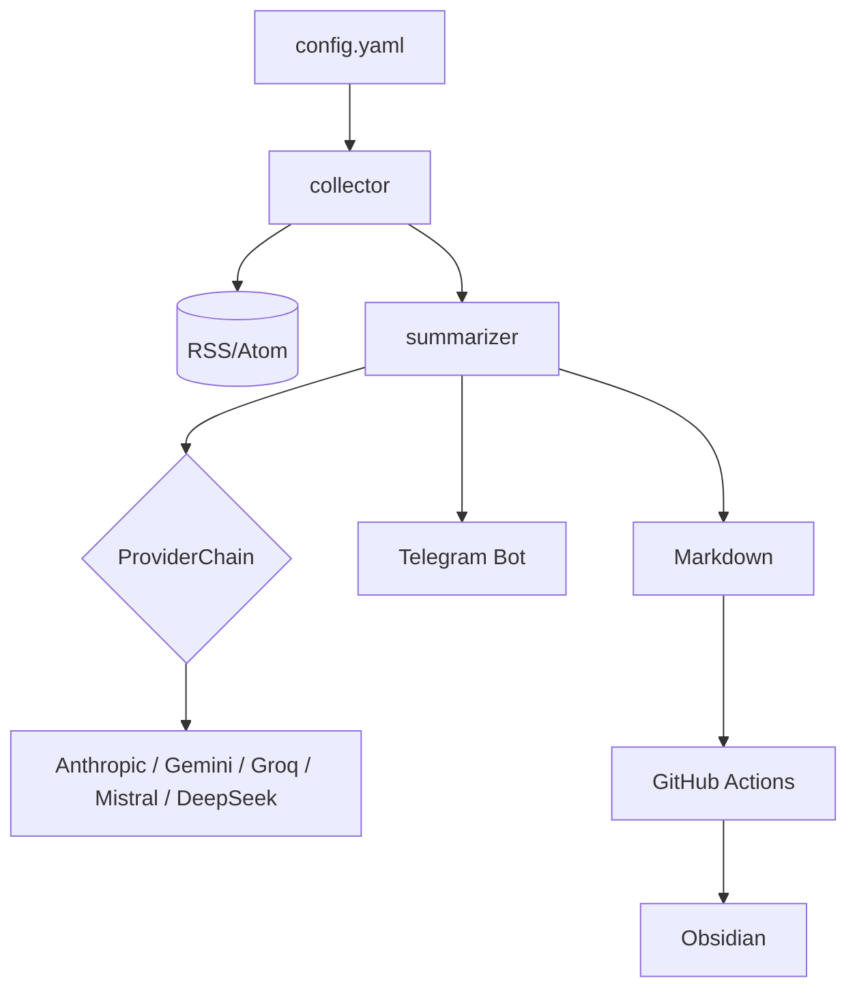
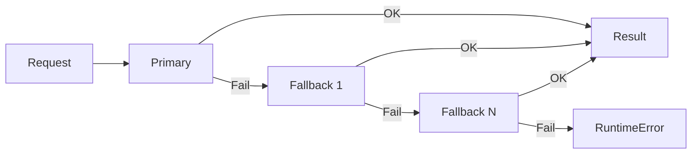

# Ежедневный новостной дайджест

Персональный генератор ежедневного новостного дайджеста для технического архитектора крупного банка.
Собирает RSS/Atom-ленты, суммирует их через LLM, отправляет в Telegram
и сохраняет markdown-файлы в репозиторий (для Obsidian через git-sync).

Работает на **GitHub Actions** (бесплатный tier) — без VPS и платного хостинга.

## Архитектура



Каждая категория суммируется параллельно через назначенного провайдера (или цепочку по умолчанию, если маршрутизация не задана).
**ProviderChain** автоматически переключается на следующего провайдера при сбое — дайджест всегда доставляется, даже если один API недоступен.

## Архитектура LLM-провайдеров

### ProviderChain fallback



### Параллельная обработка по категориям

Каждая категория обрабатывается параллельно:

1. `main.py` вызывает `resolve_category_providers` — получает словарь `категория → ProviderChain`
2. Для каждой категории параллельно запускается `build_category_prompt` + вызов LLM
3. После получения всех категорий строится `build_trends_prompt` и вызывается LLM для трендов
4. Итоговый дайджест собирается из всех категорий + трендов

## Маршрутизация по категориям

Можно назначить конкретного LLM-провайдера отдельным категориям. Категории без маршрутизации используют цепочку по умолчанию. Если API-ключ назначенного провайдера отсутствует — автоматически используется цепочка по умолчанию.

```yaml
llm:
  providers:
    - name: "gemini"
      model: "gemini-2.5-flash"
    - name: "groq"
      model: "llama-3.3-70b-versatile"
  routing:
    - categories: ["AI & LLM", "AI Engineering"]
      provider: "gemini"
      model: "gemini-2.5-flash"
```

## Рекомендации по выбору моделей

Рекомендации основаны на комментариях в `config.yaml`. Это не жёсткие правила — любая модель справится с любой категорией, и вы можете настроить любую комбинацию.

| Категория | Провайдер | Модель | Почему |
|-----------|-----------|--------|--------|
| AI & LLM, AI Engineering | Gemini | gemini-2.5-flash | Быстрый, хорошо разбирается в AI-тематике, бесплатный tier |
| Banking & Fintech, Payments & Fintech | Groq | llama-3.3-70b-versatile | Быстрый inference, хорошо работает с финансовой аналитикой |
| Architecture & Distributed Systems | DeepSeek | deepseek-chat | Силён в технических и архитектурных темах |
| Остальные категории | По умолчанию | — | Используется цепочка из `llm.providers` |

## Быстрый старт

### 1. Форк / клон репозитория

```bash
git clone https://github.com/<you>/digest.git
cd digest
```

### 2. Создайте Telegram-бота

1. Найдите **@BotFather** в Telegram, отправьте `/newbot`.
2. Следуйте инструкциям и сохраните полученный **токен бота**.
3. Напишите любое сообщение своему новому боту, затем откройте:
   `https://api.telegram.org/bot<TOKEN>/getUpdates`
   Найдите `chat.id` в ответе. Альтернативно используйте **@userinfobot**.

### 3. Получите API-ключ LLM

Выберите одного или нескольких провайдеров (у Gemini и Groq есть бесплатные тиры):

| Провайдер | Консоль | Бесплатный tier |
|-----------|---------|----------------|
| Anthropic Claude | https://console.anthropic.com/ | Пробные кредиты |
| Google Gemini | https://aistudio.google.com/app/apikey | Да |
| Groq | https://console.groq.com/ | Да |
| Mistral | https://console.mistral.ai/ | Пробные кредиты |
| DeepSeek | https://platform.deepseek.com/ | Пробные кредиты |

### 4. Настройте дайджест

Отредактируйте `config.yaml`:

```yaml
llm:
  provider: "anthropic"   # или "gemini", "groq"
  model: "claude-sonnet-4-20250514"

digest:
  language: "ru"               # "ru" или "en"
  summary_style: "analytical"  # "analytical" | "brief" | "detailed"
```

### 5. Добавьте GitHub Secrets

В вашем форке: **Settings → Secrets and variables → Actions → New repository secret**.

Добавьте секреты для выбранных провайдеров:

| Имя секрета           | Описание                                        |
|-----------------------|-------------------------------------------------|
| `ANTHROPIC_API_KEY`   | API-ключ Anthropic (если используете Claude)    |
| `GEMINI_API_KEY`      | API-ключ Gemini (если используете Gemini)       |
| `GROQ_API_KEY`        | API-ключ Groq (если используете Groq)           |
| `MISTRAL_API_KEY`     | API-ключ Mistral (если используете Mistral)     |
| `DEEPSEEK_API_KEY`    | API-ключ DeepSeek (если используете DeepSeek)   |
| `TELEGRAM_BOT_TOKEN`  | Токен бота от @BotFather                        |
| `TELEGRAM_CHAT_ID`    | Ваш Telegram chat ID                            |

### 6. Активируйте workflow

Дайджест запускается ежедневно в **06:00 UTC** (11:00 по Ташкенту, UTC+5).

Также можно запустить вручную:
**Actions → Daily News Digest → Run workflow**

Сгенерированные файлы дайджеста сохраняются в `digests/` и автоматически коммитятся в репозиторий.

## Локальный запуск

```bash
# Установить зависимости
pip install -r requirements.txt

# Скопировать и заполнить credentials
cp .env.example .env
# отредактировать .env с вашими ключами

# Проверить конфиг и API-ключи
python -m src --check

# Запустить дайджест
python -m src

# Dry-run: собрать и суммировать, но не отправлять и не сохранять
python -m src --dry-run --verbose

# Использовать другой конфиг-файл
python -m src --config my-config.yaml

# Найти новые RSS-источники через LLM
python -m src --discover
```

## Добавление и удаление источников

Отредактируйте список `sources` в `config.yaml`. Каждый источник имеет поля:

```yaml
sources:
  - name: "My Feed"          # отображаемое название (используется в дайджесте)
    url: "https://..."       # URL RSS или Atom-ленты
    category: "AI & LLM"    # группирует источники в дайджесте
    enabled: true            # false — временно отключить без удаления
    priority: 3              # от 1 (низший) до 5 (высший); по умолчанию 3
```

Необязательные поля для пробных источников:

```yaml
    trial: true                  # тестировать новый источник с ограниченными слотами
    trial_started: "2026-03-15"  # заполняется автоматически при старте испытания
    trial_days: 7                # дней до автоматического повышения/понижения (по умолчанию 7)
```

Поле `priority` определяет долю слотов статей, которую получает источник относительно других.
Источники с высоким приоритетом также обрабатываются первыми и всегда заполняют свою квоту
до того, как источники с низким приоритетом займут общий бюджет.

## Адаптивное управление источниками

При включении (`adaptive.enabled: true` в config.yaml) система автоматически настраивает приоритеты источников:

- **Обратная связь**: реакции 👍/👎 на сообщения дайджеста в Telegram влияют на приоритеты.
- **Оценка качества**: отслеживает надёжность, продуктивность и качество описаний по каждому источнику.
- **Пробные источники**: новые источники с `trial: true` получают отдельный бюджет слотов. По истечении пробного периода качественные источники переходят в постоянные; некачественные отключаются.
- **Определение трендов**: источники с ростом числа статей >50% за 7 дней получают бонус к приоритету.

Предустановленные категории:
- **Banking & Fintech** — Finextra, PYMNTS, Monzo Tech Blog
- **AI & LLM** — MIT Technology Review, The Batch, Hugging Face Blog, OpenAI News
- **Architecture & Distributed Systems** — High Scalability, Brendan Gregg, SRE Weekly, Martin Fowler
- **Enterprise Architecture** — InfoQ, ThoughtWorks, Hacker News Best
- **Geopolitics & CIS** — Spot.uz, Kun.uz

## Формат дайджеста

Дайджест использует формат **трёх перспектив** для наиболее важных новостей в каждой категории:

```
### AI & LLM

**OpenAI выпускает GPT-5** — [OpenAI Blog](https://...)

Краткое аналитическое описание новости.

🟢 **Оптимист** — Это прорыв, который в 10 раз увеличит продуктивность разработчиков
и наконец сделает AI-агентов надёжными в production.

🔴 **Скептик** — Накрутка бенчмарков и галлюцинации сохраняются. Корпоративное
внедрение отстанет от хайпа на 12–18 месяцев, как обычно.

⚖️ **Реалист** — Реальный скачок возможностей, но сложность интеграции означает,
что большинство команд будет получать пользу постепенно, за 6–12 месяцев.
```

Второстепенные новости получают стандартный аналитический комментарий в 2–3 предложения без перспектив.

Стили суммаризации (задаются через `digest.summary_style`):
- `analytical` — анализ трендов + три перспективы для топ-тем (по умолчанию)
- `brief` — одно предложение на новость, без перспектив
- `detailed` — полный контекст, три перспективы для всех новостей

## Пример вывода дайджеста

```markdown
---
title: "Daily Digest 2026-03-14"
date: "2026-03-14"
sources_count: 13
articles_count: 24
llm_provider: anthropic
tags:
  - digest
  - daily
---

## 🏦 Banking & Fintech

**Visa запускает рельсы для трансграничных платежей в реальном времени** — [Finextra](https://...)

Новая инфраструктура Visa нацелена на B2B-коридоры в 40 странах...

🟢 **Оптимист** — ...
🔴 **Скептик** — ...
⚖️ **Реалист** — ...

---

## 🤖 AI & LLM

...

## 📈 Ключевые тренды дня

1. Платежи в реальном времени продолжают вытеснять корреспондентский банкинг...
2. ...
```

## Разработка

```bash
# Запустить тесты
python -m pytest tests/ -v

# Проверка типов
python -m mypy src/ --ignore-missing-imports

# Линтинг
python -m ruff check src/
```

## Переменные окружения

См. `.env.example` для полного списка. Все переменные необязательны — скрипт деградирует gracefully:
если Telegram-credentials отсутствуют, доставка пропускается, но markdown-файл всё равно сохраняется.

| Переменная            | Описание                          |
|-----------------------|-----------------------------------|
| `ANTHROPIC_API_KEY`   | API-ключ Anthropic Claude         |
| `GEMINI_API_KEY`      | API-ключ Google Gemini            |
| `GROQ_API_KEY`        | API-ключ Groq                     |
| `MISTRAL_API_KEY`     | API-ключ Mistral                  |
| `DEEPSEEK_API_KEY`    | API-ключ DeepSeek                 |
| `TELEGRAM_BOT_TOKEN`  | Токен Telegram-бота               |
| `TELEGRAM_CHAT_ID`    | Telegram chat ID                  |
