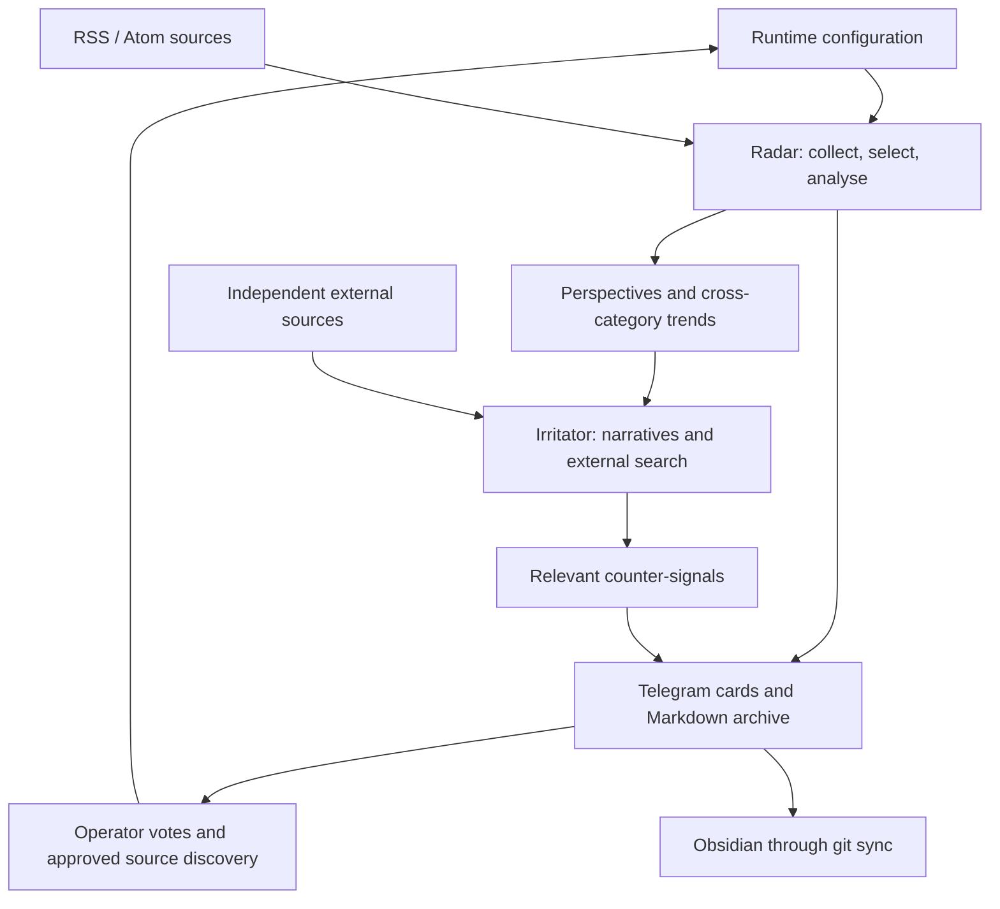

# Daily News Digest

A personal information-intake tool for a technology architect: **Radar** finds and
explains relevant developments, **Irritator** looks for external evidence that challenges
the prevailing narrative, and feedback helps shape the next reading list.

Collect RSS/Atom feeds, compare perspectives, deliver article cards to Telegram, and
keep a Markdown archive for Obsidian through git sync. Run on GitHub Actions without
a VPS or a continuously running service. Provider choice and runtime configuration
belong to the operator; free quotas are constraints, not guarantees of availability.

## Why Digest

A useful reading list should sharpen your judgment, not just compress more headlines.
Digest starts with sources you care about, connects developments across categories,
and deliberately looks for evidence outside that selection.

- **Radar:** what changed, why it matters, and which source is worth your time
- **Three perspectives:** an Optimist, a Skeptic and a Realist examine important topics
  through different reasoning, so enthusiasm does not become the only lens
- **Irritator:** what challenges the story you are being told, found through external
  sources rather than manufactured disagreement
- **A learning reading habit:** vote on articles, review proposed feeds, and evolve your
  source portfolio while keeping the operator in control
- **A durable personal archive:** read in Telegram today and revisit the connections in
  Obsidian later

That is the product intent. The current implementation and its open quality gaps are
stated below so the intended reading experience is not mistaken for a completed guarantee.

## Architecture


```mermaid
flowchart TD
    CFG[Runtime configuration] --> RADAR[Radar: collect, select, analyse]
    RSS[RSS / Atom sources] --> RADAR
    RADAR --> PERSPECTIVES[Perspectives and cross-category trends]
    RADAR --> DELIVERY[Telegram cards and Markdown archive]
    PERSPECTIVES --> IRRITATOR[Irritator: narratives and external search]
    EXTERNAL[Independent external sources] --> IRRITATOR
    IRRITATOR --> COUNTER[Relevant counter-signals]
    COUNTER --> DELIVERY
    DELIVERY --> FEEDBACK[Operator votes and approved source discovery]
    FEEDBACK --> CFG
    DELIVERY --> OBS[Obsidian through git sync]
```

These are complementary product loops. Different model opinions do not replace
Irritator's external evidence. Source reliability is not the same as relevance,
popularity is not contradiction, and quotation matching does not prove a whole
article was understood. Read the [Digest domain overview](docs/domain/digest/overview.md),
[Irritator domain overview](docs/domain/irritator/overview.md) and
[current architecture](docs/ARCHITECTURE.md) for contracts and known gaps.

## Project status

The package version is **2.0.0**. Product rehabilitation is tracked in
[#91](https://github.com/Lenivvenil/digest/issues/91); a successful API response or test
suite does not establish editorial quality. Full-source quality work in
[draft #93](https://github.com/Lenivvenil/digest/pull/93) is **not part of main**.
[#55](https://github.com/Lenivvenil/digest/issues/55) awaits real-output verification.
[#94](https://github.com/Lenivvenil/digest/issues/94) covers English productization and
optional post translation. This documentation change does not enable a new pipeline.

This is the **engine repository**. Your separate runtime repository holds configuration,
secrets references, schedules, `.cache/` and generated `digests/`; see
[ADR-0002](docs/decisions/0002-engine-instance-split.md). Cloning this repository does
not install a daily schedule or configure a Telegram destination.

## LLM providers and fallback

`digest/llm.py` implements provider adapters, role-based routing, bounded retries and
fallback. The supported provider names are Anthropic, Gemini, Groq, Mistral and
DeepSeek. Configure only services and models you intend to use; fallback does not
establish that a service is free or has sufficient quota. If every eligible route
fails, the run reports failure or incomplete work rather than guaranteed delivery.

The category-analysis mode runs category work concurrently within configured limits,
then produces cross-category trends. `review.enabled` adds independent selection from
a shared RSS evidence packet. `review.review_led_only` prioritizes those selected
cards and defers supplementary work. See the [review runbook](docs/BLIND_REVIEW.md)
for its excerpt limits, incomplete outcomes and separate post-delivery stage.

### Category routing

Unrouted categories use the configured role/provider chain. A route can nominate a
provider and model for specific categories; missing credentials are handled by the
existing fallback rules. The model IDs below are placeholders, not recommendations:

```yaml
llm:
  providers:
    - name: gemini
      model: YOUR_GEMINI_MODEL_ID
      role: [summarize, rank_signals, fallback]
    - name: groq
      model: YOUR_GROQ_MODEL_ID
      role: [fallback]
  routing:
    - categories: [AI Engineering]
      provider: gemini
      model: YOUR_GEMINI_MODEL_ID
```

### Choosing models

Check the provider's current model availability, account entitlement, rate limits and
billing before a live run. Context capacity, tokens per minute, requests per day and
price are different constraints. A large context window does not imply a matching
free throughput budget. Do not assume a provider is better for banking or architecture
without representative output evidence. Never add a paid fallback to a free-only
runtime inadvertently.

## Quick start

### 1. Install the engine

Python **3.12 or newer** is required. From a checkout:

```sh
git clone https://github.com/Lenivvenil/digest.git
cd digest
python -m venv .venv
. .venv/bin/activate
python -m pip install .
python -m digest --help
```

For a separate runtime, install a reviewed immutable engine commit instead of following
`main` automatically. Keep the previous pin and runtime configuration for rollback.
Installing the engine alone does not register credentials or enable delivery.

### 2. Validate an example without credentials or external requests

The [example configuration](examples/config.example.yaml) has English output, no enabled
feeds and delivery disabled. It is deliberately safe for first configuration checks.

```sh
python -c "from digest.config import load_config; c = load_config('examples/config.example.yaml'); print('Configuration valid:', c.radar.language)"
python -m digest --config examples/config.example.yaml --dry-run --radar-only
```

This is an offline empty-input smoke check, **not** a demonstrated news digest. To
produce useful output, copy the example to your runtime's `config.yaml`, replace the
model placeholder and feed URL, enable a real feed, and configure its provider key.
Do not put runtime data or real credentials in this public engine repository.

### 3. Configure a live report-only run

Use environment variables for credentials. `.env.example` is a reference only: the
engine does **not** automatically load a `.env` file. Load credentials securely through
your shell or runner. Set only the providers you selected.

Run from an isolated runtime working directory so its local cache and output paths
cannot interfere with another instance:

```sh
python -m digest --config config.yaml --check
python -m digest --config config.yaml --dry-run --radar-only
```

`--check` probes feed URLs and checks expected environment variables; it is **not an
offline validation command** and does not establish editorial quality. `--dry-run`
can fetch sources and call configured models, consuming their quotas, while suppressing
normal digest delivery and saved digest output. Do not use it as a no-network probe.
Keep Telegram and Markdown delivery disabled until you review the output.

### 4. Enable delivery in your runtime

Create your own Telegram bot through the official BotFather flow and configure its
existing token and intended chat ID in your runtime's environment/Actions secrets.
Never paste a token into a committed URL, screenshot, issue or log. The engine sends
to `TELEGRAM_CHAT_ID`; it does not choose recipients for you.

Set `telegram.enabled: true` only when ready. Set `telegram.required: true` if a
Markdown archive alone must not count as successful delivery. Enable `obsidian` to
save Markdown files in the configured output directory and sync that runtime archive
to Obsidian. API acceptance confirms transport acceptance, not that a person read it.

### 5. Add a runtime workflow

The public engine's CI checks source code. The operator's runtime owns its schedule,
engine pin, secrets, persistence and delivery. There is no universal daily time in this
repository. Serialize runs that share state, preserve confirmed receipts and diagnostic
outcomes, and commit only intended runtime files. Use the
[architecture guide](docs/ARCHITECTURE.md) and [review runbook](docs/BLIND_REVIEW.md)
when enabling the separately reserved post-delivery stage.

## CLI reference

```sh
python -m digest [OPTIONS]
```

| Option | Behavior |
| --- | --- |
| No flags | Run configured collection, analysis and delivery; runtime workflow owns git persistence |
| `--config PATH` | Read YAML configuration; default `config.yaml` |
| `--dry-run` | Fetch/analyse and print results without normal Telegram/Markdown digest delivery; may call models |
| `--radar-only` | Print Radar summary and return before Irritator and normal Telegram/Markdown delivery; may still fetch sources/call models and, without `--dry-run`, poll feedback |
| `--verbose` | Enable debug logging; inspect logs before sharing them |
| `--check` | Validate configuration, check environment variables and probe feed URLs |
| `--discover` | Request source suggestions, validate them, persist candidates and send approval cards when configured |

## Sources and categories

Edit the runtime's `sources` list:

```yaml
sources:
  - name: My Feed
    url: https://example.com/feed.xml  # Replace before enabling
    category: Architecture
    enabled: false
    priority: 3
    recency_hours: 24
    trial: false
    trial_days: 7
```

Priority ranges from 1 to 5 and influences the legacy source-slot allocation. It is
not proof that an article is useful. Categories are operator-defined; banking/payments,
AI engineering, distributed systems, enterprise architecture and regional affairs are
examples from the project's original use, not mandatory presets shipped as a personal
profile. The public example contains no private source list.

<a id="обратная-связь-и-адаптивная-система"></a>

## Adaptive source management and feedback

The intended learning loop uses Telegram article votes, observed source behavior and
explicit base priorities. With adaptive processing enabled, source scores combine
reliability, productivity, description length and recency; trial sources receive a
separate allocation and may graduate or be demoted. See the architecture guide for
weights and state ownership.

Current main polls Telegram on an eligible pipeline run, not continuously. It couples
polling to `adaptive.enabled`; disabling adaptation also prevents that polling path.
A button therefore does not imply immediate acknowledgement or demonstrated influence
on the review-led selector. [#48](https://github.com/Lenivvenil/digest/issues/48) tracks
end-to-end feedback repair and acceptance. Preserve the product loop while describing
its current limitation honestly.

<a id="формат-дайджеста"></a>

## Digest format and perspectives

The category-summary path supports `radar.summary_style` values `analytical`, `brief`
and `detailed`. Set `radar.perspectives: true` to request Optimist, Skeptic and Realist
views for significant topics. Brief mode does not use the three-perspective format.
The views should offer different reasoning, not three tones repeating a headline.

Illustrative structure, **not a factual news item or benchmark**:

```text
Architecture
A source describes a new deployment mechanism — source link
A concise statement of the mechanism and its stated conditions.

🟢 Optimist — The opportunity, conditional on those conditions holding.
🔴 Skeptic — The unsupported assumption or relevant counter-evidence.
⚖️ Realist — The practical trade-off and what remains unknown.
```

Minor items can use a short analytical comment. Cross-category trends connect related
developments. Markdown output includes front matter for Obsidian. The review-led path
instead produces explicitly attributed model-selection cards from RSS evidence; its
current limitations are described in the review runbook. Neither format should invent
benefits, certainty or facts to fill a template.

<a id="автоматическое-обнаружение-источников"></a>

## External counter-signals and source discovery

Irritator extracts narratives, generates challenging queries, searches external sources
and ranks relevant contrary or complicating evidence. It should help the operator read
something outside the current information bubble. A failed search is not evidence that
no counter-signal exists. Supported adapter contracts and their current failures are
tracked in [#77](https://github.com/Lenivvenil/digest/issues/77).

`python -m digest --discover` separately proposes feeds for underrepresented categories,
checks their URLs, saves candidates and requests operator approval through Telegram.
Approved candidates enter the source lifecycle; runtime configuration and lifecycle
state are separate under [ADR-0003](docs/decisions/0003-source-state-split.md). Do not
assume an approval changes the engine repository or that a weekly schedule exists
without a corresponding runtime workflow.

## Cache and persistence

The runtime owns `.cache/` and the Markdown archive. No database or always-on service
is required. GitHub Actions persistence is the runtime workflow's responsibility.

| File | Purpose |
| --- | --- |
| `seen_articles.json` | Delivered/consumed article deduplication state |
| `source_stats.json` | Source observations and recent history |
| `feedback.json` | Votes, polling offset and article-to-source mapping |
| `pending_sources.json` | Source suggestions awaiting operator decisions |
| `source_state.json` | Trial/graduation/demotion lifecycle state |
| `source_category_map.json` | Category mapping for diagnostics |

Do not delete state as a retry mechanism. Distinguish confirmed failure from unknown
Telegram outcomes; a retry must not assume an uncertain send was safe to repeat.
Optional supplementary failures must remain visible and must not erase primary receipts.

## Language and translation status

This documentation and the new example are English. Current main supports
`radar.language: en` or `ru`; its legacy omitted-field default remains `ru`. Set the
language explicitly. Optional post translation is planned in #94 and is **not yet a
separate implemented setting**. Existing Russian runtimes must retain their explicit
configuration during migration. Original evidence is never translated in place.

## Development

```sh
python -m pip install -r requirements-dev.txt
make lint
make typecheck
make test
# Or all three:
make check
```

Optional local pre-commit hooks are configured in `.pre-commit-config.yaml`; install
only if you want them in your checkout. Follow [project principles](docs/principles.md),
[domain documentation](docs/domain/digest/overview.md) and the [ADR index](docs/decisions/README.md).
Unit tests use mocked external calls. Real-source usefulness and operational delivery
remain separate acceptance checks. Historical plans and diagnostics preserve their
original context; see [documentation status](docs/README.md).

## Environment variables

See [.env.example](.env.example). Missing keys disable matching provider routes; they do
not guarantee another route can succeed. Missing required Telegram credentials is a
failure, even when Markdown can be saved.

| Variable | Purpose |
| --- | --- |
| `ANTHROPIC_API_KEY` | Anthropic provider |
| `GEMINI_API_KEY` | Gemini provider |
| `GROQ_API_KEY` | Groq provider |
| `MISTRAL_API_KEY` | Mistral provider |
| `DEEPSEEK_API_KEY` | DeepSeek provider |
| `TELEGRAM_BOT_TOKEN` | Configured Telegram bot |
| `TELEGRAM_CHAT_ID` | Intended destination and supported owner checks |
| `REDDIT_CLIENT_ID`, `REDDIT_CLIENT_SECRET`, `REDDIT_USERNAME` | Optional existing Reddit adapter credentials |

## Releases and licensing

Use the package version, immutable commit and [changelog](CHANGELOG.md) together when
upgrading; a historical release entry is not proof that every current quality gate has
passed. Keep the previous engine pin and compatible runtime state for rollback.

**License unresolved:** this repository currently contains no LICENSE file or declared
package license. An owner-confirmed license is an outstanding release decision; this
document does not grant additional reuse or distribution rights.
