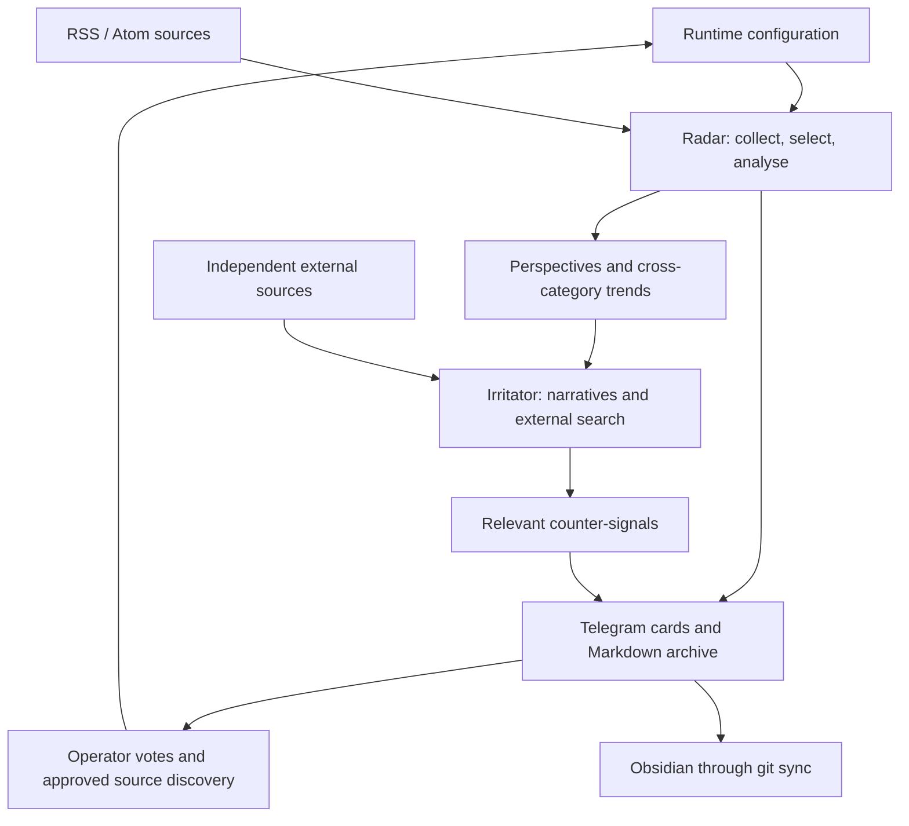

# Daily News Digest

A personal information-intake tool for a technology architect: **Radar** finds and
explains relevant developments, **Irritator** looks for external evidence that challenges
the prevailing narrative, and feedback helps shape the next reading list.

Collect RSS/Atom feeds, compare perspectives, deliver article cards to Telegram, and
keep a Markdown archive for Obsidian through git sync. Run on GitHub Actions without
a VPS or a continuously running service. Provider choice and runtime configuration
belong to the operator; free quotas are constraints, not guarantees of availability.

## Why Digest

A useful reading list should sharpen your judgment, not just compress more headlines.
Digest starts with sources you care about, connects developments across categories,
and deliberately looks for evidence outside that selection.

- **Radar:** what changed, why it matters, and which source is worth your time
- **Optional perspectives:** an Optimist, a Skeptic and a Realist can examine important topics
  through different reasoning, so enthusiasm does not become the only lens
- **Irritator:** what challenges the story you are being told, found through external
  sources rather than manufactured disagreement
- **A learning reading habit:** vote on articles, review proposed feeds, and evolve your
  source portfolio while keeping the operator in control
- **A durable personal archive:** read in Telegram today and revisit the connections in
  Obsidian later

That is the product intent. The current implementation and its open quality gaps are
stated below so the intended reading experience is not mistaken for a completed guarantee.

## Architecture


```mermaid
flowchart TD
    CFG[Runtime configuration] --> RADAR[Radar: collect, select, analyse]
    RSS[RSS / Atom sources] --> RADAR
    RADAR --> PERSPECTIVES[Perspectives and cross-category trends]
    RADAR --> DELIVERY[Telegram cards and Markdown archive]
    PERSPECTIVES --> IRRITATOR[Irritator: narratives and external search]
    EXTERNAL[Independent external sources] --> IRRITATOR
    IRRITATOR --> COUNTER[Relevant counter-signals]
    COUNTER --> DELIVERY
    DELIVERY --> FEEDBACK[Operator votes and approved source discovery]
    FEEDBACK --> CFG
    DELIVERY --> OBS[Obsidian through git sync]
```

These are complementary product loops. Different model opinions do not replace
Irritator's external evidence. Source reliability is not the same as relevance,
popularity is not contradiction, and quotation matching does not prove a whole
article was understood. Read the [Digest domain overview](docs/domain/digest/overview.md),
[Irritator domain overview](docs/domain/irritator/overview.md) and
[current architecture](docs/ARCHITECTURE.md) for contracts and known gaps.

## Project status

The package version is **2.0.0**. Product rehabilitation is tracked in
[#91](https://github.com/Lenivvenil/digest/issues/91); a successful API response or test
suite does not establish editorial quality. Full-source quality work in
[closed, unmerged PR #93](https://github.com/Lenivvenil/digest/pull/93) is **not part of main**.
[#55](https://github.com/Lenivvenil/digest/issues/55) remains open for useful, faithful
daily output and sustainable delivery. Mandatory complete-source processing was an
assistant-proposed mechanism, not an established owner requirement or closure gate.
[#94](https://github.com/Lenivvenil/digest/issues/94) covers English productization and
optional post translation, now implemented with explicit compatibility and recovery.
The current priority is one compact daily edition within the documented
[operating envelope](docs/domain/digest/overview.md#operating-envelope-and-daily-edition-decision--2026-10-02).
Compact delivery is implemented and deployed: a production edition confirmed five
articles in one Telegram chunk, with its archive and delivery state persisted.
Translation and recovery acceptance covers the observed cases described below;
editorial quality remains open in #55.

Full-source reading briefs are off by default. The `reading_brief` setting requires
English canonical text, review-led selection, and an explicitly configured model
route. Gemini 3.8 Flash uses an exact count; Groq GPT-OSS 120B supports a pinned
local tokenizer estimate with explicit framing headroom and output reserve. Unknown
profiles (including Qwen without a verified current framing profile) remain technical
pending. An unavailable route may use at most one other supported route already in
`llm.providers`, within the same deadline, pacing and request cap, without retries.
See [offline tokenizer preparation and accounting](docs/reading-brief-accounting.md).
Advertised context and the local request allowance do not establish free-account quota.
The draft integration runs only through `--prepare-edition`; unsupported preview/direct
publish modes stop before source/model work. It uses exact saved candidate selections and current occurrence
eligibility before source work. Completed pages become a technical evidence handoff
for #55; they do not publish concatenated draft prose or create an accepted edition.
Unknown generation outcomes hold across later invocations and route changes. Known
count uncertainty remains distinct from generation uncertainty. See proposed
[ADR0009](docs/decisions/0009-selected-source-admission.md) for lineage, legacy evidence
reuse and the proposed shared per-cycle request allocation. The finite factual-quality,
reconciliation and throughput gates remain open; reading stays off.

This is the **engine repository**. Your separate runtime repository holds configuration,
secrets references, schedules, `.cache/` and generated `digests/`; see
[ADR-0002](docs/decisions/0002-engine-instance-split.md). Cloning this repository does
not install a daily schedule or configure a Telegram destination.

## LLM providers and fallback

`digest/llm.py` implements provider adapters, role-based routing, bounded retries and
fallback. The supported provider names are Anthropic, Gemini, Groq, Mistral and
DeepSeek. Configure only services and models you intend to use; fallback does not
establish that a service is free or has sufficient quota. If every eligible route
fails, the run reports failure or incomplete work rather than guaranteed delivery.

The category-analysis mode runs category work concurrently within configured limits,
then produces cross-category trends. `review.enabled` adds independent selection from
a shared RSS evidence packet. `review.review_led_only` prioritizes those selected
cards and defers supplementary work. See the [review runbook](docs/BLIND_REVIEW.md)
for its excerpt limits, incomplete outcomes and separate post-delivery stage.

### Category routing

Unrouted categories use the configured role/provider chain. A route can nominate a
provider and model for specific categories; missing credentials are handled by the
existing fallback rules. The model IDs below are placeholders, not recommendations:

```yaml
llm:
  providers:
    - name: gemini
      model: YOUR_GEMINI_MODEL_ID
      role: [summarize, rank_signals, fallback]
    - name: groq
      model: YOUR_GROQ_MODEL_ID
      role: [fallback]
  routing:
    - categories: [AI Engineering]
      provider: gemini
      model: YOUR_GEMINI_MODEL_ID
```

### Choosing models

Check the provider's current model availability, account entitlement, rate limits and
billing before a live run. Context capacity, tokens per minute, requests per day and
price are different constraints. A large context window does not imply a matching
free throughput budget. Do not assume a provider is better for banking or architecture
without representative output evidence. Never add a paid fallback to a free-only
runtime inadvertently.

## Quick start

### 1. Install the engine

Python **3.12 or newer** is required. From a checkout:

```sh
git clone https://github.com/Lenivvenil/digest.git
cd digest
python -m venv .venv
. .venv/bin/activate
python -m pip install .
python -m digest --help
```

For a separate runtime, install a reviewed immutable engine commit instead of following
`main` automatically. Keep the previous pin and runtime configuration for rollback.
Installing the engine alone does not register credentials or enable delivery.

### 2. Validate an example without credentials or external requests

The [example configuration](examples/config.example.yaml) has English output, no enabled
feeds and delivery disabled. It is deliberately safe for first configuration checks.

```sh
python -c "from digest.config import load_config; c = load_config('examples/config.example.yaml'); print('Configuration valid:', c.radar.language)"
python -m digest --config examples/config.example.yaml --dry-run --radar-only
```

This is an offline empty-input smoke check, **not** a demonstrated news digest. To
produce useful output, copy the example to your runtime's `config.yaml`, replace the
model placeholder and feed URL, enable a real feed, and configure its provider key.
Do not put runtime data or real credentials in this public engine repository.

### 3. Configure a live report-only run

Use environment variables for credentials. `.env.example` is a reference only: the
engine does **not** automatically load a `.env` file. Load credentials securely through
your shell or runner. Set only the providers you selected.

Run from an isolated runtime working directory so its local cache and output paths
cannot interfere with another instance:

```sh
python -m digest --config config.yaml --check
python -m digest --config config.yaml --dry-run --radar-only
```

`--check` probes feed URLs and checks expected environment variables; it is **not an
offline validation command** and does not establish editorial quality. `--dry-run`
can fetch sources and call configured models, consuming their quotas, while suppressing
normal digest delivery and saved digest output. Do not use it as a no-network probe.
Keep Telegram and Markdown delivery disabled until you review the output.

### 4. Enable delivery in your runtime

Create your own Telegram bot through the official BotFather flow and configure its
existing token and intended chat ID in your runtime's environment/Actions secrets.
Never paste a token into a committed URL, screenshot, issue or log. The engine sends
to `TELEGRAM_CHAT_ID`; it does not choose recipients for you.

Set `telegram.enabled: true` only when ready. Set `telegram.required: true` if a
Markdown archive alone must not count as successful delivery. Enable `obsidian` to
save Markdown files in the configured output directory and sync that runtime archive
to Obsidian. API acceptance confirms transport acceptance, not that a person read it.

### 5. Add a runtime workflow

The public engine's CI checks source code. The operator's runtime owns its schedule,
engine pin, secrets, persistence and delivery. There is no universal daily time in this
repository. Serialize runs that share state, preserve confirmed receipts and diagnostic
outcomes, and commit only intended runtime files. Use the
[architecture guide](docs/ARCHITECTURE.md) and [review runbook](docs/BLIND_REVIEW.md)
when enabling the separately reserved post-delivery stage.

## CLI reference

```sh
python -m digest [OPTIONS]
```

| Option | Behavior |
| --- | --- |
| No flags | Run configured collection, analysis and delivery; runtime workflow owns git persistence |
| `--config PATH` | Read YAML configuration; default `config.yaml` |
| `--dry-run` | Fetch/analyse and print results without normal Telegram/Markdown digest delivery; may call models |
| `--radar-only` | Print Radar summary and return before Irritator and normal Telegram/Markdown delivery; may still fetch sources/call models and, without `--dry-run`, poll feedback |
| `--verbose` | Enable debug logging; inspect logs before sharing them |
| `--check` | Validate configuration, check environment variables and probe feed URLs |
| `--feedback-precollected` | Let a managed runtime own feedback ingestion; never poll again inside this digest process |
| `--discover` | Request source suggestions, validate them, persist candidates and send approval cards when configured |

## Sources and categories

Edit the runtime's `sources` list:

```yaml
sources:
  - name: My Feed
    url: https://example.com/feed.xml  # Replace before enabling
    category: Architecture
    enabled: false
    priority: 3
    recency_hours: 24
    trial: false
    trial_days: 7
```

Priority ranges from 1 to 5 and influences the legacy source-slot allocation. It is
not proof that an article is useful. Categories are operator-defined; banking/payments,
AI engineering, distributed systems, enterprise architecture and regional affairs are
examples from the project's original use, not mandatory presets shipped as a personal
profile. The public example contains no private source list.

<a id="обратная-связь-и-адаптивная-система"></a>

## Adaptive source management and feedback

The intended learning loop uses Telegram article votes, observed source behavior and
explicit base priorities. With adaptive processing enabled, source scores combine
reliability, productivity, description length and recency; trial sources receive a
separate allocation and may graduate or be demoted. See the architecture guide for
weights and state ownership.

Feedback is collected on eligible runs, independently of `adaptive.enabled`; there is
no continuously running bot service. The supported owner is the configured private
chat, and the sender must match that recipient. Group and inline callbacks are rejected
until an explicit ownership contract exists. Set `telegram.bot_username` to the plain
username of the same bot as your token to enable 👍/👎 vote links. Tap a vote, then
Telegram’s **Start** button to send it as an ordinary message; collection occurs on
the next run. A visible `/vote g <article-code>` or `/vote b <article-code>` command
is also available, including when no username is configured. Recognized vote data
and `/status` or `/bubble` command tags are retained, not arbitrary message bodies.

Votes and their polling offset are saved together before acknowledgement. On a managed
GitHub Actions runtime, run `python -m digest.feedback_poll collect`, commit and push
`.cache/feedback.json`, then run `python -m digest.feedback_poll ack --expected-sha256`
with the SHA256 of that exact committed file. Invoke the digest with
`--feedback-precollected` even if the optional feedback stage fails, so it cannot
consume another uncommitted batch. Direct local use saves strictly to local disk before
acknowledgement; that is not a guarantee of remote repository persistence.

Legacy callback buttons are best effort only: the official Telegram server queues
callbacks for about 150 seconds, so a sleeping batch bot cannot reliably receive them.
Message-based votes last longer, but ordinary messages are retained for at most
24 hours; delayed or failed schedules can still lose uncollected votes. See
[ADR-0006](docs/decisions/0006-batch-message-voting.md) for the source evidence and UX tradeoff.
Once a vote is durably recorded, later feed, model, delivery or UI-reply failures do
not remove it. Pending replies remain best effort and may be superseded by a later
successful collection. Corrupt state is preserved for diagnosis, not silently reset.
Unknown or stale cursor history uses one non-confirming read without an offset before
re-anchoring; it never blindly confirms updates using an old high offset. See the
[Telegram update contract](https://core.telegram.org/bots/api#getupdates).

With automatic adaptation disabled, source feedback alone can adjust configured
priorities within the existing bounds; unrated sources retain their configured priority.
The latest valid vote per article is effective; repeated taps change an opinion rather
than amplify it. Raw rating history follows the existing retention policy, and raw
votes are never model input. This affects the candidate pool, not a guarantee that
an individual article will be selected. Automatic trial decisions remain disabled with adaptation.
Source proposals use Add/Reject links followed by Telegram's Start button, or the
`/source ok HASH` and `/source no HASH` command fallback. A private owner message
records a decision only for one matching proposal, with its URL hash and age (0–30
days) checked during collection and application. The saved decision binds the exact
proposal; historical unbound decisions cannot authorize a later replacement.
One batch receipt reports decisions saved, not sources added. Approved sources are
applied before feed collection, even when the digest is empty or later fails;
config/backup failures retain the decision for retry. Ordinary decision messages
have the same at-most-24-hour Telegram retention limit as votes.
[#48](https://github.com/Lenivvenil/digest/issues/48)
tracks operational acceptance of this learning loop.

<a id="формат-дайджеста"></a>

## Digest format and perspectives

The category-summary path supports `radar.summary_style` values `analytical`, `brief`
and `detailed`. Set `radar.perspectives: true` to request Optimist, Skeptic and Realist
views for significant topics. Brief mode does not use the three-perspective format.
The views should offer different reasoning, not three tones repeating a headline.

Illustrative structure, **not a factual news item or benchmark**:

```text
Architecture
A source describes a new deployment mechanism — source link
A concise statement of the mechanism and its stated conditions.

🟢 Optimist — The opportunity, conditional on those conditions holding.
🔴 Skeptic — The unsupported assumption or relevant counter-evidence.
⚖️ Realist — The practical trade-off and what remains unknown.
```

Minor items can use a short analytical comment. Cross-category trends connect related
developments. Markdown output includes front matter for Obsidian. The review-led path
instead produces explicitly attributed model-selection cards from RSS evidence; its
current limitations are described in the review runbook. Neither format should invent
benefits, certainty or facts to fill a template.

An optional humane final story is implemented behind `closing.enabled: false`
for compact review-led edition preparation. It uses one validated selection from
the existing evidence packet and explicit eligible feed bindings; it adds no
selection request and preserves the main-card cap. Source approval, attribution
review and finite editorial/capacity acceptance are still required. Closing prose
can join an existing translation request only when it fits without displacing main
fields; invalid optional output preserves valid main translation. Exact NHS/Environment
Agency feed attribution is added only to presentation, including ordinary main cards
from those feeds. A split optional credit omits the closer; missing required proof
or a split main credit holds preparation before sending. Source activation remains
unapproved, and sparse feed supply does not establish a daily positive story. See
[ADR-0014](docs/decisions/0014-optional-humane-closing-item.md) for configuration,
recovery boundaries and the remaining #127 acceptance work.

<a id="автоматическое-обнаружение-источников"></a>

## External counter-signals and source discovery

Irritator extracts narratives, generates challenging queries, searches external sources
and ranks relevant contrary or complicating evidence. It should help the operator read
something outside the current information bubble. A failed search is not evidence that
no counter-signal exists. Supported adapter contracts and their current failures are
tracked in [#77](https://github.com/Lenivvenil/digest/issues/77).

`python -m digest --discover` separately proposes feeds by rotating configured exploration areas,
checks their URLs, saves candidates and requests operator approval through Telegram.
Discovery targets a configurable list that includes professional source refresh and
broader disciplines, independent of the active professional source portfolio:

```yaml
discovery:
  exploration_areas:
    - fintech/banking/architecture
    - science
    - society/institutions
    - history/culture
    - environment
    - design
```

These are provisional defaults when the section is absent, not historical preferences
or an owner-mandated proportion. Professional refresh stays eligible; cross-field
requests do not require a contrived technology, finance or banking connection.
Use 1–16 distinct nonempty names, at most 80 characters each. Within each complete
pass through this list, discovery prefers the least recently offered area, breaking
ties in configured order. Empty or failed attempts advance the pass without counting
as offers, so an unavailable field cannot monopolize every generation. Confirmed
Telegram messages and uncertain possible sends remain distinguishable; reservations
and explicit API rejections do not count as offers. Requested areas are not verified
classifications or evidence of semantic novelty.

Approved candidates enter the source lifecycle; runtime configuration and lifecycle
state are separate under [ADR-0003](docs/decisions/0003-source-state-split.md). Do not
assume an approval changes the engine repository or that a weekly schedule exists
without a corresponding runtime workflow.

Discovery retains one logical generation on at most two configured routes, three feed
checks/offers and a 2,048-token output limit. An invalid pending proposal consumes its
current check, then skips one later eligible prepare cycle before retry; managed run
retries do not consume that skip. Expiry and exact approval identity stay unchanged.
See the [discovery state contract](docs/ARCHITECTURE.md#trial-source-lifecycle-and-discovery).

This is the first proposal-generation slice of [#132](https://github.com/Lenivvenil/digest/issues/132).
It leaves active feeds and daily candidate scheduling unchanged. Approval still adds
a priority-3 trial source; protection of important fintech/banking/architecture work
after admission remains open. `adaptive.trial_slots` alone does not enforce that
protection. Ordinary delivered recommendations still need editorial evaluation.

## Cache and persistence

The runtime owns `.cache/` and the Markdown archive. No database or always-on service
is required. GitHub Actions persistence is the runtime workflow's responsibility.

| File | Purpose |
| --- | --- |
| `seen_articles.json` | Delivered/consumed article deduplication state |
| `source_stats.json` | Source observations and recent history |
| `feedback.json` | Votes, polling offset and article-to-source mapping |
| `pending_sources.json` | Source suggestions awaiting operator decisions |
| `discovery_delivery.json` | Proposal delivery receipts/history, exploration attempts/offers and validation cooldowns |
| `source_state.json` | Trial/graduation/demotion lifecycle state |
| `source_category_map.json` | Category mapping for diagnostics |

Do not delete state as a retry mechanism. Distinguish confirmed failure from unknown
Telegram outcomes; a retry must not assume an uncertain send was safe to repeat.
Optional supplementary failures must remain visible and must not erase primary receipts.

## Language and optional post translation

An absent `translation` section preserves the legacy direct-generation behavior:
`radar.language` accepts `en` or `ru`, and its omitted-field default remains `ru`.
Existing Russian runtimes gain no additional model calls simply by upgrading.

For a new explicit presentation configuration, use canonical English and opt in:

```yaml
radar:
  language: en
translation:
  enabled: true
  target_language: ru
  provider: gemini             # Must exist in llm.providers or an explicit review route
  model: YOUR_GEMINI_MODEL_ID  # Exact match to that configured provider/model
  max_calls: 1                # Per presentation pass, without HTTP retries
  timeout_seconds: 90         # Explicit total budget; accommodates a 65-second shared interval
  max_output_tokens: 2048
  max_input_chars: 12000
```

Generated card summaries, category-summary prose and published Irritator narratives
and reasoning are translated. **Original titles, source metadata, literal quotations
and raw reviews/evidence remain canonical.** Translation targets do not change analysis,
review evidence or external-search queries. Enabling translation with explicit
`radar.language: ru` is an error: either retain legacy direct Russian generation with
translation absent, or explicitly migrate generation to English and enable translation.
A new explicit translation section with no generation-language setting uses English;
changing the target does not change that generation language.

The route is pinned to the configured provider/model, with no automatic fallback to
another provider or retry. Check its account entitlement before enabling live use;
configuration alone cannot prove that calls are free. Allowances limit optional
translation work, not article selection. Too-large text or exhausted allowance keeps
the original canonical publication with a visible status.

The default total timeout is 90 seconds; explicit values up to 180 seconds are accepted.
If the shared provider interval is 65 seconds, choose a budget that includes that wait
and the HTTP request, as in the example. A known wait beyond the remaining budget
creates no attempt record and no request, so later eligible processing can continue.
Explicit timeout values are respected, including an existing 30-second setting.
The separate post-delivery process shares analysis pacing and has an overall processing
allowance of 180 + min(translation timeout, 45) seconds, then the existing 30-second
dispatch allowance. Translation is clipped to both its configured deadline and that
shared deadline. This leaves room for a short translation after a normally paced
three-call analysis, but does not guarantee it; exhausted time retains canonical text.
Workflow/job timeouts and schedules are unchanged. The process saves original analysis
before translating, in its canonical `.irritator.json` archive; translated Markdown
retains those original stage diagnostics. Supplement translation records live beside
that archive in `.translations/` and must be persisted for reuse across runners.

Preview primary presentation without running Irritator:

```sh
python -m digest --config config.yaml --dry-run --radar-only
```

This may consume source/model quotas; it is not an offline command.

Compatible translated batches are cached in runtime `.cache/translations/`. Keep this
state private and persist it with the runtime if reuse across runners is required.
Completed batches can be reused while later batches finish. A failed or interrupted model attempt ends translation for that canonical version: the
English fallback may already have been delivered, so it is not automatically replaced
or resent. Inspect the record before choosing an explicit retry. New canonical text,
target, model or prompt uses a separate key; the feature is not disabled globally. Do not delete delivery state to retry
translation. Dry-run uses temporary translation storage and can consume model quota.

Both Telegram and Markdown receive the same generated-text presentation. Structural
checks preserve field IDs, numeric literals, URLs and recognized quotation/code spans;
they cannot prove that every qualifier or meaning survived. Machine-translated text
is labelled accordingly, and incomplete translation falls back to canonical English.
A draft does not become fact-verified through translation. A narrow real fixture and
an ordinary archived narrative using prompt v2 passed independent comparison. A
production rate-limit failure preserved every canonical field and showed one fallback
notice in the compact edition. That edition was delivered in English; this evidence
does not claim a Russian Telegram delivery, general fidelity, or validation of every
technical term and data-flow direction. This presentation feature
does not require completing the separate #55 redesign, and does not claim to solve it.
See [ADR-0005](docs/decisions/0005-optional-presentation-translation.md).

## Compact daily presentation

Set `telegram.delivery_mode: compact` to assemble selected articles into one logical
edition. Omitted settings preserve legacy per-article cards. Long editions use
necessary Telegram chunks without cutting selected text or source URLs. Indexed
vote buttons keep the same article identity and URL → Start interaction. Translation
and model-attribution notices appear once per issue. Optional Irritator/comparison
work remains in the archive with its real status, without extra Telegram pushes.

Managed compact delivery separates preparation from sending:

```sh
python -m digest --config config.yaml --feedback-precollected --prepare-edition
# Commit/push preparation, archive and .cache/prepared_edition.json; verify its remote SHA256.
python -m digest --config config.yaml --edition-phase claim --ready-sha "$READY_SHA"
# Commit/push .cache/prepared_edition_claim.json; verify ready + claim hashes from the same revision.
python -m digest --config config.yaml --edition-phase send --ready-sha "$READY_SHA" --claim-sha "$CLAIM_SHA"
# Commit/push receipts and confirmed feedback/dedup state together.
```

Preparation saves accepted canonical analysis before presentation, then freezes exact
Telegram payloads, buttons, article coverage, archive hashes, recipient and UTC expiry.
The sender performs no collection, model request, translation or rendering. A supported
manifest survives model/prompt changes; an expired, corrupt or wrong-recipient edition
cannot send. No ready edition produces an explicit status, without a raw-feed fallback.

The default intended publication day is today in UTC. `--edition-date YYYY-MM-DD`
explicitly prepares a later UTC day's edition, including after today's delivery is
confirmed. Its creation timestamp is separate from its publication window: it remains
`pending_window` and cannot be claimed or sent before that day's 00:00 UTC. Expiry is
the end of the intended day, not creation plus 24 hours. A current-day edition prepared
at 23:59 expires at 00:00; a tomorrow edition remains eligible through tomorrow. No
new schedule or automatic choice of a future publication day is introduced.

The managed workflow owns the remote Git barriers. A local hash alone proves no remote
durability. Its second job can inspect a previously persisted eligible edition after
preparation fails. Feedback collection/persistence/acknowledgement remains independent.
Claims are created only after readiness. A claim with unknown transport or unfinished
state persistence holds publication for inspection. Confirmed current-day editions
are no-ops. Legacy unresolved compact markers also remain holds during migration.
Do not delete a marker or replay uncertain delivery. Exact-once delivery is not promised.
See [ADR0007](docs/decisions/0007-compact-issue-reservation.md) for migration and recovery.
The ready boundary does not activate experimental full-source analysis.

### Candidate coverage during preparation

Review-led edition preparation records every observed eligible RSS identity before
source-slot and review-packet limits. It uses one existing bounded primary packet per
fresh preparation window, saves its exact result, and continues later eligible candidates on a
subsequent fresh preparation. An existing accepted snapshot or ready/held edition
still takes precedence. Selected cards can proceed without waiting for all candidates.

Private `.cache/candidate_progress.json` and the archive's `.candidates.json` sibling
separate observed, planned, selected, metadata-rejected, duplicate and technically
unfinished records. The same model response supplies per-item reasons and retained
IDs; missing/invalid dispositions and capacity-only omissions stay unfinished.
Legacy responses retain their unselected-without-reason limitation. Feed parsing limits and exclusions remain explicit. This is
RSS metadata selection, not complete-source reading or proof that throughput matches
incoming volume. Current source, recency, blocklist and delivered-history rules apply
to saved candidates; no new retention TTL or extra model call is introduced. A candidate-specific 32 MB
current-work safety limit fails explicitly rather than deleting evidence. Exact source
objects are stored once, and each immutable report contains only its own packet and
current collection accounting. Per-identity history stays outside current-work admission;
unresolved work and reversible policy exclusions remain recoverable. Total archive
storage still grows with new evidence. The bounded preparation and evidence-storage
decision is accepted in [ADR0008](docs/decisions/0008-candidate-selection-progress.md);
#121 retains separate semantic, ordinary-runtime and throughput acceptance.

A valid primary abstention retains #120's accepted empty snapshot for its publication
day. New candidate responses with only deferred/missing/invalid dispositions do not
qualify as accepted empty decisions; existing legacy snapshots remain compatible. Repeating preparation in that window returns no ready edition; it does not
advance another packet. Unseen work can advance in a later fresh preparation window.
This inherited limit is part of the remaining throughput acceptance, not a claim
that all observed candidates received an editorial decision.

## Development

```sh
python -m pip install -r requirements-dev.txt
make lint
make typecheck
make test
# Or all three:
make check
```

Optional local pre-commit hooks are configured in `.pre-commit-config.yaml`; install
only if you want them in your checkout. Follow [project principles](docs/principles.md),
[domain documentation](docs/domain/digest/overview.md) and the [ADR index](docs/decisions/README.md).
Unit tests use mocked external calls. Real-source usefulness and operational delivery
remain separate acceptance checks. Historical plans and diagnostics preserve their
original context; see [documentation status](docs/README.md).

## Environment variables

See [.env.example](.env.example). Missing keys disable matching provider routes; they do
not guarantee another route can succeed. Missing required Telegram credentials is a
failure, even when Markdown can be saved.

| Variable | Purpose |
| --- | --- |
| `ANTHROPIC_API_KEY` | Anthropic provider |
| `GEMINI_API_KEY` | Gemini provider |
| `GROQ_API_KEY` | Groq provider |
| `MISTRAL_API_KEY` | Mistral provider |
| `DEEPSEEK_API_KEY` | DeepSeek provider |
| `TELEGRAM_BOT_TOKEN` | Configured Telegram bot |
| `TELEGRAM_CHAT_ID` | Intended destination and supported owner checks |
| `REDDIT_CLIENT_ID`, `REDDIT_CLIENT_SECRET`, `REDDIT_USERNAME` | Optional existing Reddit adapter credentials |

## Releases and licensing

Use the package version, immutable commit and [changelog](CHANGELOG.md) together when
upgrading; a historical release entry is not proof that every current quality gate has
passed. Keep the previous engine pin and compatible runtime state for rollback.

Before rolling back, verify that the chosen engine/configuration can interpret retained
runtime state. Preserve delivery receipts, dedup/feedback state, translation records and
compact issue reservations. Hold publication if compatibility is uncertain or an issue
is unresolved; inspect confirmed and unknown delivery outcomes before proceeding.
Rolling back is not a reason to reset state or resend an existing edition.

**No software license grant is currently supplied.** This repository contains no
LICENSE file or declared package license. This is the current release state, not an
implied open-source license. A future license grant would require an explicit owner
decision; it is not a prerequisite for the existing personal runtime milestone.
