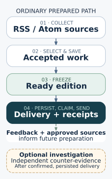

# Daily News Digest

**A personal reading list for banking, fintech and architecture, with room to look beyond work.**

Turn your RSS sources into selected reading with a reason to open the original.
Read in Telegram; keep a Markdown archive for Obsidian.

[Try it safely](#try-it-safely) · [Run your runtime](docs/BLIND_REVIEW.md#runtime-configuration) · [Recover an edition](docs/BLIND_REVIEW.md#delivery-states-and-recovery)

## A glance at an edition

> **FICTIONAL EXAMPLE · BANKING / ARCHITECTURE**
>
> ### A payment queue survives a settlement-service outage
>
> [Original-source link · trial note](https://example.com/) · Placeholder URL
>
> The trial keeps accepting payment requests while settlement is unavailable.
> For an architect, the useful detail would be how it reconciles balances and handles
> duplicate requests once the service returns.
>
> **Keep in mind:** The trial supplies no production-scale or recovery measurements;
> it would not establish that the design is ready to deploy.

*Illustrative format only. This is not actual news or production-quality evidence.*

<a id="why-digest"></a>

## More than a list of headlines

- **A reason to read.** The ordinary review-led path selects attributed cards from
  bounded RSS evidence. Source links let you inspect the original; a card does not
  imply that the whole article was read.
- **Room to question the story.** Optional [Irritator investigation](docs/BLIND_REVIEW.md#supplementary-investigation)
  looks for independent external evidence that challenges or complicates a claim.
  A second model opinion is a different kind of analysis.
- **A reading list that can evolve.** [Votes and source proposals](docs/BLIND_REVIEW.md#feedback-and-source-decisions)
  inform future preparation. New sources need operator approval, with room to
  explore science, culture, society and other fields alongside the professional radar.

There is also an optional [humane closing story](docs/decisions/0014-optional-humane-closing-item.md):
a small moment of kindness, connection or everyday wonder when suitable evidence
exists. It is off by default and needs approved sources; it is not a daily promise.

Prefer broader synthesis? The supported [category-summary mode](docs/BLIND_REVIEW.md#legacy-format-and-optional-features)
offers cross-category trends and opt-in Optimist, Skeptic and Realist perspectives,
separately from ordinary review-led cards.

<a id="quick-start"></a>
<a id="1-install-the-engine"></a>
<a id="2-validate-an-example-without-credentials-or-external-requests"></a>

## Try it safely

Use **Python 3.12+**. From a checkout, install the engine and try the
[disabled example](examples/config.example.yaml):

```sh
git clone https://github.com/Lenivvenil/digest.git
cd digest
python -m venv .venv
. .venv/bin/activate
python -m pip install .
python -m digest --config examples/config.example.yaml --dry-run --radar-only
```

Installation downloads dependencies. The final command is an **offline, empty-input
smoke check**: no enabled feeds, model requests or delivery, and no news edition.
The feed URL and model ID are placeholders. Use `python -m digest --help` to explore
available commands.

<a id="3-configure-a-live-runtime"></a>

### Ready for real sources?

Follow [live runtime setup](docs/BLIND_REVIEW.md#runtime-configuration) to choose
model routes, enable sources and review output before enabling delivery. This is
the engine repository; keep configuration, secrets, schedules and saved state in a
separate runtime. The engine does not automatically load `.env` or create a schedule.

**Live previews can make external calls:** `--check` probes feeds and `--dry-run`
can fetch sources and call models, consuming quotas. Compact delivery requires the
managed [prepare → persist → claim → send sequence](docs/BLIND_REVIEW.md#persist-claim-and-send).
Enabling Telegram alone does not make a plain `python -m digest` publishable.

<a id="architecture"></a>

## How it works

[](docs/ARCHITECTURE.md#prepared-edition-data-flow)

**Preparation** saves accepted editorial work before freezing the edition.
**The runtime** persists readiness and a claim before sending.
**Publication** records confirmed receipts and applies known coverage; the runtime
preserves the resulting state. Interrupted or uncertain delivery needs inspection.

The map follows the ordinary prepared path, not every mode or recovery outcome.
The [canonical lifecycle](docs/ARCHITECTURE.md#prepared-edition-data-flow) owns the
sequence and boundaries. [Full-source reading](docs/BLIND_REVIEW.md#experimental-source-reading)
is experimental, off by default and unnecessary for ordinary RSS-review cards.

<a id="find-the-right-guide"></a>

## Choose your next step

- **[Run your runtime](docs/BLIND_REVIEW.md#runtime-configuration)** — sources, models,
  language and delivery settings
- **[Recover an edition](docs/BLIND_REVIEW.md#delivery-states-and-recovery)** — inspect
  saved evidence and choose a safe next action
- **[Change the engine](.github/CONTRIBUTING.md)** — make a focused, tested contribution

[All documentation](docs/README.md) · [Domain story](docs/domain/digest/overview.md#one-story-through-the-system) · [Architecture decisions](docs/decisions/README.md)

<a id="development"></a>

<details>
<summary><strong>Development setup and checks</strong></summary>

After the installation above:

```sh
python -m pip install -r requirements-dev.txt
make check
```

`make check` runs lint, type checking and tests; `make lint`, `make typecheck` and
`make test` run them separately. Unit tests mock external calls. Read the
[working agreement](AGENTS.md#working-agreement) and
[definition of done](docs/principles.md#definition-of-done) before changing a contract.

</details>

<a id="releases-and-licensing"></a>

## Status and license

A runtime can run on GitHub Actions without a VPS. Model access still requires an
entitled provider route, and provider quotas or charges apply; free operation is
not guaranteed. Useful, faithful daily output is still being validated under
[#55](https://github.com/Lenivvenil/digest/issues/55).
Passing tests and confirmed delivery establish narrower facts.

Use the [package version](pyproject.toml), an immutable engine commit and the
[changelog](CHANGELOG.md) together. Follow [upgrade and retained-state guidance](docs/BLIND_REVIEW.md#upgrades-and-retained-state)
before changing a runtime pin.

**No software license grant is supplied.** The repository has no LICENSE file or
declared package license; a grant needs an explicit owner decision.

<a id="earlier-readme-section-links"></a>
<a id="3-configure-a-live-report-only-run"></a>
<a id="4-enable-delivery-in-your-runtime"></a>
<a id="5-add-a-runtime-workflow"></a>
<a id="cli-reference"></a>
<a id="project-status"></a>
<a id="llm-providers-and-fallback"></a>
<a id="category-routing"></a>
<a id="choosing-models"></a>
<a id="experimental-source-reading"></a>
<a id="sources-and-categories"></a>
<a id="обратная-связь-и-адаптивная-система"></a>
<a id="adaptive-source-management-and-feedback"></a>
<a id="формат-дайджеста"></a>
<a id="digest-format-and-perspectives"></a>
<a id="автоматическое-обнаружение-источников"></a>
<a id="external-counter-signals-and-source-discovery"></a>
<a id="cache-and-persistence"></a>
<a id="language-and-optional-post-translation"></a>
<a id="compact-daily-presentation"></a>
<a id="candidate-coverage-during-preparation"></a>
<a id="environment-variables"></a>

<details>
<summary><strong>Following an older README link? Find its current guide</strong></summary>

These retained section anchors lead here. Open the relevant guide:

- **Setup and CLI:** [live runtime and workflow](docs/BLIND_REVIEW.md#runtime-configuration),
  [CLI](docs/BLIND_REVIEW.md#cli-options), [environment variables](docs/BLIND_REVIEW.md#environment-variables)
- **Models and sources:** [model/category routes](docs/BLIND_REVIEW.md#model-routes),
  [source settings](docs/BLIND_REVIEW.md#sources-and-categories),
  [experimental source reading](docs/BLIND_REVIEW.md#experimental-source-reading)
- **Reading and presentation:** [format and perspectives](docs/BLIND_REVIEW.md#legacy-format-and-optional-features),
  [language and translation](docs/BLIND_REVIEW.md#language-and-optional-post-translation),
  [compact delivery](docs/BLIND_REVIEW.md#delivery-settings)
- **Feedback and exploration:** [feedback/source decisions](docs/BLIND_REVIEW.md#feedback-and-source-decisions),
  [external investigation](docs/BLIND_REVIEW.md#supplementary-investigation),
  [source discovery](docs/BLIND_REVIEW.md#source-discovery)
- **Saved work and delivery:** [persisted state](docs/ARCHITECTURE.md#cache-architecture),
  [candidate continuation](docs/BLIND_REVIEW.md#candidate-continuation),
  [persist, claim and send](docs/BLIND_REVIEW.md#persist-claim-and-send)
- **History:** [prior README and dated status](docs/history/readme-2026-10-08.md#project-status)

</details>
