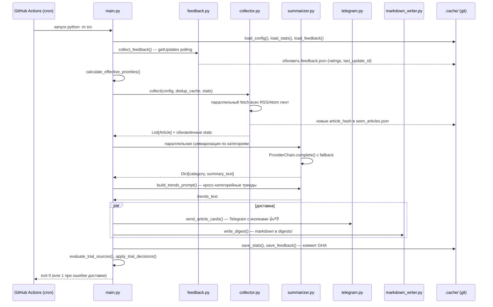

# Architecture — Daily News Digest v1.0.0

## Overview

Персональный генератор ежедневного новостного дайджеста. Работает полностью на GitHub Actions — без VPS, без постоянно запущенных процессов. Состояние между запусками хранится в JSON-файлах, которые коммитятся обратно в репозиторий.

---

## Data Flow

Полный путь от cron-триггера до доставки:



---

## Модули и ответственности

| Модуль | Ответственность |
|--------|----------------|
| `main.py` | Оркестрация всего пайплайна. CLI-флаги (`--config`, `--dry-run`, `--verbose`, `--discover`, `--check`). Логика exit-кода. |
| `config.py` | Загрузка и валидация `config.yaml`. Строгая проверка всех полей с понятными ошибками. Dataclasses: `Config`, `SourceConfig`, `AdaptiveConfig`, `LLMConfig`. |
| `collector.py` | Параллельный fetch RSS/Atom лент через `httpx`. Парсинг через `feedparser`. Дедупликация по MD5(title|link). Slot allocation по приоритетам. |
| `summarizer.py` | Абстракция LLM-провайдеров (Anthropic, Gemini, Groq, Mistral, DeepSeek). `ProviderChain` с автоматическим fallback. Prompt building (категории + тренды). |
| `telegram.py` | Доставка через Telegram Bot API. Разбивка на карточки по статьям с inline-кнопками 👍/👎. Retry-логика. |
| `feedback.py` | Polling Telegram getUpdates. Парсинг callback-запросов (`fb:a:g:{hash}`, `fb:a:b:{hash}`). Хранение оценок в `feedback.json`. |
| `source_scorer.py` | Вычисление quality score по 4 метрикам. `calculate_effective_priorities()`. Обнаружение trending-источников. Trial source evaluation. |
| `discovery.py` | LLM-генерация кандидатов источников для недопредставленных категорий. Валидация feed URL. Хранение в `pending_sources.json`. Отправка approval-кнопок в Telegram. |
| `markdown_writer.py` | Запись дайджеста в `digests/YYYY-MM-DD.md` с YAML front matter для Obsidian. |
| `_dns_pinning.py` | SSRF-защита: DNS pinning для всех исходящих HTTP-запросов. Блокирует запросы к internal IP ranges (RFC1918). |
| `_sanitize.py` | Очистка HTML/текста из feed-контента перед передачей в LLM. |
| `_util.py` | `atomic_json_write()` — атомарная запись JSON через временный файл + rename, предотвращает корруп цию при сбое. |

---

## Adaptive Priority System

Когда `adaptive.enabled: true`, система автоматически корректирует приоритеты источников перед каждым запуском.

### Формула

```
base_norm = source.priority / 5.0          # нормализованный базовый приоритет [0.0..1.0]
score     = calculate_score(stats)          # качество источника [0.0..1.0]
feedback  = feedback_score или 0.5         # пользовательская оценка [0.0..1.0]

weighted = base_norm  * base_weight        # веса из config: base_weight + score_weight + feedback_weight = 1.0
         + score      * score_weight
         + feedback   * feedback_weight

effective_priority = round(min_priority + weighted * (max_priority - min_priority))
if source in trending: effective_priority += 1  # trend bonus
effective_priority = clamp(min_priority, max_priority)
```

### Настройка весов (config.yaml)

```yaml
adaptive:
  enabled: true
  feedback_weight: 0.3   # влияние реакций 👍/👎 от пользователя
  score_weight: 0.5       # влияние автоматических метрик качества
  base_weight: 0.2        # влияние базового приоритета из config
  trial_slots: 4          # отдельный бюджет слотов для trial-источников
  min_priority: 1
  max_priority: 5
```

---

## Source Quality Scoring

`calculate_score()` в `source_scorer.py` возвращает float [0.0..1.0] по 4 метрикам:

| Метрика | Вес | Как считается |
|---------|-----|--------------|
| **Reliability** | 0.3 | `successful_fetches / total_fetches` |
| **Productivity** | 0.3 | `articles_included / articles_found` (по последним 7 дням) |
| **Description quality** | 0.2 | `avg_description_length / 100` (cap 1.0 при ≥100 символов) |
| **Recency** | 0.2 | 1.0 если виден ≤3 дня назад, линейно убывает до 0 за 10 дней |

Новый источник без истории получает нейтральный score 0.5.

История ограничена 30 днями (скользящее окно `HISTORY_MAX_DAYS = 30`).

---

## LLM Provider Chain

### Fallback

```
ProviderChain([primary, fallback1, fallback2, ...])
  → пробует primary
  → при ошибке (HTTP 4xx/5xx, timeout, rate limit) — следующий в цепочке
  → если все провайдеры отказали — RuntimeError
```

### Category Routing

Каждая категория может быть маршрутизирована к конкретному провайдеру:

```yaml
llm:
  providers:                          # цепочка по умолчанию
    - name: "gemini"
      model: "gemini-2.5-flash"
    - name: "groq"
      model: "llama-3.3-70b-versatile"
  routing:                            # переопределение для отдельных категорий
    - categories: ["AI & LLM"]
      provider: "gemini"
      model: "gemini-2.5-flash"
    - categories: ["Architecture & Distributed Systems"]
      provider: "deepseek"
      model: "deepseek-chat"
```

Если API-ключ маршрутизированного провайдера отсутствует — используется цепочка по умолчанию.

Все категории обрабатываются **параллельно** через `asyncio.gather()`.

---

## Feedback Loop

```
Пользователь нажимает 👍/👎 на статью в Telegram
    ↓
Telegram сохраняет callback_query с data="fb:a:g:{article_hash}" или "fb:a:b:{article_hash}"
    ↓
collect_feedback() на следующем запуске дайджеста:
  - deleteWebhook (обеспечивает polling mode)
  - getUpdates с timeout=10 (long polling)
  - парсит callback_data → ArticleFeedback(article_hash, source_name, rating=+1/-1)
  - source_name берётся из article_source_map[article_hash] в feedback.json
    ↓
get_source_feedback_score(source_name) → float [0.0..1.0] (скользящее окно 14 дней)
    ↓
calculate_effective_priorities() учитывает feedback_score
    ↓
источник получает больше/меньше слотов в следующем digest
```

Оценки старше 30 дней автоматически удаляются при `save_feedback()`.

---

## Trial Source Lifecycle

```
1. DISCOVERY
   python -m src --discover
   → LLM генерирует кандидатов для категорий с < N источников
   → валидация feed URL (реальный HTTP-запрос)
   → сохранение в .cache/pending_sources.json
   → отправка в Telegram: кнопки [✅ Approve] [❌ Reject]

2. APPROVAL
   collect_feedback() парсит callback src:ok:{hash} или src:no:{hash}
   → store.source_decisions[hash] = "approved" | "rejected"

3. ACTIVATION
   apply_trial_decisions() в конце каждого digest run:
   → approved → добавляет источник в config.yaml с trial: true, trial_started: сегодня
   → rejected → удаляет из pending_sources.json

4. TRIAL PERIOD (по умолчанию 7 дней)
   Источник получает отдельный бюджет слотов (trial_slots из adaptive config)
   Не конкурирует с основными источниками за обычные слоты

5. EVALUATION (evaluate_trial_sources() после каждого digest)
   Через trial_days дней:
   → calculate_score() >= 0.5 → promote: убрать trial: true, сохранить в config
   → calculate_score() < 0.5  → disable: enabled: false в config
```

---

## Cache Architecture

Все файлы в `.cache/` **коммитятся в git** через GitHub Actions после каждого успешного запуска. Это единственный механизм персистентности — без базы данных, без внешнего хранилища.

| Файл | Содержимое | Очистка |
|------|-----------|---------|
| `seen_articles.json` | `{md5_hash: iso_timestamp}` для дедупликации | Записи старше 7 дней удаляются при `save_dedup_cache()` |
| `source_stats.json` | `SourceStats` per source с daily history | История ограничена 30 снапшотами; неактивные источники pruned |
| `feedback.json` | `ArticleFeedback[]` + `last_update_id` + `article_source_map` | Оценки старше 30 дней; `article_source_map` ограничен 1000 записями |
| `pending_sources.json` | Очередь кандидатов на добавление из `--discover` | Очищается после apply_trial_decisions() |

Запись всех файлов — атомарная через `atomic_json_write()` (write tmp → rename), что предотвращает частичную запись при сбое процесса.

---

## GitHub Actions Workflows

### digest.yml — ежедневный дайджест

```
Schedule: 02:00 UTC (07:00 Tashkent) + 13:00 UTC (18:00 Tashkent)
Concurrency: group=digest, cancel-in-progress=false

Jobs:
  test:   ruff check → mypy → pytest → validate config
  digest: (needs: test) → python -m src → git add digests/ .cache/ config.yaml → git push
```

После запуска дайджест коммитится обратно в `main` с сообщением `digest: YYYY-MM-DD`. Перед push делается `git pull --rebase` для обработки concurrent writes (например, если discover и digest запустились одновременно).

### discover.yml — еженедельное обнаружение источников

```
Schedule: Sundays 06:00 UTC
Concurrency: group=digest, cancel-in-progress=false  (та же группа, что и digest!)

Jobs:
  test:     ruff check → mypy → pytest
  discover: (needs: test) → python -m src --discover → git add .cache/ → git push
```

Та же concurrency group предотвращает одновременную запись в `.cache/` двумя workflow.

---

## Security

### DNS Pinning (`_dns_pinning.py`)

Все исходящие HTTP-запросы к RSS-лентам проходят через DNS pinning:
- Резолюция DNS выполняется один раз, IP кешируется
- Запросы к RFC1918 адресам (10.x, 172.16.x, 192.168.x) и loopback блокируются
- Предотвращает SSRF-атаки через вредоносные RSS-ленты с internal URL

### Input Sanitization (`_sanitize.py`)

Feed-контент (title, description) очищается перед передачей в LLM:
- Удаление HTML-тегов
- Декодирование HTML entities
- Нормализация пробелов
- Обрезка до `DESCRIPTION_MAX_CHARS = 500`

### Secrets

Все credentials (API ключи, Telegram token) хранятся исключительно в GitHub Secrets и передаются через environment variables. В коде нет хардкодированных ключей.

---

## Диагностика и мониторинг

### Статус-footer в Telegram

Каждое сообщение дайджеста содержит footer:
```
📊 45 src | 10 art | 42 ok / 3 err | gemini, groq
📈 2 ↑ | 1 ↓ | avg score: 0.74
```

Строка 1: количество источников, статей, успешных/ошибочных fetches, провайдеры.
Строка 2: сколько источников повышено/понижено адаптивной системой, средний score.

### /status команда в Telegram

Отправьте `/status` боту — он ответит временем последнего дайджеста и количеством источников.

### Failure notification

При падении workflow дайджест отправляет уведомление в Telegram с ссылкой на GitHub Actions run.

### Logging

Все модули используют `logging` с `logger = logging.getLogger(__name__)`. В verbose-режиме (`--verbose`) уровень DEBUG. В production (GHA) — INFO.

---

## Ограничения и известные особенности

- **GitHub Actions free tier**: 2000 минут/месяц. Два запуска дайджеста в день × ~3 минуты = ~180 минут/месяц. Вписывается в лимит.
- **Telegram long polling**: `collect_feedback()` использует `timeout=10` в getUpdates. При каждом запуске дайджеста выполняется один poll — без постоянно работающего webhook-сервера.
- **Race condition между workflow**: если discover и digest запускаются одновременно, concurrency group `digest` ставит один из них в очередь. `git pull --rebase` перед push обрабатывает случаи, когда это не помогло.
- **Stale stats**: если источник переименован в config.yaml, его stats orphan-запись pruned при следующем `save_stats()` с `active_sources`.
