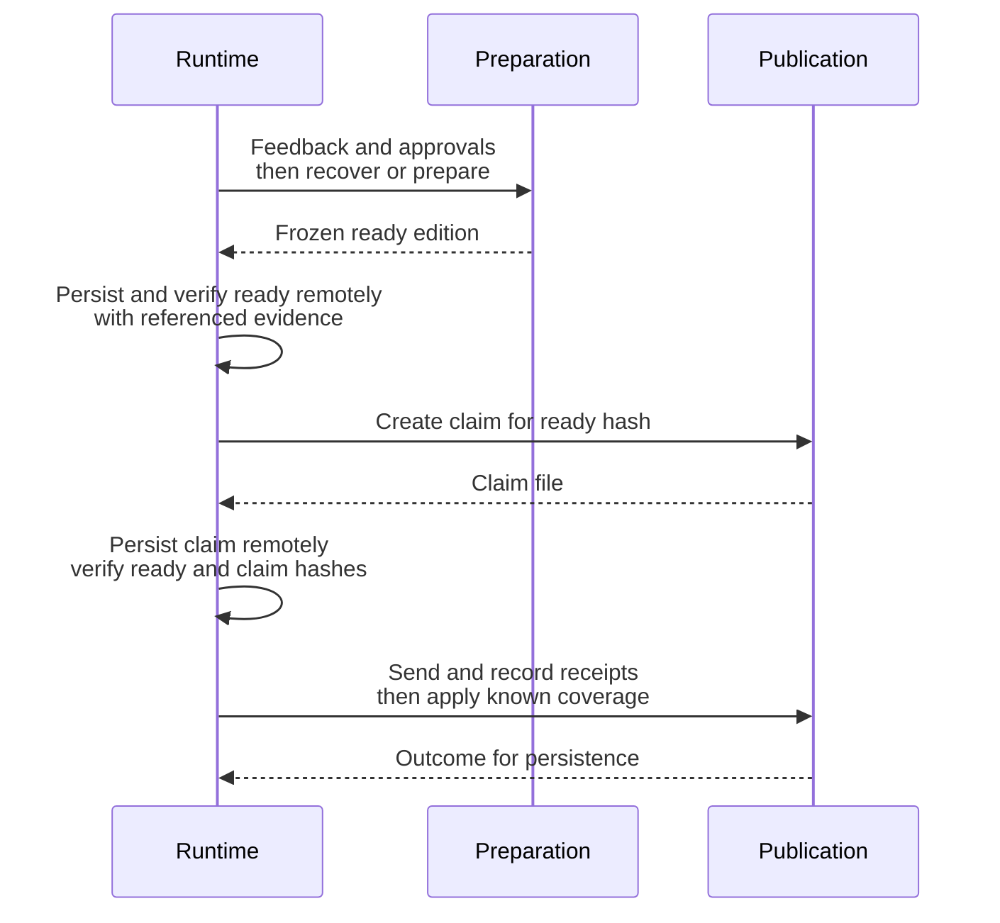

# Architecture — Daily News Digest

Digest has one Python engine and a separate runtime repository. The engine decides
what work can advance; the runtime supplies configuration, credentials, scheduling
and durable Git storage. Telegram is an external effect that cannot be rolled back.
The design therefore separates choosing an edition from publishing its exact bytes.

Read the [domain model](domain/digest/overview.md) for the meaning of the entities,
and the [operational guide](BLIND_REVIEW.md) for commands and recovery decisions.
This page connects that model to effects, persisted records and code.

## Overview

The ordinary daily path is review-led compact delivery. It observes configured RSS
sources, reviews one bounded evidence packet, saves accepted canonical work, prepares
its presentation and freezes a sendable edition. Sending uses only that frozen
edition. Optional comparison and external investigation use retained evidence after
primary publication; compact mode keeps their results in the archive.

There are two recovery boundaries before transport:

- **Accepted preparation** preserves the reading decision before translation,
  attribution, archive writing or rendering can fail.
- **Ready edition** preserves the final payloads before a sending process begins.
  The sender does not run selection, translation or rendering again.

A claim and transport receipts then distinguish an unused ready edition from an
attempt that may already have reached Telegram. Accounting is applied afterward,
so confirmed transport and completed local effects are separate facts.

## Prepared-edition data flow

```mermaid
sequenceDiagram
    participant R as Runtime
    participant P as Preparation
    participant D as Publication
    R->>P: Feedback and approvals<br/>then recover or prepare
    P-->>R: Frozen ready edition
    R->>R: Persist and verify ready remotely<br/>with referenced evidence
    R->>D: Create claim for ready hash
    D-->>R: Claim file
    R->>R: Persist claim remotely<br/>verify ready and claim hashes
    R->>D: Send and record receipts<br/>then apply known coverage
    D-->>R: Outcome for persistence
```

This overview follows a publishable edition; recovery and no-edition outcomes are detailed below.
The arrows are ordered operations, not a transaction. Failure between them leaves
recoverable work or a hold, according to the boundary already crossed.

## Preparing an edition

1. **Process independent input.** Load current operational state, collect feedback
   unless the managed runtime already did so, and apply verified source approvals.
   Reloaded source configuration takes effect before inspecting saved preparation.
   Feedback and approved configuration work can occur even when the edition is reused.
2. **Prefer an existing edition.** Ready, future-window, confirmed and held outcomes
   return before fresh collection. A completed edition can permit preparation for a
   later intended day; unresolved claimed work blocks replacement.
3. **Resume accepted work.** A matching `pending_preparation.json` resumes presentation.
   It does not acquire a new review result. Presentation can still call an explicitly
   configured translation route when its cache is absent.
4. **Collect and reconcile candidates.** Retain observed occurrences and current
   eligibility, including saved unfinished work. A feed failure is not a relevance
   judgment. If every feed fails, eligible saved candidates may still form a packet;
   otherwise collection failure remains a failure.
5. **Recover a candidate report or review a packet.** Reusable completed candidate
   reports are considered after collection and eligibility reconciliation. With no
   reusable report, persist the planned attempt before the bounded primary review.
   Planning does not prove that a provider received a request.
6. **Accept an editorial result.** Valid selected cards, including accepted partial
   results, can advance. A valid primary abstention requires resolved disposition
   evidence when recorded attempts carry it, as fresh candidate packets do. Older
   packets without that capture retain their existing compatibility behavior.
   If the primary is invalid/unavailable and the secondary only abstains, the
   delivery-used result remains incomplete. It does not become accepted no-news.
7. **Save, verify and hand off accepted work.** The ordinary candidate path saves the
   canonical checkpoint, verifies readback equality, and carries an accepted reference
   into candidate handoff and presentation. Fetch statistics follow the handoff.
   The reference contains the path, existing envelope/body hash and restored snapshot;
   it proves local acceptance, not remote persistence. A handoff is not delivery.
8. **Present and freeze.** Validate required immutable source provenance before model
   presentation calls. Translate generated prose, append literal credits, check chunk
   coverage, write the enabled archive and freeze the exact edition. Clear the pending
   preparation only after the ready file is written. An accepted empty result stays
   as its canonical checkpoint and creates no ready edition.

An expired accepted checkpoint does not consume undelivered selection. Candidate
recovery can reuse exact still-eligible selected work after collection, even after
handoff; handed-off empty abstentions stay consumed and mixed eligibility requeues
the eligible subset.

### Outcomes in the application

| Operation | Explicit result | Meaning for the next step |
| --- | --- | --- |
| `recover_preparation` | `ExistingEdition`, `AcceptedPreparation` or `FreshPreparation.REQUIRED` | Return an existing edition outcome, resume locally verified accepted content, or collect fresh work. `held` remains the inspector’s conservative summary, not a detailed receipt diagnosis. |
| Collection/review | `ReviewedCandidates`, `CategoryAnalysis` or `EmptyWork` | Candidate work carries required progress, packet and report values; category and empty outcomes do not masquerade as that record. |
| `accept_preparation` | `AcceptedPreparation` or `IncompleteSelection` | One policy decides whether ordinary work is acceptable, saves it and verifies the exact restored snapshot before handoff. |
| `assemble_publication` | `PublicationAssembly` | Resolve required provenance, present main content and decide whether the optional closer can accompany it. Final card order and existing metadata derive from this result. |
| `present_preparation` | `FrozenPreparation` or `NoEdition` | Presentation consumes the accepted reference; successful freezing returns a required ready-file hash. |

`RunStats` is the terminal public/reporting projection, not the internal work model.
These values add no persisted state machine or new schema. Category preparation keeps
its existing save-without-candidate-readback/clock behavior, and compatibility
wrappers still expose their prior interfaces.

Publication assembly keeps the canonical snapshot separate from presented main
cards and the optional closing disposition. Required main-card credit failures
hold preparation; optional credit or layout failures omit the closer with its
existing reason. The archive and frozen edition consume the same derived card
sequence. The coordinator then writes the archive, hashes its references, freezes
readiness and clears accepted preparation, in that order. Assembly itself does
not persist a new checkpoint or change translation's request/cache contract.

These are ordinary-path contracts. Category preparation and experimental source work
retain their own terminal behavior; they must not be inferred from a generic success
boolean. The code entrypoints below identify the implemented owners.

## Entities, contracts and enforcement

| Boundary | Rule | Code owner |
| --- | --- | --- |
| Observation → candidate | Preserve exact source occurrences and distinguish eligibility, review progress and delivery evidence. | [candidate values](../digest/domain/editorial/candidates.py), [candidate policy](../digest/domain/editorial/candidate_policy.py) |
| Candidate → packet → review | Admission is bounded; persist the planned packet before review. Shared request bytes bind planning, execution and resume. | [candidate application](../digest/application/candidate_review.py), [request builder](../digest/application/review_request.py), [review application](../digest/application/review.py) |
| Review → accepted preparation | Selected cards or a qualifying primary abstention are canonical work; incomplete output is not an accepted empty edition. | [preparation application](../digest/application/preparation.py), [checkpoint codec and accepted reference](../digest/preparation.py) |
| Canonical work → presentation | Translation changes generated prose while retaining source identity/evidence. Required main-card provenance failure holds accepted work; unsafe optional closing insertion is omitted. | [publication assembly](../digest/application/publication.py), [attribution](../digest/application/source_attribution.py), [accepted presentation](../digest/edition_runtime.py) |
| Presentation → frozen edition | Bind payloads, article coverage, recipient, publication window and archive references together. | [edition domain](../digest/domain/delivery/edition.py), [prepared application](../digest/application/prepared_delivery.py) |
| Ready → claim → transport | Require the exact remote ready/claim hashes. Persist attempted count before each POST and each known confirmation afterward. | [prepared application](../digest/application/prepared_delivery.py), [storage](../digest/adapters/storage/edition.py), [Telegram adapter](../digest/adapters/telegram/prepared.py) |
| Receipts → applied outcome | Apply only known complete article coverage; mark receipts applied after the ordered operational writes succeed. | [coverage projection](../digest/domain/delivery/outcomes.py), [outcome application](../digest/application/delivery.py) |

## Cache architecture

### The four publication records

All paths below are relative to the runtime working directory. These records have
different jobs; a filename's presence alone never proves the later stages happened.

| Record | Meaning and binding | Next boundary |
| --- | --- | --- |
| `.cache/pending_preparation.json` | Canonical `PreparationSnapshot`, intended publication date, creation time and integrity hash. It can contain accepted empty work. | Resume presentation for the same intended day; no selection rerun. It is removed after successful readiness freeze, or becomes ineligible after its publication day. |
| `.cache/prepared_edition.json` | Frozen `Edition`: exact payloads, article chunk ranges, owner/bot binding, UTC window, canonical/presentation hashes and referenced archive/evidence hashes. | The runtime must persist and verify these exact file bytes before claiming. |
| `.cache/prepared_edition_claim.json` | One immutable claim bound to the ready-file SHA-256 and owner. | The runtime must persist and verify the claim and ready file from the same remote revision before first dispatch. |
| `.cache/prepared_edition_receipts.json` | Ready/claim binding, attempted chunk count, known chunk confirmations, terminal transport state and `applied`. | Persist the known send outcome and apply its complete article coverage. Existing uncertain or unapplied state holds later automatic publication. |

Legacy snapshot counters need care: in this preparation path, `article_count` counts
admitted packet articles, while `source_count` is the number of category groups
(`len(articles_by_category)`), not distinct publishers. Main/closing card counts and
`RunStats.feeds_fetched` (attempted feeds) are separate. The retained schema names do
not make those quantities interchangeable.

`READY_SHA` and `CLAIM_SHA` are hashes of the complete persisted file bytes, not an
edition ID or the manifest's internal content hash. Archive references bind the
exact Markdown, review and candidate-evidence files used to prepare the edition.
Reformatting an otherwise equivalent JSON file changes its external hash.

The runtime establishes three durable boundaries:

1. After successful freeze, persist the ready edition and referenced archive/evidence;
   verify the ready hash from the successful remote revision before claim creation.
   Successful freeze has already cleared the pending preparation. On preparation
   failure, retain and persist the remaining accepted/candidate work for recovery instead.
2. Persist the immutable claim; verify ready and claim hashes from that remote
   revision before sending.
3. Persist receipts and resulting feedback/dedup/accounting state together, including
   partial or failed outcomes. Optional-stage failure must not discard primary state.

Engine atomic writes and filesystem sync protect local records. They do not make
several files a transaction, publish a Git commit or survive a runner loss by themselves.
The runtime must preserve saved work on failure and serialize writers sharing state.

### Other retained state

| Record | Owner and purpose |
| --- | --- |
| `.cache/candidate_progress.json` | Current eligible/unfinished candidate work and planned packets. |
| `.cache/candidate_sources/`, `candidate_reports/`, `candidate_index/`, `candidate_excluded/` | Exact occurrences and packet proof, indexed historical decisions and reversible policy exclusions. Retirement removes active work only after proof has been written and verified. |
| `.cache/feedback.json` | Votes, polling cursor, replay/acknowledgement data, source decisions and article/source attribution. |
| `.cache/seen_articles.json` | Delivered/consumed identity timestamps under the scenario's deduplication policy. |
| `.cache/source_stats.json`, `source_state.json`, `source_category_map.json` | Source observations, trial lifecycle and category read model. |
| `.cache/pending_sources.json`, `discovery_delivery.json` | Saved proposals and separately bound discovery reservation/delivery history. |
| `.cache/compact_issue.json` | Legacy direct-compact reservation; unresolved legacy sending also blocks prepared publication. |
| `digests/*.review.json`, `*.candidates.json` | Review and candidate-accounting evidence associated with archived output. |

## Sending and applying coverage

The sender validates the owner, bot, window, exact ready/claim bytes and referenced
checkpoint files. It uses the frozen payloads; current prompts or translation settings
do not rerender them. Each POST is attempted once in the prepared protocol.

| Step | Ordering and failure meaning |
| --- | --- |
| Claim | Verify an eligible ready edition and its checkpoint bytes, reject existing receipts, then create the claim exclusively. |
| Start send | Require the already persisted ready and claim hashes. Create `sending` receipts exclusively before the first POST. |
| Send a chunk | Persist its attempted count, perform one POST, then persist a positive message ID with a matching chat. A transport uncertainty or lost post-acceptance write can leave the attempt held. |
| Finish transport | Record `confirmed`, `failed`, `partial` or `unknown`. A known complete article needs every covering chunk confirmed; a failed notice can still leave the whole edition incomplete. |
| Apply | Reload current operational state and apply known confirmed coverage. Set `applied` only after those effects complete. Partial/unknown transport remains held even after known coverage is applied. |

A normal confirmed-and-applied edition is a no-op. Confirmed transport with
`applied: false` is a hold: some operational files may already have changed. There
is no automatic multi-file rollback or counter reconciliation. An expired unresolved
claim is still unresolved; expiry does not make a resend safe.

An uninterrupted managed workflow may send its newly persisted claim when no receipt
exists yet. Rediscovering a claim in a later run is different: missing remote receipts
do not prove the earlier process never sent. The [recovery guide](BLIND_REVIEW.md#delivery-states-and-recovery)
uses the observed records and execution history together.

## Applying confirmed outcomes

Prepared and legacy applications share coverage values while preserving distinct
accounting rules. The following matrix is the current compatibility contract.

| Effect | Prepared edition | Legacy direct run, including direct compact |
| --- | --- | --- |
| Mutable input | Reload current feedback, delivered cache and statistics; reload lifecycle state only when adaptation is enabled. Never restore the preparer's mutable snapshot. | Use current-run feedback, collected cache, statistics, lifecycle state and fetch observations supplied by the caller. |
| Delivery identity | Full article hashes enter deduplication only after complete confirmed chunk coverage. Empty coverage returns before state reads or writes. | Confirmed Telegram hashes qualify. Cards mode additionally consumes summarized-category articles and top articles after a saved Markdown output when Telegram is optional or complete. That consumption does not imply Telegram confirmation. Direct compact never treats Markdown as delivered coverage. |
| Attribution | Merge confirmed 8-character hash/source mappings; update last-digest sources/time only when the whole issue is complete. | Merge confirmed mappings when any article was sent or Markdown was saved; last-digest metadata still requires complete Telegram output. With neither output, restore only prior attribution, preserving collected votes and polling cursor. |
| Deduplication timestamps/path | Add absent hashes with application-time UTC timestamps; preserve existing timestamps. Write under the supplied cache directory. | Preserve collection timestamps and old entries; filter newly collected entries to qualifying output. Save only when an article was sent or Markdown was saved. Compact uses the supplied cache directory; cards retain `save_dedup_cache`'s default path, ignoring the passed `cache_dir`. |
| Source accounting | Count only confirmed hashes absent from the reloaded delivered cache, and only for existing source-stat entries. Use the intended UTC publication day; a delivery-only snapshot adds no fetch, found-article or HTTP-success observation. No inactive-source pruning. | Record actual fetch observations, including failed feeds, and qualifying output through the existing run-stat operation. Keep current-day fetch history semantics and inactive-source pruning on save. |
| Lifecycle state | When adaptation is enabled and coverage exists, reload/evaluate current state and strictly save it, including an unchanged result. Use application-time UTC day for trial decisions. | Evaluate only when adaptation is enabled and an article was sent or Markdown was saved. Apply changes only when promotion, demotion or trial start is needed; persist lifecycle state on the normal path even without delivery. |
| Write order | Strict feedback → strict source statistics → optional strict lifecycle state → strict seen cache; caller then marks receipts applied. | Seen cache when output qualifies → usable feedback → lifecycle state → source statistics → source-category map; caller then finalizes the compact guard. |
| Failure policy | Feedback/cache validation fails closed. All application writes propagate failures. Statistics and lifecycle reads retain their existing permissive loaders; strict writes do not imply strict reads. | Compact cache/feedback writes propagate failures. Cards cache/feedback and source-state/statistics/category-map writers retain their existing caught-write-error behavior; setup failures outside those handlers can still propagate. |

After a successful prepared application, inclusion counters and existing deduplication
timestamps remain unchanged on reapplication while those hashes are cached. Metadata,
clock observations and adaptive evaluation are not byte-idempotent. Normal confirmed
and applied inspection avoids reapplication entirely. If any write or the final
applied marker fails, the held receipt prevents blind replay.

## Supported application scenarios

| Scenario | Execution and publication boundary |
| --- | --- |
| Ordinary review-led preparation | One bounded primary packet, at most one configured secondary fallback, canonical acceptance, then presentation/freeze. Independent comparison remains separate. |
| Prepared sending | Frozen bytes and persisted claim/receipts only; no model work. |
| Category/legacy execution | Category summaries, optional perspectives and direct output. It retains its own guard, Markdown consumption and retry/error behavior. |
| Independent comparison/resume | Review slots assess identical evidence independently. Report-only or supplementary output does not create a new primary edition. |
| Source discovery | Propose, validate, persist and request approval; source activation requires a separately verified operator decision. |
| Supplementary investigation | Search external sources from saved evidence under its own reservation. Compact mode archives the result. |
| Experimental source preparation | Optional source-bound acquisition/analysis with its own technical handoff and uncertainty holds; it does not publish a concatenated prototype as an edition. |

The transport contracts also differ. Selecting compact formatting alone does not
turn a legacy direct call into the persisted prepared protocol.

| Protocol | Preserved acceptance, retries and effects |
| --- | --- |
| Legacy cards, status and counter-signals | HTTP success is sufficient; no Telegram `ok` or message-ID validation is added. HTTP 400 triggers the existing plaintext fallback. The existing three attempts, Retry-After/backoff, per-card continuation and 0.5-second spacing remain. Supplement dispatch retains its 90-second total bound and status-dependent notification. |
| Direct compact | Render every chunk before `before_send`, which remains immediately before dispatch. A 30-second total bound and per-request timeout remain. HTTP 4xx or explicit `ok: false` fails; other non-200/malformed receipts and transport uncertainty become unknown. HTTP 200 plus `ok: true` confirms without message-ID/chat validation. No retry or fallback; only complete confirmed article coverage is attributed. |
| Post-delivery supplement | Missing/disabled destination returns `not_configured` before rendering/client creation. Each silent chunk gets one POST with a 30-second total bound and per-request timeout. HTTP success plus explicit `ok: true` is required; errors propagate to the existing unknown marker. No retry, plaintext fallback or receipt-validation strengthening. |

Prepared transport additionally requires a positive message ID and exact matching
chat, persists chunk receipts and holds uncertain/unapplied outcomes. Its adapter has
no retry or plaintext fallback.

## Feedback loop

Feedback is independent of today's generation and delivery outcome. The private-owner
poller validates identity/replay, saves votes, cursor and pending acknowledgement data,
then acknowledges the exact saved batch. Managed runtimes persist that batch remotely
before acknowledgement. A later send failure does not roll votes back.

Only the latest valid vote per article contributes within the existing 14-day feedback
window. Source allocation uses the resulting effective priority; model review sees
ordinary supplied evidence rather than individual private votes. Repeated taps are
not independent evidence, and a changed allocation does not guarantee a different
editorial choice.

## Trial source lifecycle and discovery

Source configuration describes the portfolio; trial/graduation/demotion are runtime
state. Statistics describe observations and inclusion, not truth. Scoring and trial
rules receive explicit clock observations from the application, so separate observation
points preserve their existing behavior around a day boundary.

Discovery rotates configured exploration areas independently of Irritator. A proposal
must pass feed validation and be saved before an approval card is sent. Both receipt
reservation and the exact pending-proposal hash are checked before sending; uncertain
sending remains held. An approval is revalidated against one current, exact proposal
before the application performs its idempotent source addition. YAML/backup or later
state failures preserve the decision/proposal for inspection or retry under the existing
ordered contract. No source is activated merely because a model suggested it.

## Provider execution

Declarative settings select provider/model routes and limits. A lazy `ModelExecution`
owns per-loop concurrency, pacing, cooldowns and local attempt accounting. Applications
pass that owner explicitly; construction alone does not inspect a quota or acquire a
request allowance. Accepted work can therefore recover without initializing model work.

Fresh versus shared derived execution, loop rebinding and first-initialization semaphore
capacity follow the [execution contract](decisions/0020-explicit-model-execution.md).
The durable cycle journal is separate from that in-memory holder. Each physical retry,
fallback or counting call retains its own reservation; failures do not refund attempts.
Absolute deadlines and provider/account allowance remain distinct constraints.

Request construction is shared by planning, execution and resume. Cached review reuse
requires the configured slot/provider/model, exact bundle and prompt identity, plus
valid retained selections. Accepted preparation and ready editions are separate
recovery objects and are not revalidated as new model judgments.

Hash encodings retain their specific contracts: prompt JSON uses sorted ASCII-escaped
JSON with spaces; evidence JSON uses sorted non-ASCII JSON with spaces; retained
occurrences/objects use compact sorted UTF-8 JSON. Source attribution resolves the
accepted immutable occurrence before calls, adds literal credits after translation,
and applies identical final cards to archive and frozen payloads.

## Modules and responsibilities

| Responsibility | Entry or owner |
| --- | --- |
| Public command dispatch and reporting | `main.main`, `cli/arguments.py`, `cli/reporting.py` |
| Select an execution scenario | `application/execution.py` |
| Prepare ordinary canonical work | `application/preparation.py:prepare_edition` |
| Inspect/recover accepted or ready work; present/freeze | `edition_runtime.py:recover_preparation`, `accept_preparation`, `present_preparation`; `preparation.py:load_accepted_preparation` |
| Assemble presented main cards and optional closing disposition | `application/publication.py:assemble_publication`, `PublicationAssembly` |
| Candidate rules, packet construction and ordered persistence | `domain/editorial/candidate_policy.py`, `application/candidate_review.py`, `application/candidate_lifecycle.py` |
| Configured request, review routes and display copy | `application/review_request.py`, `application/review.py`, `presentation/review.py` |
| Freeze/claim/send/inspect an edition | `application/prepared_delivery.py`; CLI phases enter through `edition_runtime.delivery_phase` |
| Edition/claim/receipt validation and bytes | `domain/delivery/edition.py`, `adapters/storage/edition.py` |
| One prepared Telegram POST | `adapters/telegram/prepared.py` |
| Apply known article coverage | `application/delivery.py`, with feedback/catalog policy owners |
| Feedback and approved source application | `application/feedback.py`, `application/run_state.py` |
| Discovery and external investigation | `application/discovery.py`; `post_delivery.py`, `irritator/evidence_stage.py` |

Domain code defines values and decision rules. Applications sequence effects; adapters
perform concrete I/O; presentation builds output copies. Compatibility modules preserve
existing public imports. The map describes ownership, not a requirement that every
facade disappear.

## Deliberate remaining coupling

Candidate collection accounting retains the eager Radar package dependency. Irritator's
registry/package initialization and some presentation type references retain their
existing imports; individual pure validators do not imply universal cold-import
isolation. Translation, optional full-source assembly, closing sidecars and trial/resume
marker persistence have explicit owners or compatibility boundaries outside ordinary
RSS review. Their invariants are not silently unified by this layout.

## Security

[`radar/collector.py`](../digest/radar/collector.py) validates the initial configured
feed URL and pins that hostname's resolved addresses. Its HTTP client follows redirects
automatically; a redirect to another hostname uses ordinary DNS resolution without
that initial URL validation/pinning guard. [`discovery_feed.py`](../digest/discovery_feed.py)
and optional article acquisition in [`article_source.py`](../digest/article_source.py)
instead follow bounded redirects explicitly and validate/pin each requested hop,
rejecting non-global destinations. These are distinct acquisition boundaries, not a
universal outbound-HTTP guarantee. The fixed-endpoint Hacker News, Reddit and arXiv
[search clients](../digest/irritator/sources/) use their own HTTP requests; optional
signal URL liveness checks are separate in
[`application/signal_validation.py`](../digest/application/signal_validation.py) and
[`adapters/http/signal_liveness.py`](../digest/adapters/http/signal_liveness.py);
`irritator/validator.py` preserves compatibility imports.

Feed titles/descriptions are untrusted content: sanitization removes HTML, decodes
entities, normalizes whitespace and limits the description supplied to existing RSS prompts. Sanitization does not turn
an excerpt into a full article or guarantee immunity to all malicious instructions.

Keep real keys/tokens in runtime environment variables or Actions secrets. The engine
does not automatically load `.env`. Never commit credentials or source-account details
in public examples. Runtime artifacts can contain source bodies and model outputs;
choose access and retention deliberately rather than copying them into the public repo.

## Decisions and history

The [ADR index](decisions/README.md) records the architectural decisions. The
[dated architecture and migration record](history/architecture-2026-10-08.md)
preserves prior implementation stages, detailed acceptance evidence and release facts.
Use runtime pins and receipts to establish deployment; this current design is not a
substitute for observed operational state.

Links to prior sections

- [Adaptive priority system](history/architecture-2026-10-08.md#adaptive-priority-system)

- [Source quality scoring](history/architecture-2026-10-08.md#source-quality-scoring)

- [GitHub Actions and release operations](history/architecture-2026-10-08.md#github-actions-and-release-operations)

- [Diagnostics and monitoring](history/architecture-2026-10-08.md#diagnostics-and-monitoring)

- [Limitations and known behavior](history/architecture-2026-10-08.md#limitations-and-known-behavior)

- [Daily operating boundary (proposal, 2026-10-02)](history/architecture-2026-10-08.md#daily-operating-boundary-proposal-2026-10-02)

- [Appendix: migration and release history](history/architecture-2026-10-08.md#appendix-migration-and-release-history)

- [Release scope — 2026-10-07](history/architecture-2026-10-08.md#release-scope--2026-10-07)

- [Structural migration: current stage and target](history/architecture-2026-10-08.md#structural-migration-current-stage-and-target)

- [Stage 1: application ownership](history/architecture-2026-10-08.md#stage-1-application-ownership)

- [Stage 2: candidate contracts and explicit retirement](history/architecture-2026-10-08.md#stage-2-candidate-contracts-and-explicit-retirement)

- [Stage 5: investigation signal validation ownership](history/architecture-2026-10-08.md#stage-5-investigation-signal-validation-ownership)

- [Stage 5: bounded RSS review ownership (#165)](history/architecture-2026-10-08.md#stage-5-bounded-rss-review-ownership-165)

- [Target responsibility map](history/architecture-2026-10-08.md#target-responsibility-map)

- [Incremental migration and rollback](history/architecture-2026-10-08.md#incremental-migration-and-rollback)

- [ограничения-и-известные-особенности](history/architecture-2026-10-08.md#ограничения-и-известные-особенности)

