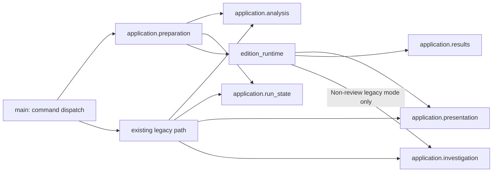
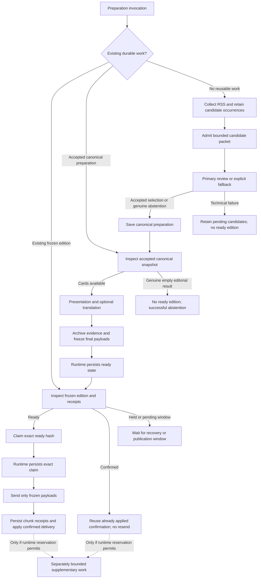

# Architecture — Daily News Digest

> Prepared delivery and presentation contracts checked against main `5fbb26ac` on 2026-10-07.
> Other sections retain their stated implementation scope; this is not a complete project audit.
> [Digest context](domain/digest/overview.md) · [Irritator context](domain/irritator/overview.md)

## Structural migration: current stage and target

Tracked by [#143](https://github.com/Lenivvenil/digest/issues/143) under the
[#126 migration umbrella](https://github.com/Lenivvenil/digest/issues/126), with the
[stage-1 ownership decision](decisions/0015-application-workflow-ownership.md).
Stage 1 merged in [PR #149](https://github.com/Lenivvenil/digest/pull/149) at engine
`de595797282b7b289561105820a55d467f8379a2` and was deployed through runtime PR #72.
The candidate-ownership slice under [#144](https://github.com/Lenivvenil/digest/issues/144)
is implemented in this change; its boundaries are recorded in
[ADR0016](decisions/0016-candidate-contracts-and-retirement.md). Neither status establishes
editorial acceptance or completion of the remaining migration stages.

The target is a modular monolith: one deployable Python engine, the existing private
runtime, and no additional services or workflow framework. Organization follows who
owns a decision and its state, not the external tool used to execute it.

### Stage 1: application ownership

The first migration introduces `digest/application/`:

- `preparation.py`: ordinary edition preparation and the separately terminated
  experimental source-preparation scenario. Recovery precedes new selection.
- `analysis.py`: canonical RSS analysis shared by prepared and legacy applications.
- `presentation.py`: shared presentation orchestration and optional translation;
  rendering and transport adapters remain in their existing modules for now.
- `investigation.py`: existing synchronous external-investigation invocation, kept
  separate from presentation rather than making a view operation own search.
- `run_state.py`: feedback collection, approved source changes and fetch accounting.
- `results.py`: the existing `RunStats` result, moved without changing its fields.

`main.py` resolves prepared versus legacy execution before either workflow runs.
`edition_runtime.py` consumes application presentation/results and no longer imports
`main`. The ordinary preparation coordinator has no preview, direct-send or source-
reconciliation branch. Legacy preview/dispatch and discovery are still in `main`;
this stage does not claim the entire entrypoint has become thin. The programmatic
`run()` entry now rejects preparation combined with dry-run/radar-only before
configuration/preparation effects, matching the existing CLI restriction. Its existing
finally block still finalizes an explicitly supplied legacy issue guard. Previously those unsupported Python
combinations could partially execute; silently treating a preview as a mutating
preparation is not retained as compatibility. `SelectedPreparation`
is a transitional in-memory application handoff, not a new domain entity or wire
schema. Its optional candidate fields preserve existing non-review modes; separating
those ownership constraints belongs to stage 2. Shared candidate acquisition still
invokes disabled reading-budget/checkpoint hooks for compatibility, so experimental
source work is not yet completely isolated from the ordinary acquisition stage.


```mermaid
flowchart LR
    CLI[main: command dispatch] --> PREP[application.preparation]
    CLI --> LEGACY[existing legacy path]
    PREP --> ANALYSIS[application.analysis]
    PREP --> STATE[application.run_state]
    PREP --> EDITION[edition_runtime]
    EDITION --> VIEW[application.presentation]
    EDITION --> RESULT[application.results]
    LEGACY --> ANALYSIS
    LEGACY --> STATE
    LEGACY --> VIEW
    LEGACY --> INVESTIGATE[application.investigation]
    EDITION -->|Non-review legacy mode only| INVESTIGATE
```

No lower module imports `main`; the executable `__main__` remains its caller.
Existing candidate, checkpoint and delivery internals retain known ownership debt.
In particular, this is not a redesign of their serialized records or retry policies.

### Stage 2: candidate contracts and explicit retirement

The current #144 implementation separates candidate contracts from scheduling and
persistence without changing the accepted accounting behavior in
[ADR0008](decisions/0008-candidate-selection-progress.md):

- [`domain/catalog/articles.py`](../digest/domain/catalog/articles.py) owns `Article`
  and the existing title/link identity. [`domain/editorial/`](../digest/domain/editorial/)
  owns evidence/review, disposition and candidate values plus pure occurrence,
  packet and decision-proof validators. Storage validates the retained object
  directly; it does not manufacture an aggregate or an empty report for validation.
- [`_serialization.py`](../digest/_serialization.py) supplies stdlib-only JSON
  encoding and dataclass restoration. It performs no filesystem operations.
  [`adapters/storage/`](../digest/adapters/storage/) owns path guards, candidate
  object envelopes, verified object writes and active-checkpoint persistence.
- [`application/candidate_lifecycle.py`](../digest/application/candidate_lifecycle.py)
  makes the effect explicit: `checkpoint_candidates` materializes source references,
  retires eligible-for-retirement work only after verified object/index writes, then
  writes the active checkpoint. `persist_candidates` materializes and writes without
  retiring candidates or proof packets. Report reconciliation uses the latter before
  freezing report accounting; preparation handoff uses the former.

Retirement removes work from the active checkpoint, not its retained evidence.
Existing unresolved empty-report and unsent-selection recovery rules still apply;
policy exclusion is not editorial completion. A prior active record takes precedence
after interruption before the new active checkpoint is persisted. These ordered
file writes are not an atomic transaction or a remote-persistence guarantee.

`candidate_storage.py` remains a compatibility facade, and the old candidate save
API still dispatches to the same retirement or persistence behavior. Existing
collector/review/disposition imports retain the moved value identities. Scheduling,
eligibility reconciliation and prompt orchestration still involve
`candidate_review.py`, `review.py` and collector/configuration code. This slice does
not claim a pure scheduler, a completed catalog domain or full legacy isolation.

### Target responsibility map

```text
digest/
  cli/                     command parsing and outcome reporting
  application/             explicit preparation, send, feedback, investigation and discovery scenarios
  domain/
    catalog/               sources, proposals, observations and trial lifecycle
    editorial/             candidates, evidence packets, review attempts and selection decisions
    editions/              accepted canonical preparation, presentation and frozen editions
    delivery/              claims, chunk receipts and transport outcomes
    feedback/              votes and source-approval provenance
    investigation/         attributed targets, hypotheses, external evidence and relations
  adapters/
    feeds/                 RSS and supported external-search protocols
    models/                configured provider wire protocols and request controls
    telegram/              Telegram transport
    storage/               versioned JSON codecs and retained-object persistence
  presentation/            Markdown and Telegram rendering
```

This is the destination; only the application and candidate-related domain/storage
boundaries described above exist in the current staged implementation. Domain code
owns invariants and transitions; it imports neither CLI/application orchestration,
HTTP clients nor filesystem persistence. Applications coordinate domain operations
and adapters. Adapters consume domain values and enforce external protocols. Small
interfaces are introduced only at actual boundaries; no generic repository hierarchy
or dependency-injection framework is required.

Delivery owns send claims and receipts, not source metrics or editorial decisions.
An application operation applies confirmed outcomes to each owning domain explicitly.
Multiple JSON writes are not an atomic transaction: current write order, idempotence
and interrupted-application recovery must remain observable.

### Incremental migration and rollback

| Stage | Concrete change and acceptance | Compatibility and rollback |
| --- | --- | --- |
| 1. Prepared application — deployed | One ordinary recovery → collection/selection → accepted snapshot → presentation/freeze path; no lower-to-`main` imports. PR #149 and runtime PR #72 implement this boundary; legacy scenarios remain. | No wire/schema/provider changes. Revert the engine pin; retain all runtime state. |
| 2. Candidate ownership — #144 | Pure values and validators sit below selection/storage; storage validates actual objects. Application operations distinguish verified retirement from persistence without retirement. Scheduler and remaining domain ownership are still staged work. | Preserve hashes, envelope versions and verified-write-before-removal order. Verify historical objects and bounded continuation before deployment; release evidence is tracked in #144. |
| 3. Confirmed-delivery application | One explicit operation updates attribution, deduplication and accounting through their owners; remove duplicated prepared/direct update algorithms. | Preserve partial-send receipts, unknown-send holds and per-file recovery. Never rewrite receipt history for migration. |
| 4. Review and source attribution | One review-reuse rule; general source credits independent of optional closing; explicit canonical occurrence ownership. | Preserve report/sidecar formats, exact source binding, fallback and optional omission semantics. |
| 5. Adapters and remaining scenarios | Move CLI discovery/legacy workflows to explicit applications; separate provider runtime state from configuration; locate codecs with storage adapters. | Migrate one boundary at a time, preserving request counts, deadlines and existing configured routes. |
| 6. Consolidation | Reconcile domain docs, package exports and behavior-oriented tests with actual ownership; remove compatibility code only when its callers are migrated. | Keep historical rationale and evidence. Deletion is not a substitute for an explicit compatibility decision. |

Each stage needs a reviewable dependency change, existing behavioral regression
checks, exact-head CI and runtime-state preservation. Green checks alone do not prove
clarity or editorial quality. Useful content, humane closing supply, faithful
translation and meaningful external counter-evidence retain their separate acceptance.

## Overview

Digest is a personal information-intake product, not simply an article formatter.
Radar collects and analyses a chosen source portfolio. Feedback and approved discovery
adjust that portfolio. Irritator searches for external evidence that challenges or
complicates the narratives in the operator's reading.

The public engine contains Python code and CI. A separate runtime owns configuration,
credentials, schedules, JSON state and Markdown output. GitHub Actions can execute and
persist each run without a continuously running service or external database. Persistence
requires the runtime workflow to save state; writing a local file is not a durable push.
See [ADR-0002](decisions/0002-engine-instance-split.md) and
[ADR-0003](decisions/0003-source-state-split.md).

The package is 2.0.0. The older architecture document described v1 category summarization
as the only execution path. The original is retained in git history; current behavior
has a second, opt-in RSS-review path. Full-source enrichment in
[closed, unmerged PR #93](https://github.com/Lenivvenil/digest/pull/93) is not available on main and is
not the operating architecture documented below.

The draft source-admission adapter reuses safe acquisition and contiguous page progress.
It admits only current candidate occurrences with exact saved selection proof, and
freezes technical source evidence before accepted preparation. It does not publish the
draft reading-angle concatenation or mark independent comparison complete. Request
intents preserve ambiguous generation holds; count uncertainty is separate. Proposed
[ADR0009](decisions/0009-selected-source-admission.md) records this integration. #55
owns useful, faithful editorial output; full-source reconciliation is an optional
experimental mechanism, with runtime activation off.

## Prepared-edition data flow

The deployed review-led path separates model work from sending. Recovery inspects
existing ready editions and accepted preparation before fresh collection/selection.


```mermaid
flowchart TD
    RUN[Preparation invocation] --> STATE{Existing durable work?}
    STATE -->|Existing frozen edition| READY[Inspect frozen edition and receipts]
    STATE -->|Accepted canonical preparation| CANON[Inspect accepted canonical snapshot]
    STATE -->|No reusable work| COL[Collect RSS and retain candidate occurrences]
    COL --> PACKET[Admit bounded candidate packet]
    PACKET --> REVIEW[Primary review or explicit fallback]
    REVIEW -->|Accepted selection or genuine abstention| ACCEPT[Save canonical preparation]
    REVIEW -->|Technical failure| PENDING[Retain pending candidates; no ready edition]
    ACCEPT --> CANON
    CANON -->|Cards available| PRESENT[Presentation and optional translation]
    CANON -->|Genuine empty editorial result| EMPTY[No ready edition; successful abstention]
    PRESENT --> FREEZE[Archive evidence and freeze final payloads]
    FREEZE --> PERSIST[Runtime persists ready state]
    PERSIST --> READY
    READY -->|Ready| CLAIM[Claim exact ready hash]
    READY -->|Confirmed| RECOVER[Reuse already applied confirmation; no resend]
    READY -->|Held or pending window| HOLD[Wait for recovery or publication window]
    CLAIM --> CLAIMSAVE[Runtime persists exact claim]
    CLAIMSAVE --> SEND[Send only frozen payloads]
    SEND --> RECEIPT[Persist chunk receipts and apply confirmed delivery]
    RECEIPT -.->|Only if runtime reservation permits| OPTIONAL[Separately bounded supplementary work]
    RECOVER -.->|Only if runtime reservation permits| OPTIONAL
```

The runtime owns the remote persistence barriers; local atomic writes alone do not
survive loss of a runner. The sender uses frozen payloads and makes no model calls.
A confirmed chunk is not replayed; an uncertain send remains held for reconciliation.
Accepted preparation may still need presentation work, including translation on a
cache miss. It is not equivalent to a ready edition.

Legacy category-summary/direct-delivery modes remain supported. They can run
synchronous Irritator analysis before delivery and do not inherit the prepared-path
failure isolation merely because they use the same presentation functions.

### Entities, contracts and enforcement

| Entity / transition | Invariant and implementation boundary |
| --- | --- |
| Candidate occurrence → `CandidatePacket` | Original source observations and pending status survive bounded admission. Planning is an opportunity, not a successful review. [`plan_packet`, `begin_packet`](../digest/candidate_review.py) preserve packet bounds and proof; capacity deferral is not editorial rejection. |
| Candidate proof → retained history / active checkpoint (#144) | [`domain validators`](../digest/domain/editorial/candidates.py) check actual occurrence, packet and decision bindings. [`candidate_lifecycle`](../digest/application/candidate_lifecycle.py) coordinates verified retirement; [`storage`](../digest/adapters/storage/candidate_progress.py) writes the resulting working set. Persistence without retirement is a separate operation; retained objects and the active file are not one transaction. |
| `EvidenceBundle` → `BlindReviewReport` | Stable evidence IDs bind model selections; allowed one-to-one typography normalization returns the exact original source slice. Detailed-response and publication-card limits are separate; a syntactically valid response is not factual verification. In local #144, [`domain review contracts`](../digest/domain/editorial/reviews.py) and [`disposition contracts`](../digest/domain/editorial/dispositions.py) enforce shape, identity and dispositions; [`review.py`](../digest/review.py) retains model-execution ownership. |
| Report → `PreparationSnapshot` | Accepted canonical cards, report and optional closing decision are saved before presentation. [`preparation.py`](../digest/preparation.py) validates versioned content; [`save_accepted_preparation`](../digest/edition_runtime.py) preserves the recovery boundary. |
| Canonical cards → presentation copies | Translation changes generated prose, not article identity, source quotes or canonical evidence. Primary preview uses the same publication path with no signals and a temporary cache. [`application/presentation.py`](../digest/application/presentation.py), [`translation.py`](../digest/translation.py) retain explicit fallback and cache semantics. |
| Presentation → ready edition | Exact payloads, article ranges and archive references freeze together. Source-bound credits travel with cards; optional closing omission cannot silently discard required main cards. [`finish_preparation`](../digest/edition_runtime.py), [`closing.py`](../digest/closing.py) validate before freeze. |
| Ready edition → claim → receipts | Hash-bound claim and per-chunk receipts govern sending; confirmed work is reusable and unknown send outcomes are not blindly retried. [`delivery/edition.py`](../digest/delivery/edition.py) enforces identity and state, while the runtime persists them remotely. |
| Saved evidence → Irritator archive | Labelled hypotheses guide query planning only. Ranking compares the attributed target with external evidence; empty, unavailable and rejected outcomes remain distinct. [`evidence_stage.py`](../digest/irritator/evidence_stage.py), [`post_delivery.py`](../digest/post_delivery.py) keep optional work separate from primary receipts. |

These are deterministic identity, recovery and bounded-execution contracts. Useful
selection, faithful translation and meaningful counter-evidence remain empirical
acceptance under #55/#77; no row certifies model semantics. Existing regression entry
points are `test_candidate_preparation.py`, `test_preparation.py`,
`test_edition_runtime.py`, `test_prepared_edition.py`, `test_translation.py` and
`test_irritator_evidence.py`.

`--radar-only` prints Radar summary output and returns before normal delivery or
Irritator. It can still collect/analyse sources; use `--dry-run` as well to suppress
the normal feedback/state mutation path.

In the review-led-only mode, the runtime can run a bounded Irritator process after
primary delivery from its saved evidence checkpoint. This ordering prevents that
supplementary process from blocking the already completed primary output. It does not
prove the primary card is factually correct. Independent model selection is a separate
experiment, not external counter-evidence or a verified factual consensus.

## Modules and responsibilities

| Module | Responsibility |
| --- | --- |
| `main.py` | CLI dispatch/reporting plus legacy/discovery scenarios awaiting later migration |
| `application/` | Prepared use cases, shared canonical analysis/presentation, run-state operations and execution results |
| `domain/catalog/`, `domain/editorial/` (#144) | Feed-independent article identity, evidence/review/disposition/candidate values and pure proof validation; not the complete catalog or editorial workflow |
| `application/candidate_lifecycle.py` (#144) | Explicit verified retirement, persistence without retirement and report-accounting orchestration |
| `adapters/storage/` (#144) | Checkpoint path guards, candidate objects/envelopes, verified writes and active-record codecs; no scheduling or retirement selection |
| `config.py` | YAML loading, dataclasses and validation |
| `radar/collector.py` | Concurrent HTTP feed acquisition, parsing, freshness/blocklist filtering, title/URL deduplication and source-slot allocation |
| `radar/summarizer.py` | Category, perspective, trend and article prompts |
| `llm.py` | Provider adapters, roles/routes, fallback and bounded request controls |
| `review.py` | Immutable RSS evidence packet, independent selections, partial-item validation and fallback card attribution |
| `candidate_review.py` | Pre-slot candidate accounting, bounded packet continuation and report-bound accounting snapshots |
| `review_checkpoint.py`, `review_resume.py` | Validated saved reviews and bounded missing-review resume |
| `irritator/` | Narrative extraction, external queries, candidate validation and counter-signal ranking |
| `post_delivery.py`, `irritator/evidence_stage.py` | Separately reserved post-delivery processing from saved evidence |
| `delivery/telegram.py` | Telegram article cards, vote buttons and confirmed transport accounting |
| `delivery/markdown.py` | Markdown archive and review checkpoint output |
| `preparation.py`, `edition_runtime.py`, `delivery/edition.py` | Resumable canonical preparation, immutable ready edition and payload-bound sender receipts |
| `feedback.py` | Telegram polling, vote parsing, article/source mapping and bot commands |
| `source_scorer.py` | Source metrics, effective priorities, trial lifecycle state and bubble diagnostics |
| `discovery.py` | Proposed feeds, URL validation, approval cards and approved additions to runtime config |
| `_dns_pinning.py`, `_sanitize.py` | Outbound URL/DNS protection and untrusted feed-text sanitization |
| `_util.py` | Atomic JSON write and temporary-file utilities |

## Adaptive priority system

`adaptive.enabled: true` enables the existing priority-adjustment path. Base priority,
source statistics and available feedback contribute to a bounded effective priority:

```text
base_norm = source.priority / 5.0
score = calculate_score(source_stats)
feedback = source_feedback_score if present, otherwise 0.5
weighted = base_norm * base_weight + score * score_weight + feedback * feedback_weight
priority = round(min_priority + weighted * (max_priority - min_priority))
priority += 1 if the source is trending else 0
priority = clamp(priority, min_priority, max_priority)
```

```yaml
adaptive:
  enabled: true
  feedback_weight: 0.3
  score_weight: 0.5
  base_weight: 0.2
  trial_slots: 2
  min_priority: 1
  max_priority: 5
```

This is source allocation, not an article-level measure of novelty, relevance or truth.
The intended influence of feedback through every current selection path is still an
acceptance requirement in [#48](https://github.com/Lenivvenil/digest/issues/48).

## Source quality scoring

`calculate_score()` returns a bounded value from four observations:

| Observation | Weight | Current calculation |
| --- | --- | --- |
| Reliability | 0.3 | Successful fetches divided by total fetches |
| Productivity | 0.3 | Included/found articles over the last seven saved snapshots, with cumulative fallback |
| Description length | 0.2 | Mean description length divided by 100, capped at 1 |
| Recency | 0.2 | Full score through day 3, decreasing to zero by day 10 since last seen |

A source with no fetch history receives 0.5. History retains at most 30 snapshots.
Snapshots represent recorded dates; same-day runs are merged. Gaps can make seven
snapshots span more than seven calendar days. Long descriptions and frequent publications do not establish useful
content. Trending detection compares saved windows and can add a priority bonus.

## Provider execution

Roles such as `summarize`, `extract_narratives`, `generate_queries`, `rank_signals` and
`fallback` assign work to configured providers. Category routing can override the
normal route. Missing credentials remove unavailable routes. The category mode uses
async concurrency, subject to `llm.max_concurrent_requests` and configured pacing.
Provider failure can advance to an eligible fallback; exhaustion is visible failure.

Review slots are pinned to provider/model identities. Their opinions remain independent:
reusing a first review as a second model's input would break that contract. The leading
successful primary/secondary slot may supply cards, with incomplete comparison explicit.
See [BLIND_REVIEW.md](BLIND_REVIEW.md) for evidence limits, retry budgets and semantics.

Enabled translation and optional reading briefs reuse a provider/model identity
already present in `llm.providers` or an explicitly supplied `review.primary`,
`review.secondary` or `review.tie_breaker` mapping. Implicit review defaults and
category-routing entries do not authorize reuse. [`_configured_model_routes` and its
loader callers](../digest/config.py) enforce this before execution; feature-specific
language and mode checks remain separate. Reuse does not change ordinary provider
roles or unify the features' fallback policies. See [ADR0005](decisions/0005-optional-presentation-translation.md),
`test_explicit_review_translation_route_preserves_ordinary_roles_and_cache_identity`
and `test_reading_brief_is_opt_in_and_uses_only_explicit_configured_routes`.

Free-only operation requires actual account/model entitlement. Context size does not
specify TPM, RPM, daily allowance or price. A timeout or empty result must not be reported
as proof that no interesting articles or counter-signals exist.

## Feedback loop

Article cards use vote URL buttons when `telegram.bot_username` is configured.
The URL carries `start=vote_g_{article_hash}` or `start=vote_b_{article_hash}`;
Telegram requires a subsequent Start tap, generating an ordinary `/start` message.
A visible `/vote g|b <article_hash>` fallback requires no username configuration.
Legacy `fb:a:g/b:{article_hash}` callbacks remain best effort only.
The article/source mapping connects a later vote to the source. Polling is independent
of automatic adaptation and does not continuously handle buttons between scheduled runs.
A private owner chat and matching sender are required; group/inline callbacks cannot
change preferences. An active webhook is reported and preserved, never deleted.

One bounded batch is applied to a candidate store and strictly persisted with its offset
and minimal pending reply receipts. Managed runtimes commit/push that store before
acknowledging its exact SHA256-bound batch; `--feedback-precollected` prevents a second
poll even after optional-stage failure. Local CLI use has a local-disk durability scope.
Callback queue expiry can prevent ingestion entirely: the upstream lifetime is 150s.
An acknowledgement failure after persistence is different: recorded votes remain saved.
Pending UI receipts are best effort: a later successful collection supersedes any
unanswered earlier receipts while keeping their votes. Command replies and expired
button acknowledgements are not promised eventual delivery.
Only recognized authorized command tags are retained, never arbitrary message bodies.

When adaptive management is off, a rated source receives the centered adjustment
`round((2 * feedback_score - 1) * feedback_weight * (max_priority - min_priority))`
to its configured priority, clamped to the configured range. Unrated sources retain their
exact configured priority. No quality/trending bonuses or lifecycle decisions are added.
Collection allocation uses these effective priorities; model prompts receive
ordinary article evidence, not individual vote data. This changes candidate availability,
not a promise about the final editorial selection.

Source feedback uses a 14-day window and the latest valid rating per article; repeated
taps do not multiply its influence. Stored history is retained unchanged until the
existing 30-day pruning policy applies. Callback IDs and owner-bound vote-message identities are each bounded to the newest
1,000 receipts, alongside the existing 1,000-entry article map; a batch contains at most 100
updates. Ordinary messages have at most 24-hour upstream retention, not a guaranteed
processing window. Schedule delays/failures can lose votes before collection.
See [ADR-0006](decisions/0006-batch-message-voting.md); no continuous receiver is provisioned.

Telegram may restart update IDs after a week without events. A missing, future or
six-day-old observation timestamp therefore triggers a single read with no offset.
This does not confirm pending updates. The previous cursor is retained as audit data;
a nonempty returned batch establishes the new cursor only through strict persistence.
An empty recovery read leaves the old cursor untrusted. The six-day trust limit is
conservative because received events may already be up to 24 hours old. See the
[official update semantics](https://core.telegram.org/bots/api#getupdates).
The article/source mapping is bounded to 1,000 retained entries. Existing `/status`
and `/bubble` commands are handled through this same scheduled poller and restrict
responses to the configured owner chat. Bubble diagnostics describe saved diversity,
category mix, feedback and lifecycle state; they do not measure factual accuracy.

## Trial source lifecycle and discovery

1. `--discover` asks a model for feeds in configured exploration areas, validates feed
   URLs, persists candidates and requests operator approval where Telegram is configured.
2. Discovery sends Add/Reject deep links (`/start source_ok_HASH` or
   `/start source_no_HASH`) after persisting the proposal. Without a valid configured
   bot username, the message provides `/source ok HASH` and `/source no HASH` commands.
   The private owner poller persists decisions, replay receipts and the cursor before
   sending a single aggregate source-decision receipt. Legacy callbacks remain best effort.
   A decision requires exactly one pending proposal whose hash matches its URL and
   whose age is 0–30 days, and stores a SHA-256 binding to all proposal fields.
   Application repeats those checks and requires the same binding; legacy unbound
   decisions remain historical. Approved additions are written idempotently to the
   **runtime** configuration before feed collection, independently of digest success.
   The pipeline reloads config before collecting. Config/backup failures preserve the
   decision and proposal; strict state-write failures never clear the in-memory decision.
   Rejected candidates are removed from pending. Receipts confirm saved decisions,
   not successful config additions. Decision messages share the at-most-24-hour
   Telegram retention limit of article votes.
3. Approved sources enter runtime configuration at priority 3 as trials. Trial start,
   graduation and demotion are runtime state in `source_state.json`, not fields repeatedly
   written into source configuration by the evaluator. The daily candidate scheduler
   does not enforce `adaptive.trial_slots`; this setting is not proof of protected
   professional coverage or exploratory admission.
4. After `trial_days`, the current evaluator uses its source score threshold to graduate
   or demote the source. These operational observations are not editorial acceptance.

Discovery keeps `pending_sources.json` compatible and stores delivery/history metadata
separately in `discovery_delivery.json`. Preparation prunes expired proposals before
deduplication and validates up to three feeds, including safe redirects and RSS/Atom
content. Still-valid legacy pending proposals without a receipt get the first available
offer slots; a full legacy batch uses no model call. Otherwise generation makes at
most two physical requests for one logical generation: the first two existing summarize/
fallback routes in configured order, with zero retries per route and shared pacing.
It stops after the first successful response, including a valid empty response; no third
route or new provider is added. Weekly discovery retains its ten-minute runtime ceiling.
A valid empty result is distinct from feed-validation or delivery failure.

`discovery.exploration_areas` provisionally defaults to fintech/banking/architecture,
science, society/institutions, history/culture, environment and design. This keeps
professional source refresh eligible alongside other disciplines; it is not an
owner-mandated proportion. It accepts 1–16 distinct trimmed names of at most 80 characters;
case-insensitive duplicates are rejected. These proposal targets are independent of
active categories, feeds and priorities. Generation matches the requested area;
cross-field targets require no contrived technology or banking connection. The request
remains capped at 2,048 output tokens.

Rotation uses a bounded pass through configured areas. Among areas not yet attempted
in the pass, choose the least recently offered, with configured-order ties; only after
all areas have been attempted does a new pass begin. Persist the attempt before the
model call. Empty, invalid or interrupted generations advance the pass but never
mark coverage. A full legacy pending batch uses no generation and advances no area.
At the next prepare, confirmed and unknown receipts are folded into one latest offer
record per configured area, preserving the actual status. Unknown means possible
delivery, not confirmed exposure. Reserved or explicitly rejected sends do not count;
in particular, the transient pre-POST unknown is not counted if the final receipt is
rejected. Area summaries survive the 30-day receipt horizon; removing an area removes
its summary and its place in the current pass. Source rejection does not erase a prior
offer. Exact requested areas do not prove actual disciplinary novelty or publisher diversity.

Additive schema-1 metadata in `discovery_delivery.json` keeps `proposal_areas` by exact
binding, bounded `area_offers` and `attempted_areas`, the latest `generation` record
(requested area, cycle, time, outcome and up to three validated bindings), and pending
`validation_failures`. Old metadata initializes these fields empty. `PendingSource`
and its `asdict` decision binding remain byte-compatible; legacy proposals receive no
invented area. Present malformed fields fail closed. Metadata reads and writes enforce
the existing 256,000-byte ceiling. No new cache file or persistence path is needed.

Each failed pending validation still consumes one of that prepare's three checks.
Its binding records `failed_cycle` and initially null `skipped_cycle`. All attempts
of the failed managed run remain deferred; the next distinct eligible prepare cycle
records `skipped_cycle` and defers it, including reruns of that cycle. A subsequent
cycle may retry; another failure restarts this finite cooldown. Eligibility requires
that the pending loop reach the binding before exhausting its three-check cap, so
larger pending backlogs can delay generation. Managed cycle identity uses `GITHUB_RUN_ID`
without the attempt number; send ownership still includes the attempt. Each direct
local invocation is a distinct cycle. Send-only calls never advance cooldowns. Success
clears the marker and expiry/removal prunes it; neither resets discovery time, changes
the binding, nor records an editorial rejection.

Managed discovery uses `--discover --discovery-phase prepare`, commits/pushes both
files, and verifies both hashes from the same remote revision before `--discovery-phase
send --discovery-pending-sha ... --discovery-delivery-sha ...`. The sender binds the
batch to its run/attempt, exact proposal identities and destination. It records
uncertainty before each POST and confirms only an accepted Bot API message ID.
Reserved/unknown offers are held for inspection, including a crash between reservation
and send; no automatic replay or exactly-once promise is made. Final receipts must
be persisted even after partial failure. Direct `--discover` provides local-file
durability only. History is retained for the existing 30-day proposal horizon.
The runtime keeps its weekly ten-minute job; this change adds no polling schedule.

The first slice of [#132](https://github.com/Lenivvenil/digest/issues/132) covers proposals
and finite validation retries only. Approval-to-candidate protection of professional
signals and non-starving exploratory admission remain open, as does ordinary-output
evaluation. No scheduler adjustment, fixed daily fraction or automatic feed activation
is implied. The proposed additive state decision is [ADR-0013](decisions/0013-discovery-exploration-state.md).

No source-discovery schedule is installed by the engine. The runtime owns its cadence
and serialized access to the same state as the main digest.

## Cache architecture

| Runtime file | Purpose and retention |
| --- | --- |
| `seen_articles.json` | Article identity/timestamps; dedup retention policy in collector |
| `source_stats.json` | Per-source observations and up to 30 saved history snapshots |
| `feedback.json` | Votes, last update offset, last-digest metadata and article/source mapping |
| `source_state.json` | Versioned trial/graduation/demotion state; not automatically pruned as statistics |
| `source_category_map.json` | Config-derived category mapping used by bubble diagnostics |
| `pending_sources.json` | Proposed sources awaiting decisions |
| `digests/*.review.json` | Immutable RSS evidence and recorded review outcomes for compatible resume |
| `candidate_progress.json`, `candidate_sources/`, `candidate_reports/`, `candidate_index/`, `candidate_excluded/` | Current candidate work, immutable source/packet evidence and separately indexed history; no delivered-state mutation |
| `digests/*.candidates.json` | Private inventory/selection coverage evidence bound into prepared-edition archive hashes |

Atomic temporary-file replacement protects an individual JSON write; it does not make
several files a transaction or prove remote persistence. The runtime must retain state
on partial success and avoid overlapping writers. Do not consume undelivered items just
because they were collected. Review-led required Telegram delivery distinguishes useful
article cards from a diagnostic footer; a footer alone cannot satisfy that requirement.
Unknown send outcomes require explicit handling rather than an assumed safe resend.

## GitHub Actions and release operations

The engine repository's workflow is CI. Daily/discovery schedules and output commits
belong to the separate runtime, so this repository specifies no universal UTC schedule.
Pin a reviewed immutable engine commit, serialize jobs sharing `.cache/`, and persist
confirmed delivery outcomes even if an optional stage fails. A rebase before push alone
is not a replacement for consistent concurrency and failure ordering.

For review-led supplementary stages, follow the exact saved-checkpoint and reservation
procedure in the review runbook. Retain prior engine/config pins for rollback. Do not
merge experimental full-source code merely because unit tests or transport succeeded.
The unresolved product gates and their current dispositions are tracked in #91 and
#55. English documentation, configured translation and message voting are implemented;
remaining daily-output acceptance is tracked separately; full-source experiments do not define a mandatory release gate.

## Security

RSS/public-source requests use the URL validation and DNS-pinning path to reject private
and loopback destinations and reduce DNS-rebinding risk. Feed titles/descriptions are
untrusted content: sanitization removes HTML, decodes entities, normalizes whitespace
and limits the description supplied to existing RSS prompts. Sanitization does not turn
an excerpt into a full article or guarantee immunity to all malicious instructions.

Keep real keys/tokens in runtime environment variables or Actions secrets. The engine
does not automatically load `.env`. Never commit credentials or source-account details
in public examples. Runtime artifacts can contain source bodies and model outputs;
choose access and retention deliberately rather than copying them into the public repo.

## Diagnostics and monitoring

The main run summary reports feed counts, new articles, review status and delivery
outcomes. Telegram status text may include source successes/errors and adaptive metrics.
A successful footer is not a successful article delivery, and a completed comparison is
not a fact-check certificate. Runtime failure notifications depend on its workflow;
the engine alone does not install an Actions-to-Telegram alert service.

Python modules use logging. `--verbose` enables DEBUG; routine operation uses INFO.
Preserve useful failure reasons without exposing credentials or treating unknown quota
causes as known provider limits.

<a id="ограничения-и-известные-особенности"></a>

## Limitations and known behavior

- Free provider quotas and GitHub Actions minute allowances are account-dependent.
  Verify actual capacity; multiplying an assumed short run time is not a throughput test.
- Scheduled Telegram polling delays acknowledgements. Coupling it to adaptation is an
  open feedback defect, not the desired product contract.
- RSS selection has bounded excerpt/candidate coverage. Missing candidates are not
  proven irrelevant; #55 keeps this quality gap explicit.
- Renaming a configured source affects its statistics identity; inactive statistics may
  be pruned, while lifecycle ownership follows its separate state contract.
- External adapter failures in #77 limit counter-evidence coverage. Preserve a visible
  incomplete result rather than asserting that the world supplied no contrary evidence.
- `radar.language` controls direct en/ru generation. Optional presentation translation
  requires canonical English and leaves source evidence and analysis language unchanged;
  see [ADR-0005](decisions/0005-optional-presentation-translation.md). Its generated-text
  scope and unverified semantic-fidelity boundary are documented explicitly.


## Daily operating boundary (proposal, 2026-10-02)

The canonical [Digest operating envelope](domain/digest/overview.md#operating-envelope-and-daily-edition-decision--2026-10-02)
records the measured cost, applied daily schedule, proposed operating allocation,
maintenance reserve, account-quota
uncertainty and retention risks. This architecture page does not duplicate that budget.
A cron change alone does not implement compact output. Legacy card mode can retry
uncertain requests; the deployed compact mode initially used a coarse durable issue
reservation with complete text/source identity and confirmed per-article chunk coverage. See
[ADR0007](decisions/0007-compact-issue-reservation.md) for the hold-after-crash policy;
exactly-once delivery is not claimed. The #120 amendment moves this claim after
immutable readiness: preparation can target a later UTC publication day, while the
sender validates frozen payloads and window without running generation.

Retain configured translation and actual bounded Irritator/comparison processing.
The compact presentation keeps optional outcomes in the archive, with honest
status, instead of extra Telegram pushes. No new receiver, queue or feedback polling
cron is implied. Daily voting remains best effort under [ADR0006](decisions/0006-batch-message-voting.md).
