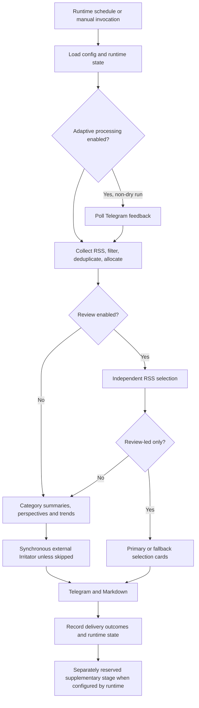

# Architecture — Daily News Digest

> Current engine reference, checked against main at `1cd1a97` on 2026-10-01.
> [Digest context](domain/digest/overview.md) · [Irritator context](domain/irritator/overview.md)

## Overview

Digest is a personal information-intake product, not simply an article formatter.
Radar collects and analyses a chosen source portfolio. Feedback and approved discovery
adjust that portfolio. Irritator searches for external evidence that challenges or
complicates the narratives in the operator's reading.

The public engine contains Python code and CI. A separate runtime owns configuration,
credentials, schedules, JSON state and Markdown output. GitHub Actions can execute and
persist each run without a continuously running service or external database. Persistence
requires the runtime workflow to save state; writing a local file is not a durable push.
See [ADR-0002](decisions/0002-engine-instance-split.md) and
[ADR-0003](decisions/0003-source-state-split.md).

The package is 2.0.0. The older architecture document described v1 category summarization
as the only execution path. The original is retained in git history; current behavior
has a second, opt-in RSS-review path. Full-source enrichment in
[draft #93](https://github.com/Lenivvenil/digest/pull/93) is not available on main and is
not the operating architecture documented below.

## Data flow


```mermaid
flowchart TD
    RUN[Runtime schedule or manual invocation] --> CFG[Load config and runtime state]
    CFG --> FB{Adaptive processing enabled?}
    FB -->|Yes, non-dry run| POLL[Poll Telegram feedback]
    FB --> COL[Collect RSS, filter, deduplicate, allocate]
    POLL --> COL
    COL --> MODE{Review enabled?}
    MODE -->|No| CAT[Category summaries, perspectives and trends]
    MODE -->|Yes| REV[Independent RSS selection]
    REV --> RLO{Review-led only?}
    RLO -->|No| CAT
    RLO -->|Yes| PRIMARY[Primary or fallback selection cards]
    CAT --> SYNC[Synchronous external Irritator unless skipped]
    SYNC --> DELIVERY[Telegram and Markdown]
    PRIMARY --> DELIVERY
    DELIVERY --> RECEIPT[Record delivery outcomes and runtime state]
    RECEIPT --> OPTIONAL[Separately reserved supplementary stage when configured by runtime]
```

`--radar-only` prints Radar summary output and returns before normal delivery or
Irritator. It can still collect/analyse sources; use `--dry-run` as well to suppress
the normal feedback/state mutation path.

In the review-led-only mode, the runtime can run a bounded Irritator process after
primary delivery from its saved evidence checkpoint. This ordering prevents that
supplementary process from blocking the already completed primary output. It does not
prove the primary card is factually correct. Independent model selection is a separate
experiment, not external counter-evidence or a verified factual consensus.

## Modules and responsibilities

| Module | Responsibility |
| --- | --- |
| `main.py` | Main CLI, collection/analysis/delivery orchestration and exit semantics |
| `config.py` | YAML loading, dataclasses and validation |
| `radar/collector.py` | Concurrent HTTP feed acquisition, parsing, freshness/blocklist filtering, title/URL deduplication and source-slot allocation |
| `radar/summarizer.py` | Category, perspective, trend and article prompts |
| `llm.py` | Provider adapters, roles/routes, fallback and bounded request controls |
| `review.py` | Immutable RSS evidence packet, independent selections, partial-item validation and fallback card attribution |
| `review_checkpoint.py`, `review_resume.py` | Validated saved reviews and bounded missing-review resume |
| `irritator/` | Narrative extraction, external queries, candidate validation and counter-signal ranking |
| `post_delivery.py`, `irritator/evidence_stage.py` | Separately reserved post-delivery processing from saved evidence |
| `delivery/telegram.py` | Telegram article cards, vote buttons and confirmed transport accounting |
| `delivery/markdown.py` | Markdown archive and review checkpoint output |
| `feedback.py` | Telegram polling, vote parsing, article/source mapping and bot commands |
| `source_scorer.py` | Source metrics, effective priorities, trial lifecycle state and bubble diagnostics |
| `discovery.py` | Proposed feeds, URL validation, approval cards and approved additions to runtime config |
| `_dns_pinning.py`, `_sanitize.py` | Outbound URL/DNS protection and untrusted feed-text sanitization |
| `_util.py` | Atomic JSON write and temporary-file utilities |

## Adaptive priority system

`adaptive.enabled: true` enables the existing priority-adjustment path. Base priority,
source statistics and available feedback contribute to a bounded effective priority:

```text
base_norm = source.priority / 5.0
score = calculate_score(source_stats)
feedback = source_feedback_score if present, otherwise 0.5
weighted = base_norm * base_weight + score * score_weight + feedback * feedback_weight
priority = round(min_priority + weighted * (max_priority - min_priority))
priority += 1 if the source is trending else 0
priority = clamp(priority, min_priority, max_priority)
```

```yaml
adaptive:
  enabled: true
  feedback_weight: 0.3
  score_weight: 0.5
  base_weight: 0.2
  trial_slots: 2
  min_priority: 1
  max_priority: 5
```

This is source allocation, not an article-level measure of novelty, relevance or truth.
The intended influence of feedback through every current selection path is still an
acceptance requirement in [#48](https://github.com/Lenivvenil/digest/issues/48).

## Source quality scoring

`calculate_score()` returns a bounded value from four observations:

| Observation | Weight | Current calculation |
| --- | --- | --- |
| Reliability | 0.3 | Successful fetches divided by total fetches |
| Productivity | 0.3 | Included/found articles over the last seven saved snapshots, with cumulative fallback |
| Description length | 0.2 | Mean description length divided by 100, capped at 1 |
| Recency | 0.2 | Full score through day 3, decreasing to zero by day 10 since last seen |

A source with no fetch history receives 0.5. History retains at most 30 snapshots.
Snapshots represent recorded dates; same-day runs are merged. Gaps can make seven
snapshots span more than seven calendar days. Long descriptions and frequent publications do not establish useful
content. Trending detection compares saved windows and can add a priority bonus.

## Provider execution

Roles such as `summarize`, `extract_narratives`, `generate_queries`, `rank_signals` and
`fallback` assign work to configured providers. Category routing can override the
normal route. Missing credentials remove unavailable routes. The category mode uses
async concurrency, subject to `llm.max_concurrent_requests` and configured pacing.
Provider failure can advance to an eligible fallback; exhaustion is visible failure.

Review slots are pinned to provider/model identities. Their opinions remain independent:
reusing a first review as a second model's input would break that contract. The leading
successful primary/secondary slot may supply cards, with incomplete comparison explicit.
See [BLIND_REVIEW.md](BLIND_REVIEW.md) for evidence limits, retry budgets and semantics.

Free-only operation requires actual account/model entitlement. Context size does not
specify TPM, RPM, daily allowance or price. A timeout or empty result must not be reported
as proof that no interesting articles or counter-signals exist.

## Feedback loop

Article cards use vote URL buttons when `telegram.bot_username` is configured.
The URL carries `start=vote_g_{article_hash}` or `start=vote_b_{article_hash}`;
Telegram requires a subsequent Start tap, generating an ordinary `/start` message.
A visible `/vote g|b <article_hash>` fallback requires no username configuration.
Legacy `fb:a:g/b:{article_hash}` callbacks remain best effort only.
The article/source mapping connects a later vote to the source. Polling is independent
of automatic adaptation and does not continuously handle buttons between scheduled runs.
A private owner chat and matching sender are required; group/inline callbacks cannot
change preferences. An active webhook is reported and preserved, never deleted.

One bounded batch is applied to a candidate store and strictly persisted with its offset
and minimal pending reply receipts. Managed runtimes commit/push that store before
acknowledging its exact SHA256-bound batch; `--feedback-precollected` prevents a second
poll even after optional-stage failure. Local CLI use has a local-disk durability scope.
Callback queue expiry can prevent ingestion entirely: the upstream lifetime is 150s.
An acknowledgement failure after persistence is different: recorded votes remain saved.
Pending UI receipts are best effort: a later successful collection supersedes any
unanswered earlier receipts while keeping their votes. Command replies and expired
button acknowledgements are not promised eventual delivery.
Only recognized authorized command tags are retained, never arbitrary message bodies.

When adaptive management is off, a rated source receives the centered adjustment
`round((2 * feedback_score - 1) * feedback_weight * (max_priority - min_priority))`
to its configured priority, clamped to the configured range. Unrated sources retain their
exact configured priority. No quality/trending bonuses or lifecycle decisions are added.
Collection allocation uses these effective priorities; model prompts receive
ordinary article evidence, not individual vote data. This changes candidate availability,
not a promise about the final editorial selection.

Source feedback uses a 14-day window and the latest valid rating per article; repeated
taps do not multiply its influence. Stored history is retained unchanged until the
existing 30-day pruning policy applies. Callback IDs and owner-bound vote-message identities are each bounded to the newest
1,000 receipts, alongside the existing 1,000-entry article map; a batch contains at most 100
updates. Ordinary messages have at most 24-hour upstream retention, not a guaranteed
processing window. Schedule delays/failures can lose votes before collection.
See [ADR-0006](decisions/0006-batch-message-voting.md); no continuous receiver is provisioned.

Telegram may restart update IDs after a week without events. A missing, future or
six-day-old observation timestamp therefore triggers a single read with no offset.
This does not confirm pending updates. The previous cursor is retained as audit data;
a nonempty returned batch establishes the new cursor only through strict persistence.
An empty recovery read leaves the old cursor untrusted. The six-day trust limit is
conservative because received events may already be up to 24 hours old. See the
[official update semantics](https://core.telegram.org/bots/api#getupdates).
The article/source mapping is bounded to 1,000 retained entries. Existing `/status`
and `/bubble` commands are handled through this same scheduled poller and restrict
responses to the configured owner chat. Bubble diagnostics describe saved diversity,
category mix, feedback and lifecycle state; they do not measure factual accuracy.

## Trial source lifecycle and discovery

1. `--discover` asks a model for feeds in underrepresented categories, validates feed
   URLs, persists candidates and requests operator approval where Telegram is configured.
2. Polling records approval/rejection callbacks. Approved additions are written to the
   **runtime** configuration; rejected candidates are removed from the pending list.
3. Trial sources receive the configured trial allocation. Trial start, graduation and
   demotion are runtime state in `source_state.json`, not fields repeatedly written into
   source configuration by the evaluator.
4. After `trial_days`, the current evaluator uses its source score threshold to graduate
   or demote the source. These operational observations are not editorial acceptance.

No source-discovery schedule is installed by the engine. The runtime owns its cadence
and serialized access to the same state as the main digest.

## Cache architecture

| Runtime file | Purpose and retention |
| --- | --- |
| `seen_articles.json` | Article identity/timestamps; dedup retention policy in collector |
| `source_stats.json` | Per-source observations and up to 30 saved history snapshots |
| `feedback.json` | Votes, last update offset, last-digest metadata and article/source mapping |
| `source_state.json` | Versioned trial/graduation/demotion state; not automatically pruned as statistics |
| `source_category_map.json` | Config-derived category mapping used by bubble diagnostics |
| `pending_sources.json` | Proposed sources awaiting decisions |
| `digests/*.review.json` | Immutable RSS evidence and recorded review outcomes for compatible resume |

Atomic temporary-file replacement protects an individual JSON write; it does not make
several files a transaction or prove remote persistence. The runtime must retain state
on partial success and avoid overlapping writers. Do not consume undelivered items just
because they were collected. Review-led required Telegram delivery distinguishes useful
article cards from a diagnostic footer; a footer alone cannot satisfy that requirement.
Unknown send outcomes require explicit handling rather than an assumed safe resend.

## GitHub Actions and release operations

The engine repository's workflow is CI. Daily/discovery schedules and output commits
belong to the separate runtime, so this repository specifies no universal UTC schedule.
Pin a reviewed immutable engine commit, serialize jobs sharing `.cache/`, and persist
confirmed delivery outcomes even if an optional stage fails. A rebase before push alone
is not a replacement for consistent concurrency and failure ordering.

For review-led supplementary stages, follow the exact saved-checkpoint and reservation
procedure in the review runbook. Retain prior engine/config pins for rollback. Do not
merge experimental full-source code merely because unit tests or transport succeeded.
The unresolved product gates are tracked in #55; the documentation/onboarding stage of
#94 is currently active. Neither changes the production runtime by itself.

## Security

RSS/public-source requests use the URL validation and DNS-pinning path to reject private
and loopback destinations and reduce DNS-rebinding risk. Feed titles/descriptions are
untrusted content: sanitization removes HTML, decodes entities, normalizes whitespace
and limits the description supplied to existing RSS prompts. Sanitization does not turn
an excerpt into a full article or guarantee immunity to all malicious instructions.

Keep real keys/tokens in runtime environment variables or Actions secrets. The engine
does not automatically load `.env`. Never commit credentials or source-account details
in public examples. Runtime artifacts can contain source bodies and model outputs;
choose access and retention deliberately rather than copying them into the public repo.

## Diagnostics and monitoring

The main run summary reports feed counts, new articles, review status and delivery
outcomes. Telegram status text may include source successes/errors and adaptive metrics.
A successful footer is not a successful article delivery, and a completed comparison is
not a fact-check certificate. Runtime failure notifications depend on its workflow;
the engine alone does not install an Actions-to-Telegram alert service.

Python modules use logging. `--verbose` enables DEBUG; routine operation uses INFO.
Preserve useful failure reasons without exposing credentials or treating unknown quota
causes as known provider limits.

<a id="ограничения-и-известные-особенности"></a>

## Limitations and known behavior

- Free provider quotas and GitHub Actions minute allowances are account-dependent.
  Verify actual capacity; multiplying an assumed short run time is not a throughput test.
- Scheduled Telegram polling delays acknowledgements. Coupling it to adaptation is an
  open feedback defect, not the desired product contract.
- RSS selection has bounded excerpt/candidate coverage. Missing candidates are not
  proven irrelevant; #55 keeps this quality gap explicit.
- Renaming a configured source affects its statistics identity; inactive statistics may
  be pruned, while lifecycle ownership follows its separate state contract.
- External adapter failures in #77 limit counter-evidence coverage. Preserve a visible
  incomplete result rather than asserting that the world supplied no contrary evidence.
- `radar.language` controls direct en/ru generation. Optional presentation translation
  requires canonical English and leaves source evidence and analysis language unchanged;
  see [ADR-0005](decisions/0005-optional-presentation-translation.md). Its generated-text
  scope and unverified semantic-fidelity boundary are documented explicitly.


## Daily operating boundary (proposal, 2026-10-02)

The canonical [Digest operating envelope](domain/digest/overview.md#operating-envelope-and-daily-edition-decision--2026-10-02)
records the measured cost, daily schedule proposal, maintenance reserve, account-quota
uncertainty and retention risks. This architecture page does not duplicate that budget.
A cron change alone does not implement compact output: the current sender posts article
cards and can retry uncertain requests. The proposed compact renderer must preserve
complete text, source/vote identity and per-article confirmed chunk coverage, and must
not claim exactly-once delivery across a crash before state persistence.

Retain configured translation and actual bounded Irritator/comparison processing.
The initial compact presentation proposes archive-only optional outcomes, with honest
status, instead of extra Telegram pushes. No new receiver, queue or feedback polling
cron is implied. Daily voting remains best effort under [ADR0006](decisions/0006-batch-message-voting.md).
