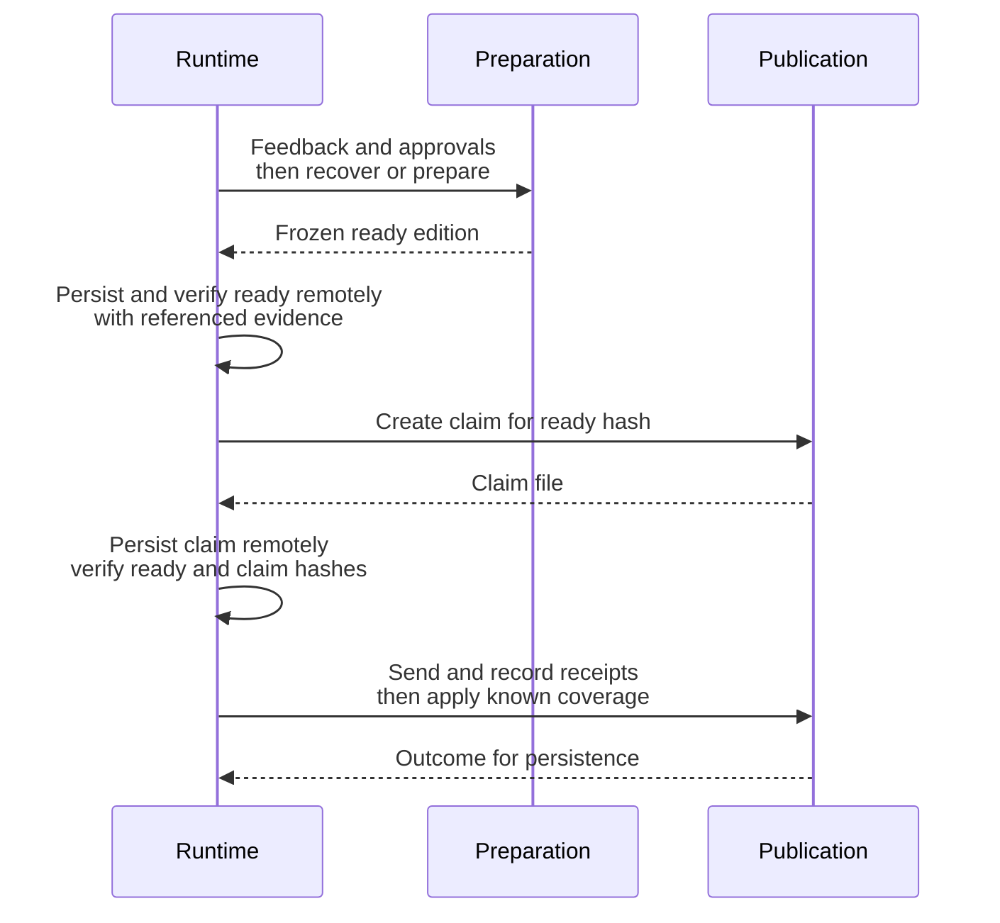

# Architecture — Daily News Digest

Digest separates choosing an edition from publishing its exact bytes.

## Overview

For an ordinary publishable edition:

1. **Prepare.** Review one bounded RSS packet, save accepted work and freeze its presentation.
2. **Persist.** The runtime verifies the ready edition and claim remotely before sending.
3. **Publish.** Send frozen bytes, record confirmations and apply known complete coverage.

One Python engine owns the decisions; a private runtime supplies configuration,
credentials, scheduling and durable Git storage. Telegram is an external effect
that cannot be rolled back.

[Recover an edition](OPERATIONS.md#inspect-an-interrupted-edition) · [Find an owner](#entities-contracts-and-enforcement) · [Find code](#modules-and-responsibilities) · [Compare scenarios](#supported-application-scenarios)

Commands live in [Operations](OPERATIONS.md); exact contracts in [State and effects](STATE_AND_EFFECTS.md).

## Prepared-edition data flow

```mermaid
sequenceDiagram
    participant R as Runtime
    participant P as Preparation
    participant D as Publication
    R->>P: Feedback and approvals<br/>then recover or prepare
    P-->>R: Frozen ready edition
    R->>R: Persist and verify ready remotely<br/>with referenced evidence
    R->>D: Create claim for ready hash
    D-->>R: Claim file
    R->>R: Persist claim remotely<br/>verify ready and claim hashes
    R->>D: Send and record receipts<br/>then apply known coverage
    D-->>R: Outcome for persistence
```

This overview follows a publishable edition; see [preparation outcomes](STATE_AND_EFFECTS.md#outcomes-in-the-application) and
[interruption recovery](OPERATIONS.md#inspect-an-interrupted-edition) for other results.
The arrows are ordered operations, not a transaction. Failure between them leaves
recoverable work or a hold, according to the boundary already crossed.

### Two recovery checkpoints

There are two recovery boundaries before transport:

- **Accepted preparation** preserves the reading decision before translation,
  attribution, archive writing or rendering can fail
- **Ready edition** preserves the final payloads before a sending process begins;
  the sender does not run selection, translation or rendering again

A claim and transport receipts distinguish an unused ready edition from an attempt
that may already have reached Telegram. Confirmed transport and completed local
accounting are separate facts. The [domain story](domain/digest/overview.md#one-story-through-the-system)
traces these distinctions through one illustrative reading decision.

## Preparing an edition

1. Process feedback and verified source approvals independently of publication.
2. Prefer an existing edition or matching accepted preparation before fresh collection.
3. Collect and reconcile candidates, then recover a compatible report or review one bounded packet.
4. Resolve one editorial response and save/read back accepted canonical work.
5. Revalidate that reference, present the cards, write the archive and freeze ready bytes.

Accepted empty work remains a checkpoint without a ready edition. A failed or
abstaining fallback is not automatically accepted no-news. Candidate and category
admission keep their distinct rules; the exact [preparation and presentation contract](STATE_AND_EFFECTS.md#preparation-and-presentation)
owns outcomes, reference checks and write order.

## Entities, contracts and enforcement

| Boundary | Rule | Code owner |
| --- | --- | --- |
| Observation → candidate | Preserve exact source occurrences and distinguish eligibility, review progress and delivery evidence. | [candidate values](../digest/domain/editorial/candidates.py), [candidate policy](../digest/domain/editorial/candidate_policy.py) |
| Candidate → packet → review | Admission is bounded; persist the planned packet before review. Shared request bytes bind planning, execution and resume. | [candidate application](../digest/application/candidate_review.py), [request builder](../digest/application/review_request.py), [review application](../digest/application/review.py) |
| Review → accepted preparation | Selected cards or a qualifying primary abstention are canonical work; incomplete output is not an accepted empty edition. | [preparation application](../digest/application/preparation.py), [checkpoint codec and accepted reference](../digest/preparation.py) |
| Canonical work → presentation | Translation changes generated prose while retaining source identity/evidence. Required main-card provenance failure holds accepted work; unsafe optional closing insertion is omitted. | [publication assembly](../digest/application/publication.py), [attribution](../digest/application/source_attribution.py), [accepted presentation](../digest/edition_runtime.py) |
| Presentation → frozen edition | Bind payloads, article coverage, recipient, publication window and archive references together. | [edition domain](../digest/domain/delivery/edition.py), [prepared application](../digest/application/prepared_delivery.py) |
| Ready → claim → transport | Require the exact remote ready/claim hashes. Persist attempted count before each POST and each known confirmation afterward. | [prepared application](../digest/application/prepared_delivery.py), [storage](../digest/adapters/storage/edition.py), [Telegram adapter](../digest/adapters/telegram/prepared.py) |
| Receipts → applied outcome | Apply only known complete article coverage; mark receipts applied after the ordered operational writes succeed. | [coverage projection](../digest/domain/delivery/outcomes.py), [prepared publication](../digest/application/prepared_delivery.py) |
| Confirmed publication → later supplementary evidence | Freeze canonical delivered targets and source occurrences; the evidence producer retains narrative/ranking authority. Preserve one immutable projection and per-attempt disposition. | [origin application](../digest/application/investigation_origin.py), [delivered values](../digest/domain/investigation/delivered.py), [evidence stage](../digest/irritator/evidence_stage.py), [supplement application](../digest/application/supplement.py) |
| Fragment coverage → consumption | Separate supplement chunks from article attribution. Consume only complete positive owner-matching coverage inside receipt-owned publication before the applied marker is written. | [supplement values](../digest/domain/delivery/supplement.py), [prepared application](../digest/application/prepared_delivery.py) |

## Sending and applying coverage

Prepared publication owns frozen-byte validation, one-attempt transport, exact-receipt
application and the verified applied marker. The runtime owns the remote durability
barriers and retention of partial outcomes. It must serialize writers sharing state.
There is no transaction across Telegram, Git and multiple accounting files.

Use [send and apply](STATE_AND_EFFECTS.md#send-and-apply) for the exact contract and
[inspect an interrupted edition](OPERATIONS.md#inspect-an-interrupted-edition) for a
safe next step. Missing receipts cannot establish that nothing was sent; an unresolved
claim does not become safe merely by expiring.

## Supported application scenarios

| Scenario | Execution and publication boundary |
| --- | --- |
| Ordinary review-led preparation | One bounded primary packet, at most one configured secondary fallback, canonical acceptance, then presentation/freeze. Independent comparison remains separate. |
| Prepared sending | Frozen bytes and persisted claim/receipts only; no model work. |
| Category/legacy execution | Category summaries, optional perspectives and direct output. It retains its own guard, Markdown consumption and retry/error behavior. |
| Independent comparison/resume | Review slots assess identical evidence independently. Report-only or supplementary output does not create a new primary edition. |
| Source discovery | Propose, validate, persist and request approval; source activation requires a separately verified operator decision. |
| Supplementary investigation | Search external sources from frozen evidence under its own attempt. New compact attempts bind actually delivered canonical cards and may retain one accepted fragment for a later ordinary edition; unbound standalone results have no fragment eligibility. |
| Experimental source preparation | Optional source-bound acquisition/analysis with its own technical handoff and uncertainty holds; it does not publish a concatenated prototype as an edition. |

Optional comparison and external investigation use retained evidence after primary
publication. Their results are archived; eligible target-bound investigation material
can enter a later ordinary edition without a separate supplementary dispatch. Optionality
and useful-counter-evidence acceptance remain separate; see [supplementary investigation](ADVANCED_OPERATIONS.md#supplementary-investigation).

See [transport protocols](STATE_AND_EFFECTS.md#transport-protocols) for distinct
confirmation, retry and fallback rules, and [experimental source reading](ADVANCED_OPERATIONS.md#experimental-source-reading)
for reconciliation ownership and technical-handoff limits.

## Feedback loop

Feedback is independent of today's generation and delivery outcome. The private-owner
poller validates identity/replay; application code saves the exact batch before acknowledgement.
Managed runtimes persist it remotely first. A later publication failure cannot roll votes back.
Source allocation uses effective priorities; models receive supplied evidence rather than
individual private votes. Changed allocation does not guarantee changed editorial selection.

[Feedback operations](OPERATIONS.md#feedback-and-source-decisions) owns the collect/persist/ack
sequence, observation timestamps and old/full-token limits. [ADR0021](decisions/0021-catalog-feedback-boundaries.md)
and [ADR0024](decisions/0024-full-article-vote-identity.md) retain identity and scoring rationale.

## Trial source lifecycle and discovery

Source configuration describes the portfolio; trial/graduation/demotion are runtime
state. Statistics describe observations and inclusion, not truth. Scoring and trial
rules receive explicit clock observations from the application, so separate observation
points preserve their existing behavior around a day boundary.

Discovery rotates configured exploration areas independently of Irritator. A proposal
must pass feed validation and be saved before an approval card is sent. Both receipt
reservation and the exact pending-proposal hash are checked before sending; uncertain
sending remains held. An approval is revalidated against one current, exact proposal
before the application performs its idempotent source addition. YAML/backup or later
state failures preserve the decision/proposal for inspection or retry under the existing
ordered contract. No source is activated merely because a model suggested it.

Configure [exploration areas](CONFIGURATION.md#source-discovery) and follow the
[proposal/approval workflow](OPERATIONS.md#source-discovery) for operator actions.

## Provider execution

Declarative settings select routes and limits. An explicitly passed lazy `ModelExecution`
owns concurrency, pacing, cooldowns and local attempt accounting. Constructing it
neither inspects quota nor acquires an allowance, so accepted work can recover without
initializing model work. [Request identity and reuse](STATE_AND_EFFECTS.md#request-identity-and-reuse)
owns fresh/shared execution, reservations, cache identity and hash encodings.

## Modules and responsibilities

| Responsibility | Entry or owner |
| --- | --- |
| Public command dispatch and reporting | `main.main`, `cli/arguments.py`, `cli/reporting.py` |
| Select an execution scenario | `application/execution.py` |
| Prepare ordinary canonical work | `application/preparation.py:prepare_edition` |
| Inspect/recover accepted or ready work; present/freeze | `edition_runtime.py:recover_preparation`, `accept_preparation`, `present_preparation`; `preparation.py:persist_accepted_preparation`, `load_accepted_preparation` |
| Assemble presented main cards and optional closing disposition | `application/publication.py:assemble_publication`, `PublicationAssembly` |
| Candidate rules, packet construction and ordered persistence | `domain/editorial/candidate_policy.py`, `application/candidate_review.py`, `application/candidate_lifecycle.py` |
| Canonical RSS item preparation, measurement and evidence bundle serialization | `domain/editorial/evidence.py` |
| Resolve primary/fallback authority and restore saved reviews | `application/review.py:run_primary_review`, `domain/editorial/attempts.py:resolve_review`, `restore_review` |
| Category acceptance and ordered coordination | `application/preparation.py:_accept_category_preparation`, `_prepare_category_edition`; [category contract](STATE_AND_EFFECTS.md#outcomes-in-the-application) |
| Configured request, review routes and display copy | `application/review_request.py`, `application/review.py`, `presentation/review.py` |
| Freeze/claim/send/inspect an edition | `application/prepared_delivery.py`; CLI phases enter through `edition_runtime.delivery_phase` |
| Edition/claim/receipt validation and bytes | `domain/delivery/edition.py`, `adapters/storage/edition.py` |
| One prepared Telegram POST | `adapters/telegram/prepared.py` |
| Apply known article coverage | `application/prepared_delivery.py:send_prepared_edition` for exact persisted prepared receipts through accounting and verified applied marking; `application/delivery.py` for legacy direct output, with feedback/catalog policy owners |
| Feedback and approved source application | `application/feedback.py`, `application/run_state.py` |
| Discovery and external investigation | `application/discovery.py`; `post_delivery.py`, `irritator/evidence_stage.py` |

Domain code defines values and decision rules. Applications sequence effects; adapters
perform concrete I/O; presentation builds output copies. The unused RSS review and
candidate import bridges are retired with an explicit
[migration map](decisions/0016-candidate-contracts-and-retirement.md#retire-the-rss-import-bridges--2026-10-08).
Feedback, discovery and source-scoring compatibility interfaces remain supported.
The map describes ownership, not a requirement that every facade disappear.

Candidate admission returns exact scheduling-order occurrences together with their
canonical evidence. Its lazy occurrence cache shares the RSS builder's item preparation
and JSON measurement; accepted items retain the separate category-round-robin evidence
order. Packet construction consumes that result directly. The
[admission ownership amendment](decisions/0008-candidate-selection-progress.md#candidate-admission-ownership-211)
records the internal return migration and preserved scheduling and trust boundaries.

## Deliberate remaining coupling

Candidate collection accounting retains the eager Radar package dependency. Irritator's
registry/package initialization and some presentation type references retain their
existing imports; individual pure validators do not imply universal cold-import
isolation. Translation, optional full-source assembly, closing sidecars and trial/resume
marker persistence have explicit owners or compatibility boundaries outside ordinary
RSS review. Their invariants are not silently unified by this layout.

## Security

Untrusted feed, discovery, article and optional signal-liveness acquisition share
one bounded, connection-scoped public-fetch operation. Telegram adapters share safe
diagnostics without merging their transport policies. Feed sanitization does not
make excerpts complete articles or guarantee immunity to malicious instructions.

The exact [public acquisition and diagnostic limits](STATE_AND_EFFECTS.md#public-acquisition-and-diagnostics)
cover addresses, redirects, bytes, deadlines, decoding and redaction scope. Fixed-endpoint
search clients retain their own policies; this is not a universal outbound-HTTP guarantee.

Keep real keys/tokens in runtime environment variables or Actions secrets. The engine
does not automatically load `.env`. Never commit credentials or source-account details
in public examples. Runtime artifacts can contain source bodies and model outputs;
choose access and retention deliberately rather than copying them into the public repo.

## Target architecture and migration

Accepted direction is separate from implemented contracts and observed production quality.
Read the [target architecture](MIGRATION.md#target-architecture-and-migration), its
[destination and boundaries](MIGRATION.md#destination-and-boundaries), and the
[staged migration and exit evidence](MIGRATION.md#staged-migration-and-exit-evidence).
Issue [#164](https://github.com/Lenivvenil/digest/issues/164) carries current implementation
evidence; [#91](https://github.com/Lenivvenil/digest/issues/91) carries product acceptance.

## Detailed contract routes

Older links below keep their exact subject while the detail has one canonical home.

- [Target destination and boundaries](MIGRATION.md#destination-and-boundaries)

- [Migration stages and exit evidence](MIGRATION.md#staged-migration-and-exit-evidence)

- [Explicit application outcomes](STATE_AND_EFFECTS.md#outcomes-in-the-application)

- [Publication records and exact byte bindings](STATE_AND_EFFECTS.md#publication-records)

- [Other retained state](STATE_AND_EFFECTS.md#other-retained-state)

- [Prepared sending and application](STATE_AND_EFFECTS.md#send-and-apply)

- [Prepared/direct output-effect matrix](STATE_AND_EFFECTS.md#output-effect-matrix)

- [Transport protocol compatibility](STATE_AND_EFFECTS.md#transport-protocols)

- [Request reuse and source attribution](STATE_AND_EFFECTS.md#request-identity-and-reuse)

## Decisions and history

The [ADR index](decisions/README.md) records the architectural decisions. The
[dated architecture and migration record](history/architecture-2026-10-08.md)
preserves prior implementation stages, detailed acceptance evidence and release facts.
Use runtime pins and receipts to establish deployment; this current design is not a
substitute for observed operational state.

- [Adaptive priority system](history/architecture-2026-10-08.md#adaptive-priority-system)

- [Source quality scoring](history/architecture-2026-10-08.md#source-quality-scoring)

- [GitHub Actions and release operations](history/architecture-2026-10-08.md#github-actions-and-release-operations)

- [Diagnostics and monitoring](history/architecture-2026-10-08.md#diagnostics-and-monitoring)

- [Limitations and known behavior](history/architecture-2026-10-08.md#limitations-and-known-behavior)

- [Daily operating boundary (proposal, 2026-10-02)](history/architecture-2026-10-08.md#daily-operating-boundary-proposal-2026-10-02)

- [Appendix: migration and release history](history/architecture-2026-10-08.md#appendix-migration-and-release-history)

- [Release scope — 2026-10-07](history/architecture-2026-10-08.md#release-scope--2026-10-07)

- [Structural migration: current stage and target](history/architecture-2026-10-08.md#structural-migration-current-stage-and-target)

- [Stage 1: application ownership](history/architecture-2026-10-08.md#stage-1-application-ownership)

- [Stage 2: candidate contracts and explicit retirement](history/architecture-2026-10-08.md#stage-2-candidate-contracts-and-explicit-retirement)

- [Stage 5: investigation signal validation ownership](history/architecture-2026-10-08.md#stage-5-investigation-signal-validation-ownership)

- [Stage 5: bounded RSS review ownership (#165)](history/architecture-2026-10-08.md#stage-5-bounded-rss-review-ownership-165)

- [Target responsibility map](history/architecture-2026-10-08.md#target-responsibility-map)

- [Incremental migration and rollback](history/architecture-2026-10-08.md#incremental-migration-and-rollback)

- [ограничения-и-известные-особенности](history/architecture-2026-10-08.md#ограничения-и-известные-особенности)
