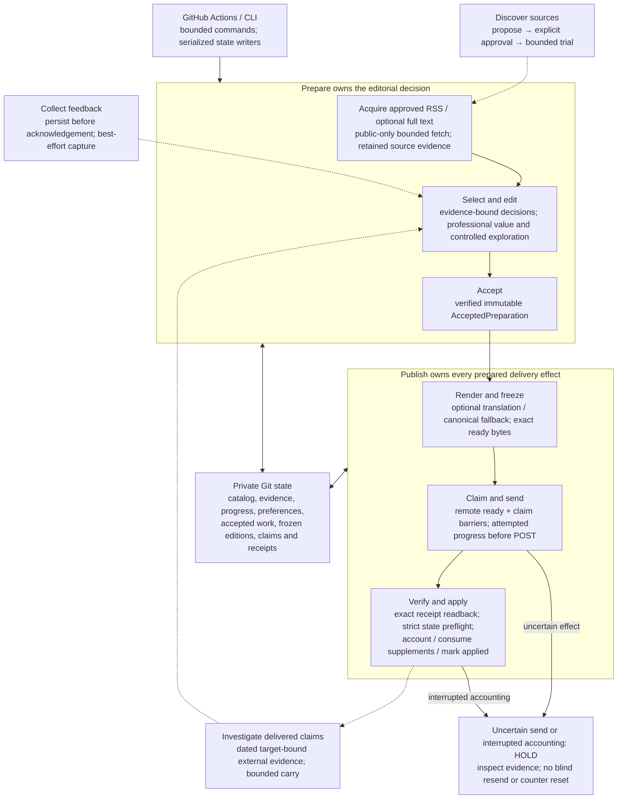

# Architecture migration

This is the accepted target and staged exit evidence, not a description of everything currently implemented or deployed.

- [Read the target](#destination-and-boundaries) and its editable diagram
- [Check stage boundaries and exit evidence](#staged-migration-and-exit-evidence)
- For implemented ownership, return to [Architecture](ARCHITECTURE.md); for exact existing contracts, use [State and effects](STATE_AND_EFFECTS.md)

## Target architecture and migration

**Accepted direction, 2026-10-09; migration in progress.** This guide describes the
intended destination, not deployed guarantees. The [current contracts](STATE_AND_EFFECTS.md)
remain authoritative for existing behavior until a reviewed implementation explicitly
amends them. [#164](https://github.com/Lenivvenil/digest/issues/164) tracks structural
work; [#91](https://github.com/Lenivvenil/digest/issues/91) tracks product acceptance.
The ownership decision is recorded in [ADR0015](decisions/0015-application-workflow-ownership.md#target-ownership-continuation--2026-10-09).

### Destination and boundaries

Keep one Python package and short-lived GitHub Actions commands, with no always-on
service, new infrastructure or paid route required. CLI/composition selects application
use cases; application code coordinates effects; pure domain policies decide validity,
eligibility and coverage. Concrete HTTP, model, Telegram and storage adapters implement
those operations. Introduce a port only where a real boundary needs it, not a generic
workflow, repository or event framework.

The editable diagram shows the target ordinary prepared path. Dashed inputs affect
future preparation. Legacy cards, direct compact, Markdown and standalone supplements
retain their distinct contracts until deliberately migrated.

- **Preparation has one accepted handoff.** Every publishable ordinary or category
  result must enter the existing verified `AcceptedPreparation` boundary before
  presentation. Category editorial/no-news decisions remain distinct. Acceptance
  preserves source identity, qualifications and provenance; it is local readback proof,
  not proof of remote persistence or semantic quality.
- **Publication owns irreversible prepared effects.** One use case consumes accepted
  work, freezes exact content, verifies ready/claim barriers, sends under the existing
  transport policy, verifies saved receipts and owns accounting, required supplement
  consumption and the final applied write. Reporting projections cannot authorize
  these operations. Remove caller-managed transitions and duplicate live authority
  rather than wrapping them in another context object.
- **Persistence is evidence, not a distributed transaction.** Strict reads distinguish
  legitimate first-run absence from invalid existing state. Validate applicable current
  accounting inputs before the first accounting write. Per-file atomicity does not
  make a multi-file update replayable. Unknown transport and incomplete application
  remain held; no automatic saved-receipt replay, state reset or supplement release.
  Telegram confirmation establishes an API receipt, not human receipt or exactly-once
  delivery across Git and Telegram.
- **External inputs have explicit trust and resource limits.** Every untrusted URL hop
  uses connection-scoped public-address validation, bounded redirects, decoded bytes
  and total elapsed time without ambient proxies or a process-global resolver override.
  Pin connections while preserving original-host TLS verification, SNI and HTTP Host.
  Telegram diagnostics retain safe stage/status evidence without credentials, raw
  request URLs or response bodies. Feed/article parsing and transport policies remain
  separate from these small shared safety operations.
- **The product and operating envelope remain testable claims.** Preserve a useful
  professional radar, humane closing where evidence fits, approved source exploration,
  best-effort feedback and independently failing optional enrichments. Retain category
  analysis, cross-category trends and opt-in three perspectives as distinct supported
  product/scenario contracts; this ordinary-path drawing does not prove their useful
  daily realization. Protect meaning
  in canonical and translated output. Paid routes remain disabled for this migration;
  current account entitlement, model quota, runner usage and archive growth require
  observation. A schedule is not a delivery SLA, and request counts do not prove a
  zero-spend or token-window limit.

### Staged migration and exit evidence

Each stage is a coherent risk or ownership change, not a mandate for one PR per symptom.
Implementation issues carry current status and evidence; this guide does not duplicate
that mutable checklist. Independent observation can proceed while code stages are
reviewed. Product evidence must inform affected behavior changes, but waiting for a
natural run does not block an unrelated mechanical safety repair.

1. **Repair active trust boundaries.** [Public fetch #218](https://github.com/Lenivvenil/digest/issues/218)
   and [Telegram diagnostics #219](https://github.com/Lenivvenil/digest/issues/219). Establish the small public-fetch operation and
   the shared Telegram diagnostic boundary. Preserve concurrency, supported sources,
   exception classification and each send mode's retry/receipt policy. Offline public
   operation tests must exercise redirects to private addresses, rebinding, concurrent
   requests, cancellation, oversized/slow streams and token-free INFO/DEBUG/error/
   traceback paths without mocking away the safety decision. No live exploit probe is
   required. The [current security boundaries](STATE_AND_EFFECTS.md#public-acquisition-and-diagnostics) describe
   the implemented protections; [ADR0026's original context](decisions/0026-public-acquisition-boundary.md#context)
   and the [Telegram diagnostic rationale](decisions/0017-confirmed-delivery-application.md#telegram-diagnostic-boundary--2026-10-09)
   preserve the gaps that motivated this stage.
2. **Establish product and cost evidence.** Build a finite source-bound acceptance set
   from observed editorial/translation failures and valid contrasts; inspect natural
   current-baseline output. Retain allowlisted physical-attempt diagnostics in existing
   reports, including unknown status/usage when absent. Reconcile actual free limits
   and measured use before deciding whether the existing durable budget journal needs
   complete runtime integration. No extra model judge, provider probe, paid route,
   manual digest dispatch or resend is part of acceptance. See [ADR0020](decisions/0020-explicit-model-execution.md),
   [the ordinary domain](domain/digest/overview.md) and [Irritator acceptance](domain/irritator/overview.md).
3. **Give prepared publication one authority.** [#220](https://github.com/Lenivvenil/digest/issues/220). Combine strict accounting preflight
   with the verified accepted-reference handoff for category work and receipt-owned
   application. Retire the raw-snapshot presentation bypass, orphan helpers,
   `PreparedOutcomePolicy`, caller `_merge_delivery` and independently callable
   `mark_applied` only when their responsibilities move to the real owner. Preserve
   accepted/ready/claim/receipt bytes and hashes, CLI phases, remote barriers, source
   and feedback identities, empty-result rules and interruption holds. Amend
   [ADR0017](decisions/0017-confirmed-delivery-application.md) explicitly: its current
   strict current-writer preflight is implemented in slice 1 and verified category
   acceptance in slice 2; receipt-owned application is implemented in slice 3. Prove
   invalid existing state blocks before the first accounting write, valid history survives, and
   every write-failure prefix remains held with a truthful read-only diagnosis.
4. **Resolve measured operating-policy tradeoffs.** Decide supported delivery guarantees,
   professional/trial allocation, retention and feedback cadence from evidence within
   the free envelope. Do not infer publisher independence from source-name entropy or
   unlimited capacity from bounded active checkpoints. Preserve required audit and
   delivery evidence before choosing retention. Follow [candidate progress ADR0008](decisions/0008-candidate-selection-progress.md),
   [exploration ADR0013](decisions/0013-discovery-exploration-state.md) and
   [feedback ADR0006](decisions/0006-batch-message-voting.md). A changed cadence or
   transport guarantee needs its own explicit decision and compatible rollout.
5. **Simplify optional ownership only when justified.** Optional reader completion
   now belongs to its frozen accepted attempt; Page retains coverage and history,
   with explicit pending scheduling or history-0 evidence. One old-wire projection
   preserves retained hashes and exact null/explicit route spelling. See the
   [reader ownership amendment](decisions/0009-selected-source-admission.md#attempt-owned-page-completion--2026-10-10). Defer
   supplement reservation/tombstone redesign until a bounded migration and observed
   need justify it. Keep the [scenario distinctions in ADR0019](decisions/0019-remaining-application-scenarios.md)
   and the [optional closing contract in ADR0014](decisions/0014-optional-humane-closing-item.md).

For every code batch, run applicable offline lint, typing and aggregate regression
checks, then obtain independent strict review of the final diff before merge. Tie CI
and release evidence to the exact revision and tested dependency graph; retain bounded
security-check evidence. Verify main and any compatible private runtime pin separately.
Rollback uses a reviewed compatible code revert or pin while retaining runtime facts;
never clear receipts, reset state or resend to make a check pass. A new wire format
requires a separate reader/rollback compatibility decision.

The measured baseline and migration constraints are recorded in
[#164](https://github.com/Lenivvenil/digest/issues/164). The execution constraint for
this work is at least 92.93% statement coverage; the repository's current CI floor
is still 80% and is not evidence that the stronger constraint passed. Architectural
boundaries, cohesive state ownership, clear contracts and removal of duplicated
logic define progress; there is no test-count target. Preserve meaningful behavioral
and security checks. Retire tests only when production states or duplicate contracts
genuinely disappear, never by packing cases, weakening assertions or adding exclusions.
The abandoned test-only consolidation is not part of this migration.

Close the learning loop with a concise linked record of incident evidence, confirmed
cause versus hypothesis, change, regression proof, deployed revision, natural-run
acceptance and remaining limits. Use the existing issues and operator guide; keep
private runtime payloads, destinations and credentials private. Synthetic success
establishes mechanics; ordinary useful output establishes the separate product gate.
