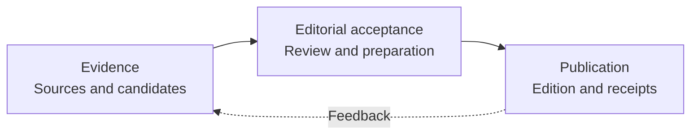

# Digest domain model

Digest turns a source portfolio into a useful daily reading decision: what changed,
why the reader should care, and which original source deserves attention. For this
project, banking, fintech and architecture are the professional core. Approved
cross-field sources broaden that view. Relevance still depends on the supplied
news; a category label is not a publication instruction.

The portfolio should regularly introduce useful, unusual sources across fields.
An optional closing item offers an evidence-backed positive development when the
available material supports one; sparse supply does not imply a daily guarantee.

Radar owns observation and editorial selection. Delivery publishes the accepted
edition. Feedback changes later source allocation, and discovery proposes additions
for the operator to approve. [Irritator](../irritator/overview.md#current-domain-model)
looks for independent evidence that challenges or complicates a narrative. It does
not manufacture disagreement or substitute a second model opinion for a source.

## Current domain model

The central distinction is between **evidence**, **an editorial decision**, and
**publication**. A collected item has not necessarily been reviewed. A selected
article has not necessarily been sent. A successful send has not necessarily been
applied to local accounting. The product retains these as separate facts so a
partial failure cannot silently become a different result.

This is the ordinary review-led reading cycle. Source approval and supplementary
investigation have their own operations; neither is a hidden prerequisite for
sending an already prepared edition.

## Entities and identities

| Concept | Identity and relationship | What it establishes |
| --- | --- | --- |
| Source | A configured name with feed URL, category and allocation settings. Lifecycle state and statistics are stored separately. | Where observations come from and how collection is allocated. Reliability and volume do not establish editorial value. |
| Article | The retained title/link pair supplies the existing 32-character article identifier. | Deduplication identity; it is not a hash of the full article's meaning or text. |
| Source occurrence | An immutable set of title, link, excerpt, source, category, publication time and feed URL, addressed by its content hash. | The exact observation used as evidence. One candidate can retain several occurrences without losing earlier evidence. |
| Candidate | An article identity with retained occurrences, current eligibility and recorded review progress. | Which work remains available, attempted or editorially decided. Eligibility and delivery are separate from its review status. |
| Evidence packet | A bounded collection of supplied RSS items, with stable item IDs and a bundle hash. A candidate packet also records the planning time and request contract. | Exactly what a particular review could consider. Omitted or oversized work has not been rejected editorially. |
| Review and disposition | A review is bound to its slot, provider/model, evidence bundle, prompt and response. A disposition records a same-response selected, not-selected, duplicate or deferred decision. | A model judgment over the retained excerpt. An exact quote proves source binding, not every claim in the generated reason. |
| Canonical card | The selected article identity and generated explanation before optional presentation translation. | A proposed reading decision; the acceptance boundary determines whether it enters a recoverable preparation. Source evidence and identity do not change when presentation prose is translated. |
| Accepted preparation | A dated checkpoint containing canonical cards, their review and an optional closing decision. A genuine accepted abstention contains no cards. | Work that can resume at presentation without reselecting articles. It is not yet a sendable message. |
| Ready edition | A frozen manifest with an edition ID, exact Telegram payloads, article-to-chunk coverage, recipient binding, publication window and referenced evidence hashes. | The bytes eligible for publication after the runtime persists them. Later prompt or model changes cannot rewrite this edition. |
| Claim | A unique claim bound to the exact ready-file hash and owner. | The managed workflow has reserved this frozen edition for its sending attempt. |
| Chunk receipt | A confirmed chunk index, positive Telegram message ID and owner binding, inside a receipt record tied to the ready and claim hashes. | Known transport acceptance. Missing confirmation can mean uncertainty, not proof that nothing was sent. |
| Applied outcome | The receipt record's applied flag, set after attribution, statistics and deduplication effects succeed. | The caller finished applying known coverage. It does not turn partial or unknown transport into a complete edition. |
| Feedback or source decision | An owner-authorized article vote, or approval/rejection bound to an exact saved source proposal. | Input to future source choices. Repeated votes on one exact token use only the latest opinion. Legacy short/full token ambiguity remains explicit in [ADR0024](../../decisions/0024-full-article-vote-identity.md#feedback-history-and-limits); discovery alone does not activate a source. |

The implementation names and persisted records are mapped in
[Architecture](../../ARCHITECTURE.md#entities-contracts-and-enforcement).

## Decisions that must remain distinct

A candidate has three independent questions:

1. **Is it currently eligible?** Source configuration, recency, blocklist and
   delivered-history rules can change eligibility. Exclusion is not an editorial rejection.
2. **What did a review decide?** The exact supplied occurrence and response bind the
   decision. Missing, malformed, over-capacity or unfinished output remains technical work.
3. **Was its whole card confirmed delivered?** Only complete covering chunks provide
   Telegram attribution and delivered identity. An archive alone does not answer this.

A response may select more useful material than can be published. Publication
capacity is applied after relevance assessment. Useful overflow is deferred;
exhausting the response or publication budget must not become a false reason that
an article is uninteresting. Contrary reports are not duplicates merely because
they share a topic.

### A response owns its decision evidence

An ordinary review attempt returns the model review, per-item dispositions and
optional closing capture together. One resolver chooses the usable
primary/fallback attempt. Independent comparison status describes a different
question and does not decide whether primary cards can be used.

Fresh closing-enabled responses supply one complete optional card separately from
professional selections. Main entries and a non-null closer share the configured
detail allowance; publication applies its own main-card cap afterward. Accepted
cards supply selected dispositions; the model accounts only for residual items.
Conflicting residuals leave accounting unresolved without removing a valid card.
An invalid optional card preserves main selections and cannot be silently consumed
as a terminal rejection. Historical captures retain their recorded contract; see
[ADR0014's v2 amendment](../../decisions/0014-optional-humane-closing-item.md#complete-optional-response-card--2026-10-09-amendment).

This result describes raw editorial selections. Projection still decides which
main cards fit, whether approved closing evidence remains eligible and whether
attribution is complete. Persisted records are revalidated when restored; a missing
chosen-slot capture is not the same as a historical packet that never recorded
captures. [ADR0023](../../decisions/0023-response-owned-editorial-outcome.md) records
the internal contract and compatibility boundary.

### Acceptance is a recovery boundary

The ordinary path can accept selected cards, including a validated partial review,
or a valid primary abstention. For a primary abstention, when recorded attempts carry
disposition evidence, acceptance requires it to be resolved; older packets without that capture retain
their existing compatibility behavior. Fresh candidate packets record attempts.
An unavailable primary followed by an abstaining fallback remains incomplete in
the current selection policy. It does not create
an accepted no-news checkpoint.

After acceptance, translation, source-credit checks, archive writing or rendering
may still fail. The saved canonical preparation lets a later invocation resume those
steps. A valid empty preparation is also retained for its intended day: repeated
preparation in that window returns no ready edition and does not advance another packet.

A saved candidate report is a different recovery object. It can spare a new review
once fresh collection and eligibility reconciliation have run. It does not grant
the precedence or publication authority of an accepted preparation or ready edition.
If accepted preparation expires before delivery, an exact still-eligible undelivered
selection can remain reusable through its candidate report, even after handoff.
Handed-off empty abstentions stay consumed; a selection with only some eligible items
returns that subset to planning. Handoff therefore never means delivery.

### Publication has two completion facts

**Confirmed** means all transport chunks were accepted, including a notice-only
chunk. **Applied** means the caller finished recording the known article coverage.
A confirmed receipt with `applied: false` is held, because some accounting writes
may already have happened. A partial or unknown transport remains held even if its
known coverage was applied.

The manifest is frozen before sending. Claims and receipts never authorize a new
selection, a rerender or a blind retry. This conservative rule protects against a
duplicate edition when Telegram accepted a request but its response or the following
local write was lost.

## One story through the system

Consider a supplied item about a payment-control change. Its title/link identify
one candidate; the feed excerpt and publication time identify the occurrence being
reviewed. If that excerpt changes later, the old review still proves only the old
occurrence. A later observation must not rewrite its evidence.

The candidate enters a bounded packet. A provider timeout leaves it unfinished.
A valid selection instead contributes a canonical card and an accepted preparation.
If presentation fails, recovery uses that preparation rather than asking the model
to choose again. Once presentation succeeds, the exact card text, source link,
buttons and chunk coverage are frozen in a ready edition.

The runtime persists readiness, then a claim, before allowing the sender to POST.
If all chunks are confirmed and accounting is applied, the article becomes eligible
for attributed feedback. If the send is uncertain, the edition is held for inspection;
a new preparation must not be used to conceal that uncertainty.

## Product rules

| Requirement | Design consequence |
| --- | --- |
| D-01: keep a free operating path and avoid exclusive dependence on one vendor | Runtime routes must respect actual account entitlement and budgets; a change cannot silently add a paid dependency. |
| D-02: provide useful, faithful reading with a specific reason to visit the original | Generated reasons distinguish supplied facts from relevance inference and preserve material qualifications. Translation changes generated prose, not evidence. |
| D-03: separate technical limits from editorial rejection | Bounded admission, provider failure and publication capacity remain visible unfinished/deferred work. Full-source processing is an optional mechanism. |
| D-04: preserve genuine external counter-evidence while primary delivery can succeed independently | Supplementary investigation uses retained evidence and its own bounded operation. In compact mode its result is archived, without another Telegram push. |
| D-05: treat Telegram delivery and durable state honestly | Complete article coverage, complete issue transport and applied accounting are separate. Unknown sending cannot be retried blindly. |
| D-06: preserve domain knowledge and trace changes to explicit decisions | Current design lives here and in Architecture; dated requirements, decisions and acceptance evidence remain linked in history. |

Mandatory full-source reading was not an owner requirement. The required outcome is
useful, faithful daily content. The [recorded correction](../../history/digest-domain-2026-10-08.md#requirement-provenance-correction--2026-10-05)
preserves how that scope error arose and was resolved.

## Operating boundary

The runtime has one active preparation and one ready/claim/receipt set, not an
unbounded publication queue. Readiness is tied to an intended UTC day. A future
edition cannot be sent early; a current-day edition expires at its day boundary.
Unresolved claimed work blocks replacing it with another edition. A completed,
applied edition permits preparation for a later day.

One fresh ordinary preparation processes one bounded primary packet, with the
configured fallback policy. Accepted preparation or an existing edition takes
precedence over new selection. Source discovery, translation and investigation
share the configured resource constraints; none makes account quota unlimited.
Retained candidate evidence can grow, and sustainable throughput remains an
operational property to measure.

Within new candidate work, the oldest fitting eligible unseen identity gets the
existing protected opportunity before technical retries and fresh/age backfill.
This limits one source of starvation without guaranteeing that arrivals above
capacity can be drained. The [admission decision](../../decisions/0008-candidate-selection-progress.md#oldest-unseen-opportunity-amendment-196)
records freshness, source-diversity and character-budget tradeoffs; admission is
not an editorial judgment or a delivery claim.

The [operational guide](../../BLIND_REVIEW.md) explains publication and recovery.
The [historical operating record](../../history/digest-domain-2026-10-08.md#operating-envelope-and-daily-edition-decision--2026-10-02)
retains measured costs and dated allocation decisions.

## Decisions and history

The [ADR index](../../decisions/README.md) explains the accepted decisions. The
[prior domain and acceptance record](../../history/digest-domain-2026-10-08.md)
preserves dated requirements, rollout evidence and the earlier domain model.
Current behavior is described above and in Architecture; historical tables retain
their original context.

Links to prior sections

- [Bounded Context: Digest](../../history/digest-domain-2026-10-08.md#bounded-context-digest)

- [Current ownership and release scope](../../history/digest-domain-2026-10-08.md#current-ownership-and-release-scope)

- [Source ownership reconciliation — 2026-10-07](../../history/digest-domain-2026-10-08.md#source-ownership-reconciliation--2026-10-07)

- [Telegram delivery ownership reconciliation — 2026-10-07](../../history/digest-domain-2026-10-08.md#telegram-delivery-ownership-reconciliation--2026-10-07)

- [Appendix: requirements and decision history](../../history/digest-domain-2026-10-08.md#appendix-requirements-and-decision-history)

- [Decision and evidence register — 2026-10-01](../../history/digest-domain-2026-10-08.md#decision-and-evidence-register--2026-10-01)

- [Product intent comes before the latest implementation](../../history/digest-domain-2026-10-08.md#product-intent-comes-before-the-latest-implementation)

- [How to read authority and status](../../history/digest-domain-2026-10-08.md#how-to-read-authority-and-status)

- [Historical decisions that must not be rediscovered](../../history/digest-domain-2026-10-08.md#historical-decisions-that-must-not-be-rediscovered)

- [Dated constraint evidence — do not substitute an assumed quota](../../history/digest-domain-2026-10-08.md#dated-constraint-evidence--do-not-substitute-an-assumed-quota)

- [Current implementation versus intended product](../../history/digest-domain-2026-10-08.md#current-implementation-versus-intended-product)

- [Rejected proposals and decisions still open](../../history/digest-domain-2026-10-08.md#rejected-proposals-and-decisions-still-open)

- [Verification gate for the next #55 change](../../history/digest-domain-2026-10-08.md#verification-gate-for-the-next-55-change)

- [Historical domain snapshot — April 2026](../../history/digest-domain-2026-10-08.md#historical-domain-snapshot--april-2026)

- [Purpose](../../history/digest-domain-2026-10-08.md#purpose)

- [Actors](../../history/digest-domain-2026-10-08.md#actors)

- [Events (Event Storming)](../../history/digest-domain-2026-10-08.md#events-event-storming)

- [Boundary](../../history/digest-domain-2026-10-08.md#boundary)

- [Aggregate Root](../../history/digest-domain-2026-10-08.md#aggregate-root)

- [Policies](../../history/digest-domain-2026-10-08.md#policies)

- [Context Map](../../history/digest-domain-2026-10-08.md#context-map)

- [Use Cases](../../history/digest-domain-2026-10-08.md#use-cases)

- [UC-1: Daily pipeline run](../../history/digest-domain-2026-10-08.md#uc-1-daily-pipeline-run)

- [UC-2: User votes on an article](../../history/digest-domain-2026-10-08.md#uc-2-user-votes-on-an-article)

- [UC-3: User requests a filter-bubble report](../../history/digest-domain-2026-10-08.md#uc-3-user-requests-a-filter-bubble-report)

- [UC-4: Operator approves/rejects a new source](../../history/digest-domain-2026-10-08.md#uc-4-operator-approvesrejects-a-new-source)

- [UC-5: Trial source evaluation (graduated/demoted)](../../history/digest-domain-2026-10-08.md#uc-5-trial-source-evaluation-graduateddemoted)

- [Domain Data Model](../../history/digest-domain-2026-10-08.md#domain-data-model)

- [Article](../../history/digest-domain-2026-10-08.md#article)

- [CategorySummary](../../history/digest-domain-2026-10-08.md#categorysummary)

- [ArticleSummary](../../history/digest-domain-2026-10-08.md#articlesummary)

- [Source (aggregate)](../../history/digest-domain-2026-10-08.md#source-aggregate)

- [FeedbackStore](../../history/digest-domain-2026-10-08.md#feedbackstore)

- [SourceStats](../../history/digest-domain-2026-10-08.md#sourcestats)

- [BubbleReport (read model)](../../history/digest-domain-2026-10-08.md#bubblereport-read-model)

- [Interface Contracts](../../history/digest-domain-2026-10-08.md#interface-contracts)

- [NFR](../../history/digest-domain-2026-10-08.md#nfr)

- [Internal Compliance](../../history/digest-domain-2026-10-08.md#internal-compliance)

- [Red Hotspots](../../history/digest-domain-2026-10-08.md#red-hotspots)

- [Ready-edition boundary (#120)](../../history/digest-domain-2026-10-08.md#ready-edition-boundary-120)

- [source-ownership-reconciliation--local-implementation-2026-10-07](../../history/digest-domain-2026-10-08.md#source-ownership-reconciliation--local-implementation-2026-10-07)

- [telegram-delivery-ownership-reconciliation--local-implementation-2026-10-07](../../history/digest-domain-2026-10-08.md#telegram-delivery-ownership-reconciliation--local-implementation-2026-10-07)

- [uc-1-ежедневный-запуск-пайплайна](../../history/digest-domain-2026-10-08.md#uc-1-ежедневный-запуск-пайплайна)

- [uc-2-пользователь-голосует-за-статью](../../history/digest-domain-2026-10-08.md#uc-2-пользователь-голосует-за-статью)

- [uc-3-пользователь-запрашивает-filter-bubble-отчёт](../../history/digest-domain-2026-10-08.md#uc-3-пользователь-запрашивает-filter-bubble-отчёт)

- [uc-4-оператор-одобряетотклоняет-новый-источник](../../history/digest-domain-2026-10-08.md#uc-4-оператор-одобряетотклоняет-новый-источник)

