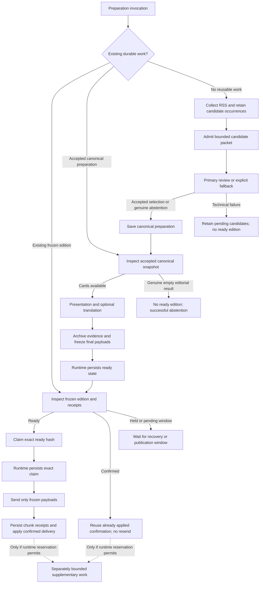
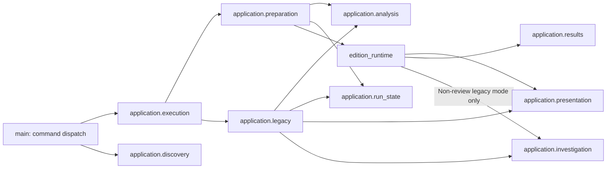

# Historical record: ARCHITECTURE.md before the maintainer design rewrite

Preserved from engine `8a81d24f` on 2026-10-08. This is a dated record of prior
requirements, contracts, implementation notes and acceptance evidence. Read the
[current guide](../ARCHITECTURE.md) for the maintained design. The original text follows;
relative links have been relocated with it.

---

# Architecture — Daily News Digest

Start with the runtime boundary, scenarios and contracts below. The
[ownership map](#modules-and-responsibilities) identifies current code owners;
[recovery and persistence](#cache-architecture) explains the operational limits.
The [migration appendix](#appendix-migration-and-release-history) preserves the
staged decisions, dates and rollback rationale. [Digest](digest-domain-2026-10-08.md)
and [Irritator](../domain/irritator/overview.md) hold domain intent and acceptance evidence.

## Overview

Digest is a personal information-intake product, not simply an article formatter.
Radar collects and analyses a chosen source portfolio. Feedback and approved discovery
adjust that portfolio. Irritator searches for external evidence that challenges or
complicates the narratives in the operator's reading.

The public engine contains Python code and CI. A separate runtime owns configuration,
credentials, schedules, JSON state and Markdown output. GitHub Actions can execute and
persist each run without a continuously running service or external database. Persistence
requires the runtime workflow to save state; writing a local file is not a durable push.
See [ADR-0002](../decisions/0002-engine-instance-split.md) and
[ADR-0003](../decisions/0003-source-state-split.md).

The package is 2.0.0. The older architecture document described v1 category summarization
as the only execution path. The original is retained in git history; current behavior
has a second, opt-in RSS-review path. Full-source enrichment in
[closed, unmerged PR #93](https://github.com/Lenivvenil/digest/pull/93) is not available on main and is
not the operating architecture documented below.

The draft source-admission adapter reuses safe acquisition and contiguous page progress.
It admits only current candidate occurrences with exact saved selection proof, and
freezes technical source evidence before accepted preparation. It does not publish the
draft reading-angle concatenation or mark independent comparison complete. Request
intents preserve ambiguous generation holds; count uncertainty is separate. Proposed
[ADR0009](../decisions/0009-selected-source-admission.md) records this integration. #55
owns useful, faithful editorial output; full-source reconciliation is an optional
experimental mechanism, with runtime activation off.

## Prepared-edition data flow

The deployed review-led path separates model work from sending. Recovery inspects
existing ready editions and accepted preparation before fresh collection/selection.



The runtime owns the remote persistence barriers; local atomic writes alone do not
survive loss of a runner. The sender uses frozen payloads and makes no model calls.
A confirmed chunk is not replayed; an uncertain send remains held for reconciliation.
Accepted preparation may still need presentation work, including translation on a
cache miss. It is not equivalent to a ready edition.

Legacy category-summary/direct-delivery modes remain supported. They can run
synchronous Irritator analysis before delivery and do not inherit the prepared-path
failure isolation merely because they use the same presentation functions.

## Supported application scenarios

The entrypoint delegates to an explicit scenario; sharing a renderer does not make
those scenarios interchangeable.

| Scenario | Application owner | Effect and recovery boundary |
| --- | --- | --- |
| Prepare an edition | `application/preparation.py` | Recover saved work first, then select, accept canonical preparation, present and freeze. It does not send the edition. |
| Publish a prepared edition | `application/prepared_delivery.py` | Validate persisted ready and claim hashes, send frozen payloads and record receipts. No model work; uncertain or unapplied outcomes hold. |
| Legacy category/direct run | `application/legacy.py` | Analyse, optionally investigate and deliver within the legacy guard lifetime. Preserve its own accounting and failure order. |
| Discover proposed sources | `application/discovery.py` | Generate and validate proposals, persist them, emit managed-runtime output, then send the persisted approval cards. Discovery cannot activate a source. |
| Apply feedback and approved changes | `application/feedback.py`, `application/run_state.py` | Persist feedback before acknowledging exact bytes; revalidate an approval against the saved proposal before changing source configuration. |
| Run supplementary investigation | `post_delivery.py`, `irritator/evidence_stage.py` | Use the saved evidence checkpoint and a separate bounded reservation. Compact publication retains supplementary results in the archive. |

`application/execution.py` chooses the scenario and validates incompatible modes
before configuration effects. `main.py` retains public wrappers and the deliberate
managed-output barrier for discovery. Operators should use the [CLI reference](../../README.md#cli-reference)
and [review runbook](review-operations-2026-10-08.md) for commands and runtime persistence steps.

## Entities, contracts and enforcement

| Entity / transition | Invariant and implementation boundary |
| --- | --- |
| Candidate occurrence → `CandidatePacket` | Original source observations and pending status survive bounded admission. Planning is an opportunity, not a successful review. [`plan_packet`, `begin_packet`](../../digest/application/candidate_review.py) preserve packet bounds and proof; capacity deferral is not editorial rejection. |
| Candidate proof → retained history / active checkpoint (#144) | [`domain validators`](../../digest/domain/editorial/candidates.py) check actual occurrence, packet and decision bindings. [`candidate_lifecycle`](../../digest/application/candidate_lifecycle.py) coordinates verified retirement; [`storage`](../../digest/adapters/storage/candidate_progress.py) writes the resulting working set. Persistence without retirement is a separate operation; retained objects and the active file are not one transaction. |
| `EvidenceBundle` → `BlindReviewReport` | Stable evidence IDs bind model selections; allowed one-to-one typography normalization returns the exact original source slice. Detailed-response and publication-card limits are separate; a syntactically valid response is not factual verification. The [`domain review contracts`](../../digest/domain/editorial/reviews.py) own distinct request, canonical and cached validators plus exact-request reuse; [`disposition contracts`](../../digest/domain/editorial/dispositions.py) bind dispositions. [`application/review.py`](../../digest/application/review.py) owns primary/fallback and independent execution, with shared request construction in [`application/review_request.py`](../../digest/application/review_request.py). |
| Report → `PreparationSnapshot` | Accepted canonical cards, report and optional closing decision are saved before presentation. [`preparation.py`](../../digest/preparation.py) validates versioned content; [`save_accepted_preparation`](../../digest/edition_runtime.py) preserves the recovery boundary. |
| Canonical cards → presentation copies | Translation changes generated prose, not article identity, source quotes or canonical evidence. Primary preview uses the same publication path with no signals and a temporary cache. [`application/presentation.py`](../../digest/application/presentation.py), [`translation.py`](../../digest/translation.py) retain explicit fallback and cache semantics. |
| Presentation → ready edition | Exact payloads, article ranges and archive references freeze together. [`application/source_attribution.py`](../../digest/application/source_attribution.py) resolves immutable main occurrences before calls; [`presentation/source_attribution.py`](../../digest/presentation/source_attribution.py) adds reviewed notices after translation. [`finish_preparation`](../../digest/edition_runtime.py) preflights credited cards before archive/freeze; optional closing omission cannot discard required main cards. |
| Ready edition → claim → receipts | Hash-bound claim and per-chunk receipts govern sending; confirmed work is reusable and unknown send outcomes are not blindly retried. [`application/prepared_delivery.py`](../../digest/application/prepared_delivery.py) orders domain/storage/transport checks, while the runtime persists them remotely. |
| Confirmed coverage → operational state (#145) | [`domain/delivery/outcomes.py`](../../digest/domain/delivery/outcomes.py) projects complete article coverage. [`application/delivery.py`](../../digest/application/delivery.py) applies scenario-specific attribution, deduplication and accounting; the caller marks receipts applied only afterward. Partial writes remain a held inspection boundary, not automatic recovery. |
| Saved evidence → Irritator archive | Labelled hypotheses guide query planning only. Ranking compares the attributed target with external evidence; empty, unavailable and rejected outcomes remain distinct. [`evidence_stage.py`](../../digest/irritator/evidence_stage.py), [`post_delivery.py`](../../digest/post_delivery.py) keep optional work separate from primary receipts. |

These are deterministic identity, recovery and bounded-execution contracts. Useful
selection, faithful translation and meaningful counter-evidence remain empirical
acceptance under #55/#77; no row certifies model semantics. Existing regression entry
points are `test_candidate_preparation.py`, `test_preparation.py`,
`test_edition_runtime.py`, `test_prepared_edition.py`, `test_translation.py` and
`test_irritator_evidence.py`.

`--radar-only` prints Radar summary output and returns before normal delivery or
Irritator. It can still collect/analyse sources; use `--dry-run` as well to suppress
the normal feedback/state mutation path.

In the review-led-only mode, the runtime can run a bounded Irritator process after
primary delivery from its saved evidence checkpoint. This ordering prevents that
supplementary process from blocking the already completed primary output. It does not
prove the primary card is factually correct. Independent model selection is a separate
experiment, not external counter-evidence or a verified factual consensus.

## Modules and responsibilities

The source tree is a modular monolith: one Python engine, a separate runtime and no
additional service or workflow framework. Domain values and rules own deterministic
invariants. Applications coordinate them with concrete adapters; presentation owns
publication text. Lower layers do not import CLI or `main` orchestration.

The map below describes this checkout. The [release scope](#release-scope--2026-10-07)
distinguishes deployed slices from prepared changes. Compatibility facades keep old
imports usable; their locations do not identify the current owner.

| Module | Responsibility |
| --- | --- |
| `main.py` | Public Python compatibility wrappers and CLI command dispatch |
| `cli/` (#147-A) | Argument parsing, explicit diagnostics, preview/result reporting and managed-runtime outputs |
| `application/` | Prepared/direct/discovery scenarios, execution validation/cleanup, shared analysis/presentation, confirmed-outcome application, run-state operations and typed results/previews |
| `domain/catalog/`, `domain/editorial/` (#144, #146, #147) | Source declarations, quality/trial rules, proposals and exploration; article identity and source occurrences; evidence, review, disposition and candidate contracts and scheduling rules. Application coordination and model execution remain separate |
| `application/candidate_lifecycle.py` (#144) | Explicit verified retirement, persistence without retirement and report-accounting orchestration |
| `domain/delivery/outcomes.py` (#145) | Transport-independent result values and pure article-to-chunk coverage projection; no HTTP, state writes or receipt validation |
| `application/delivery.py` (#145) | Explicit prepared/direct policies, confirmed attribution/deduplication/accounting coordination and ordered persistence |
| `application/source_attribution.py` (#146) | Resolve main credits from accepted report-bound immutable packets before presentation calls; preserve required versus legacy recovery policy |
| `presentation/source_attribution.py` (#146) | Exact-feed reviewed literal notices and pure attributed card copies, independent of optional closing |
| `closing.py` | Optional designation/provenance, sidecar persistence and omission rules; compatibility wrappers for moved occurrence/attribution contracts |
| `domain/catalog/proposals.py`, `domain/feedback/` (#147-C) | Proposal identity/eligibility, feedback values, vote/replay/source decision rules and confirmed attribution with explicit decision times |
| `adapters/storage/` (#144, #145, #147-C) | Candidate/checkpoint codecs and verified writes; strict prepared-delivery cache/statistics/lifecycle persistence; feedback and pending-source codecs/pruning. No scheduling, retirement or accounting policy |
| `application/feedback.py`, `adapters/telegram/feedback.py` (#147-C) | Collect/persist/ack ordering and exact-byte acknowledgement; owner/update/cursor protocol and bounded Telegram replies, respectively |
| `config.py` | YAML settings loading, dataclasses and validation; no model execution state |
| `adapters/models/execution.py` (#147-B) | Explicit lazy model-execution holders and per-loop request state; independent from the durable cycle budget |
| `radar/collector.py` | Concurrent HTTP feed acquisition, parsing, freshness/blocklist filtering, title/URL deduplication and source-slot allocation |
| `radar/summarizer.py` | Category, perspective, trend and article prompts |
| `llm.py` | Provider adapters, roles/routes, fallback and bounded request controls |
| `domain/editorial/evidence.py`, `dispositions.py` (#165) | Deterministic bounded RSS evidence and same-response disposition parsing/capture; existing review values and validators remain in `reviews.py` |
| `application/review_request.py`, `application/review.py` (#165) | Shared exact configured request construction; primary/fallback and independent review execution, respectively |
| `presentation/review.py`, `adapters/models/review.py` (#165) | Review notices, publication cards and Markdown; concrete Groq structured-output wire shape, respectively |
| `review.py`, `candidate_dispositions.py` | Compatible exports for the RSS review owners |
| `domain/editorial/candidate_policy.py` (#165) | Pure occurrence/eligibility, freshness/source-turn/retry admission, report reconciliation and recovery rules with explicit sources, limits and time |
| `application/candidate_review.py` (#165) | Configured packet/prompt assembly, history restoration and source writes; ordered begin/reconcile/handoff through `candidate_lifecycle` |
| `candidate_review.py` | Compatible candidate values and operations; legacy save dispatch retains its retirement semantics |
| `adapters/storage/review_checkpoints.py` (#165) | Bounded RSS checkpoint decoding, configured evidence validation and distinct delivery/resume/trial report writes |
| `review_checkpoint.py`, `review_resume.py` | Compatible RSS codec exports and transitional optional full-source extension; bounded missing-review resume |
| `irritator/` | Narrative extraction, external queries, candidate validation and counter-signal ranking |
| `post_delivery.py`, `irritator/evidence_stage.py` | Separately reserved post-delivery processing from saved evidence |
| `domain/investigation/` | Signal/query values, ordered URL/blocklist rules and evidence-coverage vocabulary; no HTTP or orchestration |
| `application/signal_validation.py`, `adapters/http/signal_liveness.py` | Pure validation before optional bounded HEAD checks; preserve input order and existing status/error behavior |
| `application/review_routes.py` | Shared approved model-route set for bounded trial, resume and post-delivery work |
| `presentation/telegram.py`, `presentation/supplement.py` | Pure Telegram rendering, vote keyboards, canonical supplement text and lossless chunking; transitional type-only investigation result/status coupling |
| `adapters/telegram/delivery.py` | Separate legacy, direct-compact and post-delivery Telegram protocols |
| `delivery/telegram.py`, `delivery/supplement.py` | Compatibility exports for presentation, transport and delivery result values |
| `delivery/markdown.py` | Markdown archive and ordering of its review sidecar write |
| `preparation.py`, `edition_runtime.py`, `application/prepared_delivery.py` | Resumable canonical preparation and ordered ready/claim/receipt effects through explicit domain/storage/transport owners |
| `feedback.py` | Compatibility exports for feedback values, rules, storage and application operations |
| `source_scorer.py` | Compatibility exports for catalog values/rules, source-scoring application composition, storage and bubble presentation |
| `discovery.py` | Compatibility exports for proposal/exploration values, storage, approval transport and discovery application operations |
| `domain/catalog/exploration.py`, `application/discovery.py` | Pure exploration/pruning/retry/reservation rules with explicit time; ordered generation, persistence and persisted-pair sending effects |
| `adapters/storage/discovery.py`, `adapters/storage/source_config.py`, `adapters/telegram/discovery.py` | Bounded schema-1 metadata and exact hashes; comment-preserving YAML additions; state-independent approval-card transport |
| `discovery_feed.py` | Cohesive URL/DNS, redirect and RSS/Atom content validation |
| `_dns_pinning.py`, `_sanitize.py` | URL validation/DNS pinning for feed/article acquisition and untrusted feed-text sanitization |
| `_util.py` | Atomic JSON write and temporary-file utilities |

### Deliberate remaining coupling

- `irritator/__init__.py` still eagerly initializes legacy orchestration and public
  exports. Importing a search adapter is not a cold, value-only import, even though
  `Signal` and `SearchQuery` now have pure owners. The source registry retains lazy
  registration and its existing package/decorator relationship.
- `presentation/telegram.py` retains type-only references to investigation result
  and status types. Their current location is transitional contract ownership.
- Candidate application collection accounting retains `CollectionInventory` and
  its eager radar package dependency. `SelectedPreparation` and `LegacyOutcomePolicy`
  remain transitional handoffs. `review_checkpoint.py` retains optional full-source
  values, assembly, validation and extension loading; translation, closing sidecars
  and experimental source reconciliation retain mixed responsibilities.
- `llm.py` remains the concrete provider/request owner, `model_budget.py` owns its
  distinct durable reservation journal, and `discovery_feed.py` keeps cohesive
  URL/DNS/feed validation. Flat placement alone is not an architectural defect.

These limits are explicit; the migration does not claim that every package is pure
or every responsibility has moved. See the [migration record](#structural-migration-current-stage-and-target)
for the compatibility decisions and preserved effect order.

## Adaptive priority system

`adaptive.enabled: true` enables the existing priority-adjustment path. Base priority,
source statistics and available feedback contribute to a bounded effective priority:

```text
base_norm = source.priority / 5.0
score = calculate_score(source_stats)
feedback = source_feedback_score if present, otherwise 0.5
weighted = base_norm * base_weight + score * score_weight + feedback * feedback_weight
priority = round(min_priority + weighted * (max_priority - min_priority))
priority += 1 if the source is trending else 0
priority = clamp(priority, min_priority, max_priority)
```

```yaml
adaptive:
  enabled: true
  feedback_weight: 0.3
  score_weight: 0.5
  base_weight: 0.2
  trial_slots: 2
  min_priority: 1
  max_priority: 5
```

This is source allocation, not an article-level measure of novelty, relevance or truth.
The intended influence of feedback through every current selection path is still an
acceptance requirement in [#48](https://github.com/Lenivvenil/digest/issues/48).

## Source quality scoring

`calculate_score()` returns a bounded value from four observations:

| Observation | Weight | Current calculation |
| --- | --- | --- |
| Reliability | 0.3 | Successful fetches divided by total fetches |
| Productivity | 0.3 | Included/found articles over the last seven saved snapshots, with cumulative fallback |
| Description length | 0.2 | Mean description length divided by 100, capped at 1 |
| Recency | 0.2 | Full score through day 3, decreasing to zero by day 10 since last seen |

A source with no fetch history receives 0.5. History retains at most 30 snapshots.
Snapshots represent recorded dates; same-day runs are merged. Gaps can make seven
snapshots span more than seven calendar days. Long descriptions and frequent publications do not establish useful
content. Trending detection compares saved windows and can add a priority bonus.

## Provider execution

Roles such as `summarize`, `extract_narratives`, `generate_queries`, `rank_signals` and
`fallback` assign work to configured providers. Category routing can override the
normal route. Missing credentials remove unavailable routes. The category mode uses
async concurrency, subject to `llm.max_concurrent_requests` and configured pacing.
Provider failure can advance to an eligible fallback; exhaustion is visible failure.

Review slots are pinned to provider/model identities. Their opinions remain independent:
reusing a first review as a second model's input would break that contract. The leading
successful primary/secondary slot may supply cards, with incomplete comparison explicit.
See [BLIND_REVIEW.md](review-operations-2026-10-08.md) for evidence limits, retry budgets and semantics.

Enabled translation and optional reading briefs reuse a provider/model identity
already present in `llm.providers` or an explicitly supplied `review.primary`,
`review.secondary` or `review.tie_breaker` mapping. Implicit review defaults and
category-routing entries do not authorize reuse. [`_configured_model_routes` and its
loader callers](../../digest/config.py) enforce this before execution; feature-specific
language and mode checks remain separate. Reuse does not change ordinary provider
roles or unify the features' fallback policies. See [ADR0005](../decisions/0005-optional-presentation-translation.md),
`test_explicit_review_translation_route_preserves_ordinary_roles_and_cache_identity`
and `test_reading_brief_is_opt_in_and_uses_only_explicit_configured_routes`.

Free-only operation requires actual account/model entitlement. Context size does not
specify TPM, RPM, daily allowance or price. A timeout or empty result must not be reported
as proof that no interesting articles or counter-signals exist.

## Feedback loop

Article cards use vote URL buttons when `telegram.bot_username` is configured.
The URL carries `start=vote_g_{article_hash}` or `start=vote_b_{article_hash}`;
Telegram requires a subsequent Start tap, generating an ordinary `/start` message.
A visible `/vote g|b <article_hash>` fallback requires no username configuration.
Legacy `fb:a:g/b:{article_hash}` callbacks remain best effort only.
The article/source mapping connects a later vote to the source. Polling is independent
of automatic adaptation and does not continuously handle buttons between scheduled runs.
A private owner chat and matching sender are required; group/inline callbacks cannot
change preferences. An active webhook is reported and preserved, never deleted.

One bounded batch is applied to a candidate store and strictly persisted with its offset
and minimal pending reply receipts. Managed runtimes commit/push that store before
acknowledging its exact SHA256-bound batch; `--feedback-precollected` prevents a second
poll even after optional-stage failure. Local CLI use has a local-disk durability scope.
Callback queue expiry can prevent ingestion entirely: the upstream lifetime is 150s.
An acknowledgement failure after persistence is different: recorded votes remain saved.
Pending UI receipts are best effort: a later successful collection supersedes any
unanswered earlier receipts while keeping their votes. Command replies and expired
button acknowledgements are not promised eventual delivery.
Only recognized authorized command tags are retained, never arbitrary message bodies.

When adaptive management is off, a rated source receives the centered adjustment
`round((2 * feedback_score - 1) * feedback_weight * (max_priority - min_priority))`
to its configured priority, clamped to the configured range. Unrated sources retain their
exact configured priority. No quality/trending bonuses or lifecycle decisions are added.
Collection allocation uses these effective priorities; model prompts receive
ordinary article evidence, not individual vote data. This changes candidate availability,
not a promise about the final editorial selection.

Source feedback uses a 14-day window and the latest valid rating per article; repeated
taps do not multiply its influence. Stored history is retained unchanged until the
existing 30-day pruning policy applies. Callback IDs and owner-bound vote-message identities are each bounded to the newest
1,000 receipts, alongside the existing 1,000-entry article map; a batch contains at most 100
updates. Ordinary messages have at most 24-hour upstream retention, not a guaranteed
processing window. Schedule delays/failures can lose votes before collection.
See [ADR-0006](../decisions/0006-batch-message-voting.md); no continuous receiver is provisioned.

Telegram may restart update IDs after a week without events. A missing, future or
six-day-old observation timestamp therefore triggers a single read with no offset.
This does not confirm pending updates. The previous cursor is retained as audit data;
a nonempty returned batch establishes the new cursor only through strict persistence.
An empty recovery read leaves the old cursor untrusted. The six-day trust limit is
conservative because received events may already be up to 24 hours old. See the
[official update semantics](https://core.telegram.org/bots/api#getupdates).
The article/source mapping is bounded to 1,000 retained entries. Existing `/status`
and `/bubble` commands are handled through this same scheduled poller and restrict
responses to the configured owner chat. Bubble diagnostics describe saved diversity,
category mix, feedback and lifecycle state; they do not measure factual accuracy.

## Trial source lifecycle and discovery

1. `--discover` asks a model for feeds in configured exploration areas, validates feed
   URLs, persists candidates and requests operator approval where Telegram is configured.
2. Discovery sends Add/Reject deep links (`/start source_ok_HASH` or
   `/start source_no_HASH`) after persisting the proposal. Without a valid configured
   bot username, the message provides `/source ok HASH` and `/source no HASH` commands.
   The private owner poller persists decisions, replay receipts and the cursor before
   sending a single aggregate source-decision receipt. Legacy callbacks remain best effort.
   A decision requires exactly one pending proposal whose hash matches its URL and
   whose age is 0–30 days, and stores a SHA-256 binding to all proposal fields.
   Application repeats those checks and requires the same binding; legacy unbound
   decisions remain historical. Approved additions are written idempotently to the
   **runtime** configuration before feed collection, independently of digest success.
   The pipeline reloads config before collecting. Config/backup failures preserve the
   decision and proposal; strict state-write failures never clear the in-memory decision.
   Rejected candidates are removed from pending. Receipts confirm saved decisions,
   not successful config additions. Decision messages share the at-most-24-hour
   Telegram retention limit of article votes.
3. Approved sources enter runtime configuration at priority 3 as trials. Trial start,
   graduation and demotion are runtime state in `source_state.json`, not fields repeatedly
   written into source configuration by the evaluator. The daily candidate scheduler
   does not enforce `adaptive.trial_slots`; this setting is not proof of protected
   professional coverage or exploratory admission.
4. After `trial_days`, the current evaluator uses its source score threshold to graduate
   or demote the source. These operational observations are not editorial acceptance.

Discovery keeps `pending_sources.json` compatible and stores delivery/history metadata
separately in `discovery_delivery.json`. Preparation prunes expired proposals before
deduplication and validates up to three feeds, including safe redirects and RSS/Atom
content. Still-valid legacy pending proposals without a receipt get the first available
offer slots; a full legacy batch uses no model call. Otherwise generation makes at
most two physical requests for one logical generation: the first two existing summarize/
fallback routes in configured order, with zero retries per route and shared pacing.
It stops after the first successful response, including a valid empty response; no third
route or new provider is added. Weekly discovery retains its ten-minute runtime ceiling.
A valid empty result is distinct from feed-validation or delivery failure.

`discovery.exploration_areas` provisionally defaults to fintech/banking/architecture,
science, society/institutions, history/culture, environment and design. This keeps
professional source refresh eligible alongside other disciplines; it is not an
owner-mandated proportion. It accepts 1–16 distinct trimmed names of at most 80 characters;
case-insensitive duplicates are rejected. These proposal targets are independent of
active categories, feeds and priorities. Generation matches the requested area;
cross-field targets require no contrived technology or banking connection. The request
remains capped at 2,048 output tokens.

Rotation uses a bounded pass through configured areas. Among areas not yet attempted
in the pass, choose the least recently offered, with configured-order ties; only after
all areas have been attempted does a new pass begin. Persist the attempt before the
model call. Empty, invalid or interrupted generations advance the pass but never
mark coverage. A full legacy pending batch uses no generation and advances no area.
At the next prepare, confirmed and unknown receipts are folded into one latest offer
record per configured area, preserving the actual status. Unknown means possible
delivery, not confirmed exposure. Reserved or explicitly rejected sends do not count;
in particular, the transient pre-POST unknown is not counted if the final receipt is
rejected. Area summaries survive the 30-day receipt horizon; removing an area removes
its summary and its place in the current pass. Source rejection does not erase a prior
offer. Exact requested areas do not prove actual disciplinary novelty or publisher diversity.

Additive schema-1 metadata in `discovery_delivery.json` keeps `proposal_areas` by exact
binding, bounded `area_offers` and `attempted_areas`, the latest `generation` record
(requested area, cycle, time, outcome and up to three validated bindings), and pending
`validation_failures`. Old metadata initializes these fields empty. `PendingSource`
and its `asdict` decision binding remain byte-compatible; legacy proposals receive no
invented area. Present malformed fields fail closed. Metadata reads and writes enforce
the existing 256,000-byte ceiling. No new cache file or persistence path is needed.

Each failed pending validation still consumes one of that prepare's three checks.
Its binding records `failed_cycle` and initially null `skipped_cycle`. All attempts
of the failed managed run remain deferred; the next distinct eligible prepare cycle
records `skipped_cycle` and defers it, including reruns of that cycle. A subsequent
cycle may retry; another failure restarts this finite cooldown. Eligibility requires
that the pending loop reach the binding before exhausting its three-check cap, so
larger pending backlogs can delay generation. Managed cycle identity uses `GITHUB_RUN_ID`
without the attempt number; send ownership still includes the attempt. Each direct
local invocation is a distinct cycle. Send-only calls never advance cooldowns. Success
clears the marker and expiry/removal prunes it; neither resets discovery time, changes
the binding, nor records an editorial rejection.

Managed discovery uses `--discover --discovery-phase prepare`, commits/pushes both
files, and verifies both hashes from the same remote revision before `--discovery-phase
send --discovery-pending-sha ... --discovery-delivery-sha ...`. The sender binds the
batch to its run/attempt, exact proposal identities and destination. It records
uncertainty before each POST and confirms only an accepted Bot API message ID.
Reserved/unknown offers are held for inspection, including a crash between reservation
and send; no automatic replay or exactly-once promise is made. Final receipts must
be persisted even after partial failure. Direct `--discover` provides local-file
durability only. History is retained for the existing 30-day proposal horizon.
The runtime keeps its weekly ten-minute job; this change adds no polling schedule.

The first slice of [#132](https://github.com/Lenivvenil/digest/issues/132) covers proposals
and finite validation retries only. Approval-to-candidate protection of professional
signals and non-starving exploratory admission remain open, as does ordinary-output
evaluation. No scheduler adjustment, fixed daily fraction or automatic feed activation
is implied. The accepted first-slice state decision is
[ADR-0013](../decisions/0013-discovery-exploration-state.md); owner approval on 2026-10-06
covered PR #133 and its engine-pin rollout, with those remaining gates still open.

No source-discovery schedule is installed by the engine. The runtime owns its cadence
and serialized access to the same state as the main digest.

## Cache architecture

| Runtime file | Purpose and retention |
| --- | --- |
| `seen_articles.json` | Article identity/timestamps; dedup retention policy in collector |
| `source_stats.json` | Per-source observations and up to 30 saved history snapshots |
| `feedback.json` | Votes, last update offset, last-digest metadata and article/source mapping |
| `source_state.json` | Versioned trial/graduation/demotion state; not automatically pruned as statistics |
| `source_category_map.json` | Config-derived category mapping used by bubble diagnostics |
| `pending_sources.json` | Proposed sources awaiting decisions |
| `digests/*.review.json` | Immutable RSS evidence and recorded review outcomes for compatible resume |
| `candidate_progress.json`, `candidate_sources/`, `candidate_reports/`, `candidate_index/`, `candidate_excluded/` | Current candidate work, immutable source/packet evidence and separately indexed history; no delivered-state mutation |
| `digests/*.candidates.json` | Private inventory/selection coverage evidence bound into prepared-edition archive hashes |

Atomic temporary-file replacement protects an individual JSON write; it does not make
several files a transaction or prove remote persistence. The runtime must retain state
on partial success and avoid overlapping writers. Do not consume undelivered items just
because they were collected. Review-led required Telegram delivery distinguishes useful
article cards from a diagnostic footer; a footer alone cannot satisfy that requirement.
Unknown send outcomes require explicit handling rather than an assumed safe resend.

## GitHub Actions and release operations

The engine repository's workflow is CI. Daily/discovery schedules and output commits
belong to the separate runtime, so this repository specifies no universal UTC schedule.
Pin a reviewed immutable engine commit, serialize jobs sharing `.cache/`, and persist
confirmed delivery outcomes even if an optional stage fails. A rebase before push alone
is not a replacement for consistent concurrency and failure ordering.

For review-led supplementary stages, follow the exact saved-checkpoint and reservation
procedure in the review runbook. Retain prior engine/config pins for rollback. Do not
merge experimental full-source code merely because unit tests or transport succeeded.
The unresolved product gates and their current dispositions are tracked in #91 and
#55. English documentation, configured translation and message voting are implemented;
remaining daily-output acceptance is tracked separately; full-source experiments do not define a mandatory release gate.

## Security

[`radar/collector.py`](../../digest/radar/collector.py) validates the initial configured
feed URL and pins that hostname's resolved addresses. Its HTTP client follows redirects
automatically; a redirect to another hostname uses ordinary DNS resolution without
that initial URL validation/pinning guard. [`discovery_feed.py`](../../digest/discovery_feed.py)
and optional article acquisition in [`article_source.py`](../../digest/article_source.py)
instead follow bounded redirects explicitly and validate/pin each requested hop,
rejecting non-global destinations. These are distinct acquisition boundaries, not a
universal outbound-HTTP guarantee. The fixed-endpoint Hacker News, Reddit and arXiv
[search clients](../../digest/irritator/sources) use their own HTTP requests; optional
signal URL liveness checks are separate in
[`application/signal_validation.py`](../../digest/application/signal_validation.py) and
[`adapters/http/signal_liveness.py`](../../digest/adapters/http/signal_liveness.py);
`irritator/validator.py` preserves compatibility imports.

Feed titles/descriptions are untrusted content: sanitization removes HTML, decodes
entities, normalizes whitespace and limits the description supplied to existing RSS prompts. Sanitization does not turn
an excerpt into a full article or guarantee immunity to all malicious instructions.

Keep real keys/tokens in runtime environment variables or Actions secrets. The engine
does not automatically load `.env`. Never commit credentials or source-account details
in public examples. Runtime artifacts can contain source bodies and model outputs;
choose access and retention deliberately rather than copying them into the public repo.

## Diagnostics and monitoring

The main run summary reports feed counts, new articles, review status and delivery
outcomes. Telegram status text may include source successes/errors and adaptive metrics.
A successful footer is not a successful article delivery, and a completed comparison is
not a fact-check certificate. Runtime failure notifications depend on its workflow;
the engine alone does not install an Actions-to-Telegram alert service.

Python modules use logging. `--verbose` enables DEBUG; routine operation uses INFO.
Preserve useful failure reasons without exposing credentials or treating unknown quota
causes as known provider limits.

<a id="ограничения-и-известные-особенности"></a>

## Limitations and known behavior

- Free provider quotas and GitHub Actions minute allowances are account-dependent.
  Verify actual capacity; multiplying an assumed short run time is not a throughput test.
- Scheduled Telegram polling delays acknowledgements and can miss upstream retention
  windows. Polling is independent of `adaptive.enabled`; ordinary collector acceptance
  of recorded-vote influence remains open in #48.
- RSS selection has bounded excerpt/candidate coverage. Missing candidates are not
  proven irrelevant; #55 keeps this quality gap explicit.
- Renaming a configured source affects its statistics identity; inactive statistics may
  be pruned, while lifecycle ownership follows its separate state contract.
- External adapter failures in #77 limit counter-evidence coverage. Preserve a visible
  incomplete result rather than asserting that the world supplied no contrary evidence.
- `radar.language` controls direct en/ru generation. Optional presentation translation
  requires canonical English and leaves source evidence and analysis language unchanged;
  see [ADR-0005](../decisions/0005-optional-presentation-translation.md). Its generated-text
  scope and unverified semantic-fidelity boundary are documented explicitly.


## Daily operating boundary (proposal, 2026-10-02)

The canonical [Digest operating envelope](digest-domain-2026-10-08.md#operating-envelope-and-daily-edition-decision--2026-10-02)
records the measured cost, applied daily schedule, proposed operating allocation,
maintenance reserve, account-quota
uncertainty and retention risks. This architecture page does not duplicate that budget.
A cron change alone does not implement compact output. Legacy card mode can retry
uncertain requests; the deployed compact mode initially used a coarse durable issue
reservation with complete text/source identity and confirmed per-article chunk coverage. See
[ADR0007](../decisions/0007-compact-issue-reservation.md) for the hold-after-crash policy;
exactly-once delivery is not claimed. The #120 amendment moves this claim after
immutable readiness: preparation can target a later UTC publication day, while the
sender validates frozen payloads and window without running generation.

Retain configured translation and actual bounded Irritator/comparison processing.
The compact presentation keeps optional outcomes in the archive, with honest
status, instead of extra Telegram pushes. No new receiver, queue or feedback polling
cron is implied. Daily voting remains best effort under [ADR0006](../decisions/0006-batch-message-voting.md).

## Appendix: migration and release history

This appendix records how the current boundaries were introduced. Stage descriptions
retain their original sequence, headings and rationale; phrases such as “for now”
refer to that stage. Use the current ownership map above for present-day navigation.

### Release scope — 2026-10-07

Deployment status refreshed on 2026-10-08 UTC.

| Scope | Verified release state |
| --- | --- |
| Prepared application, candidate ownership, confirmed-outcome application and review/source attribution | Deployed through engine/runtime PR pairs #149/#72, #150/#73, #151/#74 and #152/#75 |
| #147 scenarios, model execution, feedback/proposals, source catalog, discovery and Telegram presentation/transport | Deployed through engine/runtime PR pairs #153/#76, #154/#77, #155/#78, #156/#79, #157/#80 and #158/#81 |
| Prepared delivery domain/storage/application/transport | [PR #159](https://github.com/Lenivvenil/digest/pull/159) merged at `60b2daa7ea982c593cb22660fd008d2e8052ebbc` and deployed through [runtime PR #82](https://github.com/Lenivvenil/digest-prod/pull/82) |
| Investigation signal validation and shared query/coverage/route contracts | [PR #160](https://github.com/Lenivvenil/digest/pull/160) merged at `73616465bc71712ab1f4728280cfdd01a35e7d42` and deployed through [runtime PR #83](https://github.com/Lenivvenil/digest-prod/pull/83) |

Verified engine main and deployed runtime engine pin:
`73616465bc71712ab1f4728280cfdd01a35e7d42`; runtime main:
`0160e9b62cce141e8392dd7be3a7544105d9c921`. These rollouts changed
the runtime engine requirement only and did not dispatch a new live run. Release
verification does not establish editorial acceptance or whole-project completion.

## Structural migration: current stage and target

Tracked by [#143](https://github.com/Lenivvenil/digest/issues/143) under the
[#126 migration umbrella](https://github.com/Lenivvenil/digest/issues/126), with the
[stage-1 ownership decision](../decisions/0015-application-workflow-ownership.md).
Stage 1 merged in [PR #149](https://github.com/Lenivvenil/digest/pull/149) at engine
`de595797282b7b289561105820a55d467f8379a2` and was deployed through runtime PR #72.
The candidate-ownership slice under [#144](https://github.com/Lenivvenil/digest/issues/144)
merged in [PR #150](https://github.com/Lenivvenil/digest/pull/150) at engine
`6c5d7db7a6c0f5520d36f3a89b60fbb8e73fdda6`; runtime
[PR #73](https://github.com/Lenivvenil/digest-prod/pull/73) merged at
`9d529cc84d9c1968feebe25d55da0658767cc3e7` with the one-line engine-pin update.
Its boundaries are recorded in [ADR0016](../decisions/0016-candidate-contracts-and-retirement.md).
The confirmed-delivery application under [#145](https://github.com/Lenivvenil/digest/issues/145)
is implemented as recorded in [ADR0017](../decisions/0017-confirmed-delivery-application.md).
The scoped review/source-attribution implementation
under [#146](https://github.com/Lenivvenil/digest/issues/146) is recorded in
[ADR0018](../decisions/0018-review-reuse-and-source-attribution.md). The implementing
issues track merge, checks and rollout evidence. These statuses do not establish
editorial acceptance or completion of the remaining migration stages. The deployed
#147-A scenario extraction is recorded in
[ADR0019](../decisions/0019-remaining-application-scenarios.md); the deployed provider
runtime/configuration separation under #147-B is recorded in
[ADR0020](../decisions/0020-explicit-model-execution.md). The deployed #147-C feedback
boundary is recorded in [ADR0021](../decisions/0021-catalog-feedback-boundaries.md).

The target is a modular monolith: one deployable Python engine, the existing private
runtime, and no additional services or workflow framework. Organization follows who
owns a decision and its state, not the external tool used to execute it.

### Stage 1: application ownership

The first migration introduces `digest/application/`:

- `preparation.py`: ordinary edition preparation and the separately terminated
  experimental source-preparation scenario. Recovery precedes new selection.
- `analysis.py`: canonical RSS analysis shared by prepared and legacy applications.
- `presentation.py`: shared presentation orchestration and optional translation;
  rendering and transport adapters remain in their existing modules for now.
- `investigation.py`: existing synchronous external-investigation invocation, kept
  separate from presentation rather than making a view operation own search.
- `run_state.py`: feedback collection, approved source changes and fetch accounting.
- `results.py`: the existing `RunStats` result, moved without changing its fields.

`application/execution.py` now resolves prepared versus legacy execution before either
workflow runs, behind the public `main.py` wrappers (stage 5-A below).
`edition_runtime.py` consumes application presentation/results and no longer imports
`main`. The ordinary preparation coordinator has no preview, direct-send or source-
reconciliation branch. Stage 1 left legacy preview/dispatch and discovery in `main`;
stage 5-A gives those scenarios application owners. The programmatic
`run()` entry now rejects preparation combined with dry-run/radar-only before
configuration/preparation effects, matching the existing CLI restriction. Its existing
finally block still finalizes an explicitly supplied legacy issue guard. Previously those unsupported Python
combinations could partially execute; silently treating a preview as a mutating
preparation is not retained as compatibility. `SelectedPreparation`
is a transitional in-memory application handoff, not a new domain entity or wire
schema. Its optional candidate fields preserve existing non-review modes; separating
those ownership constraints belongs to stage 2. Shared candidate acquisition still
invokes disabled reading-budget/checkpoint hooks for compatibility, so experimental
source work is not yet completely isolated from the ordinary acquisition stage.



No lower module imports `main` or `cli`; the executable `__main__` remains the CLI caller.
Existing candidate, checkpoint and delivery internals retain known ownership debt.
In particular, this is not a redesign of their serialized records or retry policies.

### Stage 2: candidate contracts and explicit retirement

The current #144 implementation separates candidate contracts from scheduling and
persistence without changing the accepted accounting behavior in
[ADR0008](../decisions/0008-candidate-selection-progress.md):

- [`domain/catalog/articles.py`](../../digest/domain/catalog/articles.py) owns `Article`
  and the existing title/link identity. [`domain/editorial/`](../../digest/domain/editorial)
  owns evidence/review, disposition and candidate values plus pure occurrence,
  packet and decision-proof validators. Storage validates the retained object
  directly; it does not manufacture an aggregate or an empty report for validation.
- [`_serialization.py`](../../digest/_serialization.py) supplies stdlib-only JSON
  encoding and dataclass restoration. It performs no filesystem operations.
  [`adapters/storage/`](../../digest/adapters/storage) owns path guards, candidate
  object envelopes, verified object writes and active-checkpoint persistence.
- [`application/candidate_lifecycle.py`](../../digest/application/candidate_lifecycle.py)
  makes the effect explicit: `checkpoint_candidates` materializes source references,
  retires eligible-for-retirement work only after verified object/index writes, then
  writes the active checkpoint. `persist_candidates` materializes and writes without
  retiring candidates or proof packets. Report reconciliation uses the latter before
  freezing report accounting; preparation handoff uses the former.

Retirement removes work from the active checkpoint, not its retained evidence.
Existing unresolved empty-report and unsent-selection recovery rules still apply;
policy exclusion is not editorial completion. A prior active record takes precedence
after interruption before the new active checkpoint is persisted. These ordered
file writes are not an atomic transaction or a remote-persistence guarantee.

`candidate_storage.py` remains a compatibility facade, and the old candidate save
API still dispatches to the same retirement or persistence behavior. Existing
collector/review/disposition imports retain the moved value identities. The #144
slice left scheduling, eligibility reconciliation and prompt orchestration mixed;
the later #165 slice below separates those owners. Collection accounting,
optional source work and legacy isolation retain their explicitly staged boundaries.

### Stage 3: confirmed-delivery application

[`application/delivery.py`](../../digest/application/delivery.py) owns
`apply_confirmed_outcome`, with explicit `PreparedOutcomePolicy` and
`LegacyOutcomePolicy` inputs. `edition_runtime._merge_delivery` and the direct
workflow in `application.legacy` delegate to it. The coordinator selects the scenario's effects
and their order; it does not send messages or finalize receipts.

[`domain/delivery/outcomes.py`](../../digest/domain/delivery/outcomes.py) owns
`ArticleDeliveryResult`, `IssueDeliveryResult`, `ArticleCoverage` and the pure
`project_issue_coverage` operation. Both compact senders use the same projection:
only complete article-to-chunk coverage earns attribution and delivered hashes.
An attempted incomplete article fails even when some of its chunks are confirmed;
a failed final notice can leave every article delivered while the issue is incomplete.
The projection trusts the transport's sequential attempted/confirmed prefixes and
outcome. It performs neither receipt validation nor persistence.
The coverage module has no imports from other project modules; prepared delivery values
add only the pure editorial summary value as a domain dependency.

The existing owners retain their policies: `feedback.apply_delivery_attribution`
merges confirmed article/source mappings and sets last-digest metadata only for
complete Telegram output; `domain.catalog.source_rules.record_delivered_articles` updates prepared
inclusion accounting without another fetch. Direct runs use
`application.run_state.record_source_stats` for fetch observations and inclusion.
[`adapters/storage/delivery_state.py`](../../digest/adapters/storage/delivery_state.py)
owns the strict delivered-cache codec and prepared cache/statistics/lifecycle writes.
Feedback persistence now belongs to `adapters/storage/feedback.py` under #147-C;
legacy persistence stays with its existing owner functions. The following effects
preserve the pre-extraction behavior:

| Effect | Prepared edition | Legacy direct run, including direct compact |
| --- | --- | --- |
| Mutable input | Reload current feedback, delivered cache and statistics; reload lifecycle state only when adaptation is enabled. Never restore the preparer's mutable snapshot. | Use current-run feedback, collected cache, statistics, lifecycle state and fetch observations supplied by the caller. |
| Delivery identity | Full article hashes enter deduplication only after complete confirmed chunk coverage. Empty coverage returns before state reads or writes. | Confirmed Telegram hashes qualify. Cards mode additionally consumes summarized-category articles and top articles after a saved Markdown output when Telegram is optional or complete. That consumption does not imply Telegram confirmation. Direct compact never treats Markdown as delivered coverage. |
| Attribution | Merge confirmed 8-character hash/source mappings; update last-digest sources/time only when the whole issue is complete. | Merge confirmed mappings when any article was sent or Markdown was saved; last-digest metadata still requires complete Telegram output. With neither output, restore only prior attribution, preserving collected votes and polling cursor. |
| Deduplication timestamps/path | Add absent hashes with application-time UTC timestamps; preserve existing timestamps. Write under the supplied cache directory. | Preserve collection timestamps and old entries; filter newly collected entries to qualifying output. Save only when an article was sent or Markdown was saved. Compact uses the supplied cache directory; cards retain `save_dedup_cache`'s default path, ignoring the passed `cache_dir`. |
| Source accounting | Count only confirmed hashes absent from the reloaded delivered cache, and only for existing source-stat entries. Use the intended UTC publication day; a delivery-only snapshot adds no fetch, found-article or HTTP-success observation. No inactive-source pruning. | Record actual fetch observations, including failed feeds, and qualifying output through the existing run-stat operation. Keep current-day fetch history semantics and inactive-source pruning on save. |
| Lifecycle state | When adaptation is enabled and coverage exists, reload/evaluate current state and strictly save it, including an unchanged result. Use application-time UTC day for trial decisions. | Evaluate only when adaptation is enabled and an article was sent or Markdown was saved. Apply changes only when promotion, demotion or trial start is needed; persist lifecycle state on the normal path even without delivery. |
| Write order | Strict feedback → strict source statistics → optional strict lifecycle state → strict seen cache; caller then marks receipts applied. | Seen cache when output qualifies → usable feedback → lifecycle state → source statistics → source-category map; caller then finalizes the compact guard. |
| Failure policy | Feedback/cache validation fails closed. All application writes propagate failures. Statistics and lifecycle reads retain their existing permissive loaders; strict writes do not imply strict reads. | Compact cache/feedback writes propagate failures. Cards cache/feedback and source-state/statistics/category-map writers retain their existing caught-write-error behavior; setup failures outside those handlers can still propagate. |

Successfully saved prepared coverage is idempotent for inclusion counters and existing
deduplication timestamps while its hashes remain in the delivered cache. This is not
whole-operation byte idempotence: metadata/time and adaptive evaluation can run again.
Normal confirmed-and-applied inspection returns without dispatch or application.
If any application write or the final applied-receipt write fails, earlier writes can
already be present. Unapplied receipts remain held for inspection, with no automatic
reconciliation, rollback or resend. Even after coverage is marked applied, partial
and unknown transport outcomes remain held. Legacy fetch accounting makes no general
repeat-idempotence claim. Individual atomic replacements are not a transaction; the
runtime's remote persistence barrier is still required.

Transport differences are deliberate compatibility: prepared sending validates a
positive Telegram message ID and matching chat and persists per-chunk receipts;
direct compact uses its existing HTTP/`ok` acceptance check and coarse issue guard.
Both compact transports stop on failure/uncertainty without retry or plaintext
fallback. Legacy cards retain their existing retry/fallback behavior. Sharing a
coverage value or application entrypoint does not unify these protocols.

`delivery/edition.py` now preserves compatible exports for prepared application,
domain, storage and transport owners (the second delivery slice below).
The first stage-5 delivery slice below separates Telegram rendering and the legacy,
direct-compact and post-delivery transports. Stage 5-C now owns
feedback values/rules, storage and polling/acknowledgement separately. Its source
slice moves `SourceStats` and `SourceStateStore` into `domain/catalog/sources.py`,
quality/accounting/trial rules into `source_rules.py`, and their JSON codecs into
`adapters/storage/sources.py`. Prepared delivery shares those source encoders while
retaining strict write behavior; `source_scorer.py` is a compatibility facade.
Stage 5-A moves legacy/discovery orchestration into applications.
Compatibility exports preserve the old Telegram result imports. In particular,
the broad `LegacyOutcomePolicy` remains a transitional in-memory handoff from the
legacy application, not an ideal domain policy or a persisted entity/schema. The following
review/source-attribution slice leaves these delivery ownership debts unchanged.

### Stage 4: review reuse and source attribution

The scoped #146 decision and compatibility details are in
[ADR0018](../decisions/0018-review-reuse-and-source-attribution.md).

| Owner | Contract |
| --- | --- |
| [`domain/editorial/reviews.py`](../../digest/domain/editorial/reviews.py) | Pure `ReviewReuseIdentity` and `reusable_model_review`, shared by review execution and resume planning. Configured slot/provider/model, bundle, prompt and eligible status must match before saved selections/provenance are validated. A valid copy marks reuse without mutating the input; mismatches return no result and malformed matches raise. |
| [`domain/catalog/occurrences.py`](../../digest/domain/catalog/occurrences.py) | Frozen seven-field `SourceOccurrence` and `occurrence_sha256`. Thin named frozen `CandidateArticle` and `ClosingOccurrence` subclasses preserve import paths, type-specific equality, repr, conversion and strict JSON restoration. |
| [`presentation/source_attribution.py`](../../digest/presentation/source_attribution.py) | Reviewed literal notices keyed by exact feed URL and a pure card-copy transform, independent of optional closing. Notices are not inferred licensing facts, source activation or item-specific rights clearance. |
| [`application/source_attribution.py`](../../digest/application/source_attribution.py) | Resolve main occurrences from the immutable candidate packet bound to the accepted report and validate identity before calls. Kept separate from `application.presentation` and its review/translation dependency chain. |
| `closing.py` | Optional decision/provenance handling, sidecars and compatibility wrappers; no ownership of general main credits. |

| Validation boundary | Preserved policy |
| --- | --- |
| Request/checkpoint evidence | `validate_request_evidence_bundle` checks types, IDs, HTTP(S) URLs, configured item/excerpt limits, JSON budget and bundle hash. The checkpoint entrypoint remains a configuration adapter. |
| Stored canonical evidence/report | Existing integrity checks without imposing current request budgets on accepted work. |
| Live response / cached selections | Live parsing retains configured detail limits, salvage and quote normalization; cached validation retains exact packet membership independently of publication capacity. |
| Accepted preparation / ready edition | Existing recovery precedence, schemas and no-new-selection behavior; exact-request reuse does not replace recovery or certify source fidelity. |

Required main attribution (a supported enabled feed or closing-contract snapshot)
holds preparation before calls when packet proof is absent or inconsistent. Legacy
recovery without either requirement permits absent proof; failed optional inspection
warns and retains accepted presentation without inferred credit. Optional closing
attribution failure omits closing. No source name, article host or normalized URL
is substituted for the exact retained feed binding.

Publication remains translation → literal credit → rendering/split checks → archive
and immutable freeze. A required credited main card spanning chunks holds preparation
without discarding it; unsafe optional insertion omits closing. Archive and frozen
payload use identical final cards. Canonical evidence, translation request/cache
inputs, fallback, request/deadline limits and sender/receipt behavior stay unchanged.

Prompt hashes retain sorted ASCII-escaped JSON with default spaces; evidence hashes
retain sorted non-ASCII JSON with default spaces; occurrence/retained-object hashes
retain compact sorted UTF-8 JSON with non-finite numbers rejected. Article identity,
object envelopes, report/sidecar hashes and preparation v1/v2 bytes remain compatible.
`source_admission.py` and `article_source.py` are unchanged; no full-text prerequisite
or source/closing activation is introduced. Review scheduling, prompts, provider
execution and closing sidecar storage remain with their existing owners. Named
subclasses and compatibility exports remain debt for #147/#148 alongside broader
presentation/transport separation.

### Stage 5-A: remaining application scenarios

The deployed #147-A implementation (engine PR #153, runtime PR #76) is recorded in
[ADR0019](../decisions/0019-remaining-application-scenarios.md). It establishes no release.

| Owner | Boundary |
| --- | --- |
| `application/execution.py` | Validate and select prepared/direct execution. Outer `run` finalizes unresolved coarse guards; `_run` deliberately does not. |
| `application/legacy.py` | Approved-portfolio collection → analysis/presentation → preview or Markdown/Telegram publication → confirmed-outcome application. Explicit collection/publication handoffs retain existing mutable feedback/scoring coupling. |
| `application/discovery.py` | Resolve one owner/target session, prepare and strictly reserve bounded proposals, then send through the existing persisted-pair and unknown-before-POST checks. |
| `cli/` | Arguments, explicit diagnostics, one typed preview callback, terminal summaries and `GITHUB_OUTPUT` reporting. |
| `main.py` | Public wrapper compatibility and dispatch. Discovery explicitly orders prepare → hash output → send; output failure blocks sending even in local `all`. |

The direct-application effect matrix in stage 3 is unchanged. CLI flag precedence,
radar-only's feedback/approval effects, guard cleanup, discovery budgets and exit
mapping remain compatible. Legacy status HTTP now uses the existing Telegram
adapter, retaining notice/footer failure policies and localized text. Lower layers
never import main/CLI, including function-local and type-only imports. Stage 5-B
below separates provider execution state; broader storage codecs remain later work.

### Stage 5-B: explicit model execution

The deployed #147-B implementation (engine PR #154, runtime PR #77) is recorded in
[ADR0020](../decisions/0020-explicit-model-execution.md). `adapters/models/execution.py`
owns a concrete `ModelExecution` holder with lazy per-loop request state; configuration
contains settings only. Applications create the owner once and explicitly pass it
through model-consuming operations. Config-only replacements retain the same holder;
LLM variants deliberately choose fresh or initialized-sharing holders according to
ADR0020's complete copy matrix. Separate sharing holders independently rebind on loop
changes, and semaphore capacity is sampled only at initialization.

`llm.py` retains routes, wire protocols, pacing and reservation ordering. Count and
generation share local semaphore/lock/cooldown/cap state. The durable cycle journal,
environment binding and verified reconciliation checkpoint remain separate; the
checkpoint explicitly restores spent-plus-remaining cap and the saved pacing floor.
Construction does not inspect model allowance, preserving accepted/cached recovery.
Required internal execution arguments are an approved Python helper API break;
public CLI/run signatures, request counts, deadlines and persisted formats remain
compatible. Broader adapter extraction and release acceptance remain separate.

### Stage 5-C: catalog and feedback boundaries

The deployed #147-C implementation (engine PR #155, runtime PR #78) is recorded in
[ADR0021](../decisions/0021-catalog-feedback-boundaries.md). `domain/catalog/proposals.py`
owns the mutable five-field proposal, unchanged URL hash/binding and explicit-time
eligibility. `domain/feedback/` owns feedback values, latest-vote scoring, known
attribution, replay namespaces and bound source decision rules. Pure rules receive
time explicitly; storage validity deliberately differs from decision eligibility.

`adapters/storage/feedback.py` and `pending_sources.py` own the existing codecs,
pruning, file-existence checks and exact-byte hash/verified batch reads.
`adapters/telegram/feedback.py` owns owner checks, envelopes, cursor freshness,
payloads, one bounded poll and bounded terminal replies without reading state files.
`application/feedback.py` visibly orders strict reload → webhook/poll → relevant
strict pending read → copy/reduce → strict save → optional exact-byte ack/reload.
Ack validates the exact bytes and owner, dispatches bounded UI work, then strictly
persists cleared terminal replies. The runtime still supplies remote durability.

`application/run_state.py` revalidates the exact proposal again immediately before
config/history/pending/feedback application, preserving ordered partial writes,
caught failures and config reload with a new model execution holder. Public feedback
and discovery exports remain compatible; production imports use actual owners.
The catalog continuation deployed through engine PR #156 and runtime PR #79 replaces
the former source/configuration dependency:
`domain/catalog/sources.py` owns the unchanged `SourceConfig`, `AdaptiveConfig`,
`DailySnapshot`, `SourceStats`, `SourceStateEntry` and `SourceStateStore` values.
`config.py` loads declarations and re-exports the same classes. `source_rules.py`
owns quality factors/weights, trending, priority adjustment, fetch/delivery accounting
and trial eligibility/transitions. It receives observations and imports no config,
clock or effect owner. `application/source_scoring.py` samples per fetch and per
eligible dated score at the original points, including independent trial-day and
score-recency observations. Pure score-factor preparation precedes the conditional
clock read; zero-fetch, missing-date and malformed-date scores do not sample it.
The `/bubble` text renderer is in `presentation/bubble.py`, supplied the existing
single report-time observation. Public source-scoring signatures remain compatible.

`adapters/storage/sources.py` owns source state/statistics/category-map codecs and
legacy persistence. Both legacy and prepared writers use the same exact source JSON
encoders. Legacy writers create the directory before statistics pruning; pruning
mutates the caller even if the later write fails. Setup/encoding errors still escape,
while only the existing atomic-write failures are caught. Prepared delivery creates
no directory, prunes nothing, and propagates every failure. No new transaction,
rollback, schema, source setting, quota, provider call or state migration is added.

The discovery continuation moves rotation, retention, retry and reservation policy
into `domain/catalog/exploration.py`; its rules receive explicit observations.
`adapters/storage/discovery.py` owns unchanged bounded metadata and exact file hashes,
while `source_config.py` owns comment-preserving YAML additions and backup behavior.
`adapters/telegram/discovery.py` owns approval-card transport without state access.
`application/discovery.py` orders history/pruning, pending validation, generation,
reservation and sending, preserving separate per-proposal checks and complete-batch
validation before POST. Unknown is still persisted before each send; pending redirects
keep their original identity while generated proposals use the final feed URL.
`discovery_feed.py` remains the cohesive validation adapter. `discovery.py` is a public
compatibility facade. Exact schemas, bytes, clocks, budgets and partial writes remain.
Prepared-edition receipt/storage/application separation is recorded in the delivery
continuation below. Historical domain-page reconciliation remains open; these
extractions do not complete #147 or establish deployed behavior.

### Stage 5: first Telegram delivery ownership slice

This #147 continuation deployed through engine PR #158 and runtime PR #81 and is recorded in
[ADR0017](../decisions/0017-confirmed-delivery-application.md#telegram-presentation-and-transport-continuation).
`presentation/telegram.py` owns card/compact/supplement copy, Markdown conversion,
vote keyboards and article-to-chunk ranges. `presentation/supplement.py` owns shared
canonical signal text and the unchanged lossless UTF-16 splitter, including atomic
URLs. Both renderers import without HTTP, environment, storage or SDK dependencies.
The shared `ArticleSummary` value now belongs to `domain/editorial/summaries.py`
with the identical old summarizer re-export. Presentation's `IrritatorStatus` and
`EvidenceIrritatorResult` annotations retain transitional type-only coupling to
orchestration owners; those references perform no domain or presentation I/O.
The full-source coverage comparison remains at the sender boundary, imports the
unchanged vocabulary from `domain/investigation/coverage.py`, and supplies an explicit
boolean to localized presentation.

`adapters/telegram/delivery.py` owns three deliberately separate protocols. It reads
credentials at the same send boundaries and imports pure renderers and delivery
outcomes. `delivery/telegram.py` and `delivery/supplement.py` retain compatibility
exports; `delivery/__init__.py` resolves its existing sender/archive exports lazily,
so importing the supplement facade cannot load transport. Private test patches now
point at each actual owner. `edition_runtime` preflight and `application/prepared_delivery.py`
freeze consume presentation directly.

| Protocol | Preserved acceptance, retries and effects |
| --- | --- |
| Legacy cards, status and counter-signals | HTTP success is sufficient; no Telegram `ok` or message-ID validation is added. HTTP 400 triggers the existing plaintext fallback. The existing three attempts, Retry-After/backoff, per-card continuation and 0.5-second spacing remain. Supplement dispatch retains its 90-second total bound and status-dependent notification. |
| Direct compact | Render every chunk before `before_send`, which remains immediately before dispatch. A 30-second total bound and per-request timeout remain. HTTP 4xx or explicit `ok: false` fails; other non-200/malformed receipts and transport uncertainty become unknown. HTTP 200 plus `ok: true` confirms without message-ID/chat validation. No retry or fallback; only complete confirmed article coverage is attributed. |
| Post-delivery supplement | Missing/disabled destination returns `not_configured` before rendering/client creation. Each silent chunk gets one POST with a 30-second total bound and per-request timeout. HTTP success plus explicit `ok: true` is required; errors propagate to the existing unknown marker. No retry, plaintext fallback or receipt-validation strengthening. |

`post_delivery.py` retains marker validation and start write, bounded model work,
canonical archive before optional translation, Markdown archive, compact `archive_only`
exit, dispatching marker before transport, and final sent/unknown marker. Its storage
now delegates to the concrete adapter described below; its Telegram step delegates
to the distinct post-delivery transport. Private ranking evidence never enters the
Telegram payloads. Primary prepared transport retains stricter positive message-ID
and exact chat checks, per-chunk persistence and unknown/unapplied holds.

No stored format, hash, receipt, source identity, provider route or runtime state is
migrated. No generic sender/retry framework, automatic replay or rollback is added.
Existing rendering, delivery, post-delivery, attribution/freeze and prepared-recovery
regressions cover the preserved behaviors; focused checks add cold-import/export
compatibility and the previously implicit legacy/post-delivery acceptance differences.
Local checks and review are separate from release, runtime and editorial acceptance.

### Stage 5: prepared delivery values, persistence and application

The second #147 delivery slice, deployed through engine PR #159 and runtime PR #82,
gives prepared sending four explicit owners:

- `domain/delivery/edition.py`: the unchanged edition, article, claim and receipt
  values; pure shape, window, identity, count, state and reference checks; coverage
  projection. The validator receives owner and hash evidence explicitly. It does
  not read environment variables, checkpoint bytes or the clock.
- `adapters/storage/edition.py`: exact JSON/hash restoration, schema-1 checks,
  canonical sorted compact UTF-8 encoding with `allow_nan=False`, checkpoint-byte
  verification, immutable creation, replacement/fsync and old-dispatch cleanup.
  `adapters/storage/issue_paths.py` owns the unchanged compact/prepared symlink guard;
  the legacy issue marker codec remains in `delivery/issue_guard.py`.
- `application/prepared_delivery.py`: prepare, claim, send, inspect and mark-applied
  sequencing, current time/credentials and held-state decisions. The runtime imports
  this application directly; `delivery/edition.py` retains compatible entrypoints,
  constants and value aliases.
- `adapters/telegram/prepared.py`: one POST for one frozen payload and strict receipt
  interpretation. It has no persistent-state access, no retry and no fallback.

| Operation | Preserved ordering and interruption boundary |
| --- | --- |
| Prepare | Check current legacy/ready/claim/receipt holds, render and freeze, write the new ready edition, then remove old claim/receipts. Interrupted cleanup leaves old bindings that fail closed. |
| Claim | Check the legacy hold, bind the exact ready hash and fresh window, verify checkpoint bytes, reject existing receipts, then exclusively create the immutable claim. |
| Send | Check ready/claim/owner/bot bindings, then return confirmed-and-applied coverage or hold existing receipts before freshness/checkpoint/legacy checks. Require credentials, exclusively create `sending` receipts, persist attempted count before each POST, persist each positive matching-chat receipt, then persist the terminal state. |
| Apply | The caller completes confirmed-outcome effects before `mark_applied`; partial/unknown transport remains held even after known coverage is applied. |

A post-acceptance `OSError` still escapes. The last persisted `sending` record remains
held and prevents replay, even if its attempted count or confirmation lags the external
message. This extraction adds no journal, reset, retry or crash-idempotence guarantee.
The runtime still owns external ready/claim publication barriers. File-level fsync and
atomic replacement are not a transaction or remote durability.

`adapters/storage/post_delivery.py` owns concrete checkpoint, marker, result and archive
operations. Initial exclusive markers retain indented JSON, trailing newline, flush
and file fsync; later marker/result records retain the existing atomic JSON writer.
`post_delivery.py` preserves execute-started → canonical result → optional translation
→ presentation archive → dispatching marker → send → terminal marker. Compact mode
persists `archive_only` without dispatch. The separate unexpected-failure archives and
GITHUB_OUTPUT append remain in their original order.

No filenames, schemas, byte encodings, hashes, frozen payloads, publication windows,
owner restrictions, provider routes or accepted editorial content change. Existing
failure/replay tests, additional interruption/ownership checks and synthetic exact-byte
and effect comparison cover the local refactor. Review, merge, deployment and ordinary
editorial acceptance remain separate evidence, tracked under #147.

### Stage 5: investigation signal validation ownership

This local #147 continuation is recorded in
[ADR0019](../decisions/0019-remaining-application-scenarios.md#signal-validation-continuation).
`domain/investigation/signals.py` owns the unchanged six-field `Signal` dataclass;
`irritator.sources.Signal` re-exports that exact class. The pure
`domain/investigation/validation.py` owns ordered URL deduplication and blocklist
filtering and imports neither the source registry nor HTTP/application owners.
`application/signal_validation.py` applies that policy before optional bounded HEAD
checks in `adapters/http/signal_liveness.py`. `irritator/validator.py` preserves the
existing synchronous/asynchronous function exports and signatures. Production source,
ranking and evidence callers import the actual value/policy owners.

The first lower-cased, trailing-slash-stripped URL remains consumed before syntax or
blocklist validation, even if its signal is later filtered. URL acceptance still only
requires a parsed scheme and host; substring filtering, input order and malformed-URL
exception propagation are unchanged. With liveness disabled or no surviving signals,
there is no HTTP work. Enabled checks retain semaphore 10, five-second request timeout,
no redirects, 404/410 removal, retention of other statuses including 401/403/429/5xx,
and the existing transport/URL-error drops. Concurrent completion does not reorder
results. This does not introduce SSRF policy, URL canonicalization, new signal fields,
search/ranking/query changes, source activation or a generic validation framework.

Offline regression and synthetic baseline comparisons establish extraction parity;
they do not establish search availability, runtime rollout or editorial acceptance.
Search, narrative/query/ranking orchestration and broader investigation contracts
remain under their existing owners and are outside this slice.

The adjacent local shared-contract continuation moves the unchanged two-field
`SearchQuery` to `domain/investigation/queries.py` and the RSS/full-source coverage
strings to `domain/investigation/coverage.py`. The old query-generator and evidence-stage
names re-export the exact objects; production consumers import the pure owners.
The source registry no longer imports its query value from model orchestration.
Importing `irritator.sources` or its adapters still runs the eager `irritator` package
and registry initialization, so this does not establish cold search-adapter isolation.
`application/review_routes.py` owns the unchanged mutable `ALLOWED_REVIEW_MODELS` set
shared by trial, resume and post-delivery work; `review_trial._ALLOWED_MODELS` aliases
that same set. Production consumers no longer import the trial command for policy.
No route, prompt, call/budget policy or serialized content changes.

### Stage 5: bounded RSS review ownership (#165)

`domain/editorial/evidence.py` owns deterministic ordering, sanitization and bounded
bundle construction from explicit count/excerpt limits. The existing configured
`build_evidence_bundle` signature lives in `application/review_request.py`, beside
exact prompt construction and closing eligibility bindings. Planning, execution and
resume consume this shared request owner without importing execution just to build
a request. Prompt hashing and reuse validation retain their single domain owner.

`application/review.py` orders primary/fallback or independent attempts and captures
closing before dispositions, with the existing fresh/shared `ModelExecution` rules.
The Groq schema remains a small concrete adapter. `domain/editorial/dispositions.py`
owns same-response parsing/capture beside stored validation. `presentation/review.py`
owns attribution, capacity-limited cards and Markdown using domain values.

Root review/disposition exports and `closing.eligible_ids` retain callable imports
and signatures; internal consumers use the actual owners. Tests patch the execution
owner. No reverse facade imports or forwarding execution hooks preserve old private
monkeypatch seams. Evidence/prompt encodings, provider routes, budgets, callback order,
partial/fallback behavior, typography quotes and publication text are unchanged.

`domain/editorial/candidate_policy.py` owns deterministic occurrence registration,
current eligibility, freshness/source-turn/retry admission and report reconciliation
from explicit source values, limits and instants. It imports no configuration,
application, model or storage owner. `application/candidate_review.py` retains
configured request assembly and the original clock samples, restores relevant
retained history, persists each observed source before registration, and coordinates
the existing lifecycle operations. Beginning a packet still indexes prior decisions
before clearing them, checkpoints before its capacity check, and reconciliation
still persists without retirement before freezing report accounting. Preparation
handoff checkpoints with the existing verified retirement order. No additional
queue, scheduling policy or persistence transaction is introduced.

`adapters/storage/review_checkpoints.py` owns the unchanged bounded RSS decoder,
configured evidence-validation adapter and three distinct report-write operations.
Delivery sidecars retain atomic ASCII-escaped JSON without a trailing newline;
resumed reports retain exclusive UTF-8 JSON with a newline and the four existing
opaque source-provenance fields; trials retain direct pretty JSON with a newline
and default text encoding. Callers retain path selection, directory creation,
Markdown writes, marker persistence, error handling and side-effect order. These
writes do not become one format or a multi-file transaction.

Root `review_checkpoint.py` preserves its callable codec exports and keeps optional
full-source values, assembly, validation and extension loading explicitly
transitional. Full-source assembly is not storage codec work. Root candidate
exports retain signatures, type/value identities and the legacy save operation;
production callers use their actual owners.

Implementation and release evidence is tracked in [#165](https://github.com/Lenivvenil/digest/issues/165).
Candidate collection accounting retains the eager
radar package dependency. Translation, optional full-source work, closing sidecar
storage and trial/resume marker persistence are outside this slice. No runtime
state or wire format changes are introduced by this ownership migration. Deployment
and editorial acceptance are recorded separately from code verification. Rollback
retains existing evidence/state.

### Target responsibility map

```text
digest/
  cli/                     command parsing and outcome reporting
  application/             explicit preparation, send, feedback, investigation and discovery scenarios
  domain/
    catalog/               sources, proposals, observations and trial lifecycle
    editorial/             candidates, evidence packets, review attempts and selection decisions
    editions/              accepted canonical preparation, presentation and frozen editions
    delivery/              claims, chunk receipts and transport outcomes
    feedback/              votes and source-approval provenance
    investigation/         attributed targets, hypotheses, external evidence and relations
  adapters/
    feeds/                 RSS and supported external-search protocols
    models/                configured provider wire protocols and request controls
    telegram/              Telegram transport
    storage/               versioned JSON codecs and retained-object persistence
  presentation/            Markdown and Telegram rendering
```

This is the destination; the application, candidate, delivery-outcome/storage and
review/source-attribution boundaries described above are scoped implementations. Domain code
owns invariants and transitions; it imports neither CLI/application orchestration,
HTTP clients nor filesystem persistence. Applications coordinate domain operations
and adapters. Adapters consume domain values and enforce external protocols. Small
interfaces are introduced only at actual boundaries; no generic repository hierarchy
or dependency-injection framework is required.

Delivery owns send claims and receipts, not source metrics or editorial decisions.
An application operation applies confirmed outcomes to each owning domain explicitly.
Multiple JSON writes are not an atomic transaction: current write order, bounded
repeat safety and interrupted-application holds must remain observable.

### Incremental migration and rollback

| Stage | Concrete change and acceptance | Compatibility and rollback |
| --- | --- | --- |
| 1. Prepared application — deployed | One ordinary recovery → collection/selection → accepted snapshot → presentation/freeze path; no lower-to-`main` imports. PR #149 and runtime PR #72 implement this boundary; legacy scenarios remain. | No wire/schema/provider changes. Revert the engine pin; retain all runtime state. |
| 2. Candidate ownership — deployed, #144 | Pure values and validators sit below selection/storage; storage validates actual objects. Explicit verified retirement differs from persistence without retirement. Engine PR #150 and the one-line pin in runtime PR #73 implement this slice; scheduler ownership remains staged work. | Preserve hashes, envelope versions and verified-write-before-removal order. Exact merge/rollout evidence is tracked in #144; a compatible engine pin is the rollback boundary. |
| 3. Confirmed-delivery application — implemented, #145 | One typed application operation delegates attribution, deduplication and accounting to their owners; both compact senders share pure coverage projection. ADR0017 and the effect matrix above record preserved scenario differences. | Preserve receipt history, unknown/unapplied holds, write order and failure policy. No automatic interrupted-write recovery; merge/check/rollout evidence is tracked in #145. |
| 4. Review and source attribution — implemented, #146 | Shared pure exact-request reuse and explicit request validation; canonical source occurrence; general reviewed notices in presentation with immutable packet resolution in application. ADR0018 records ownership and remaining compatibility debt. | Preserve Python/wire contracts and distinct hash encodings, main holds, legacy warnings and optional omission. No source/full-text activation or schema migration; release evidence remains separate. |
| 5. Adapters and remaining scenarios — #147-A/B/C, catalog/discovery and delivery deployed; investigation follow-through local | Explicit execution/legacy/discovery applications and CLI reporting (ADR0019); model-execution ownership outside configuration (ADR0020); proposal/feedback and source quality/lifecycle values, rules and codecs (ADR0021). Discovery policy, metadata, YAML and approval transport now have explicit owners. Delivery slices separate pure rendering, legacy/direct/post-delivery protocols and prepared domain/storage/application/transport ownership. Signal values and ordered URL filtering have pure investigation owners, with optional HEAD work split between application and adapter. | Preserve guard/write order, public CLI/run APIs, output barriers, request counts, deadlines and configured routes. Internal model helpers require execution explicitly. No runtime state migration. |
| 6. Consolidation | Reconcile domain docs, package exports and behavior-oriented tests with actual ownership; remove compatibility code only when its callers are migrated. | Keep historical rationale and evidence. Deletion is not a substitute for an explicit compatibility decision. |

Each stage needs a reviewable dependency change, existing behavioral regression
checks, exact-head CI and runtime-state preservation. Green checks alone do not prove
clarity or editorial quality. Useful content, humane closing supply, faithful
translation and meaningful external counter-evidence retain their separate acceptance.
